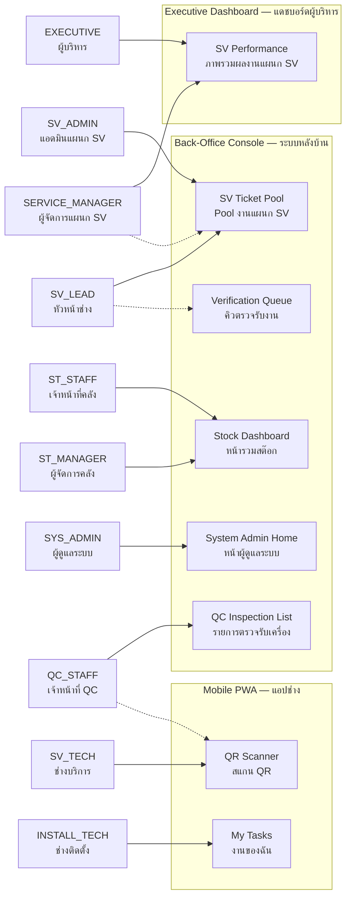
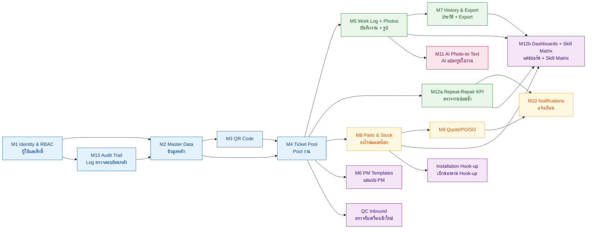
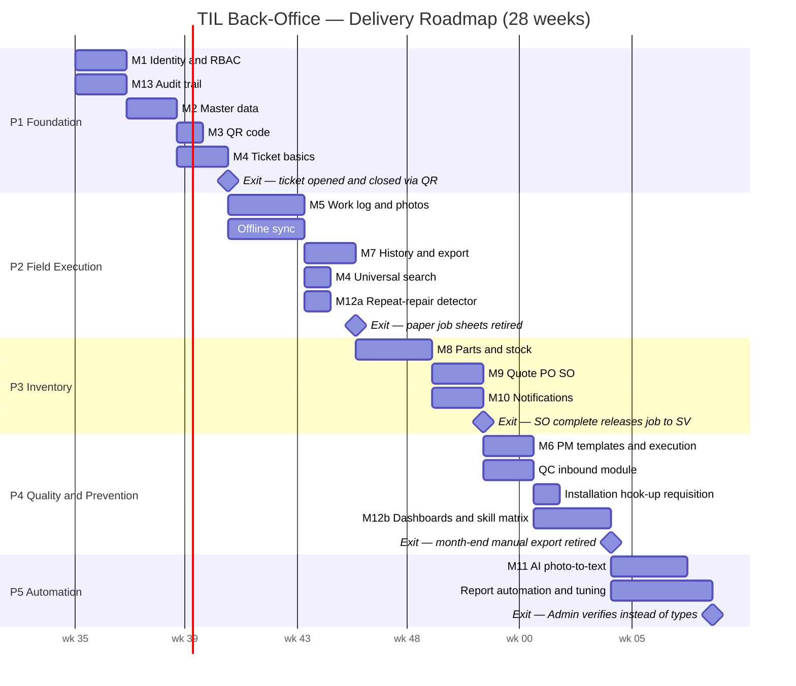
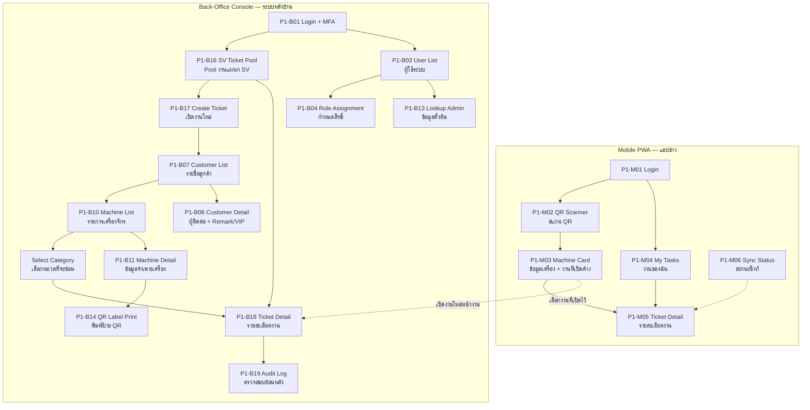
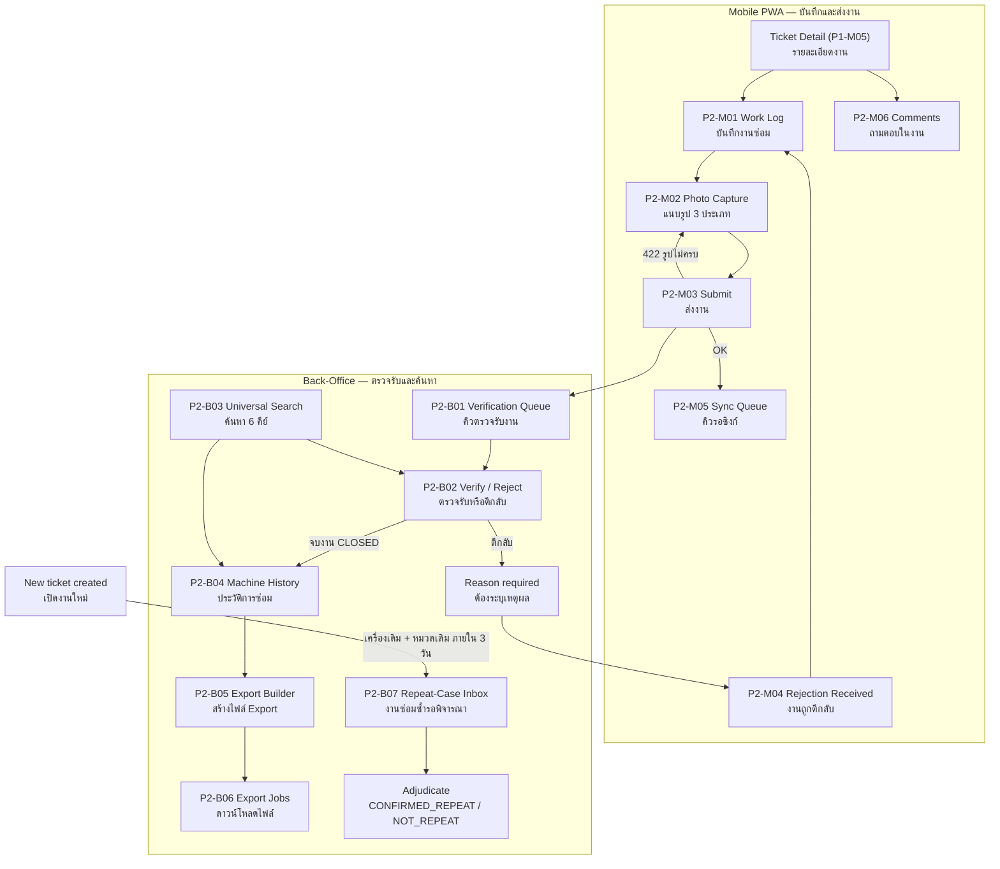
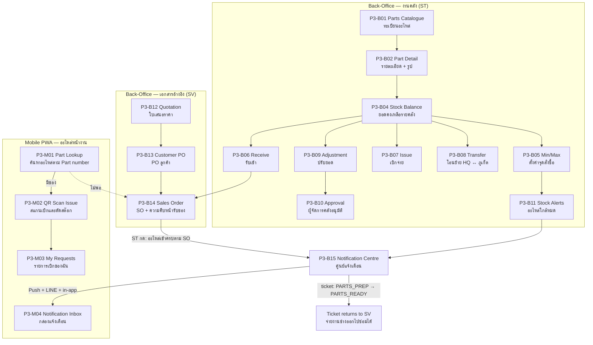
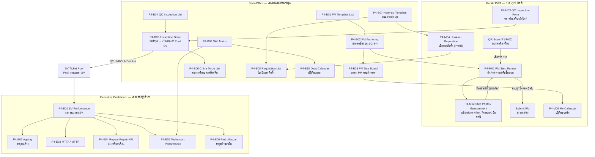
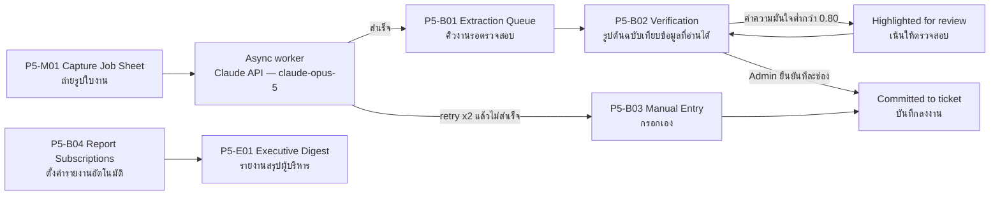
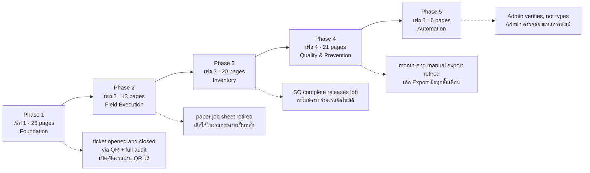

# Build Plan — TIL Back-Office System
## แผนการพัฒนาระบบแบ่งตามเฟส พร้อมรายการหน้าจอ (Phased Build Plan with Frontend Page Inventory)

**Document version:** 1.0 (draft for scope confirmation)
**Date:** 2026-08-09
**Derives from:** [`spec/PRD.md`](PRD.md) v1.0 — module definitions §4, delivery phases §11, API surface §6
**Status:** For scope confirmation — mark the **Scope** column on every page row before build starts

---

## 0. Purpose & How to Review This Document
### วัตถุประสงค์และวิธีการตรวจสอบเอกสาร

`PRD.md` specifies the **backend**: 13 modules, a REST API, a data model, a state machine. It does not say what a user *sees*. This document translates the PRD into a **sequenced, phase-by-phase build plan** and, for each phase, an inventory of the **high-level frontend pages** that phase delivers — so functional scope can be confirmed with SV, ST, QC and management staff **before implementation begins**.

**How to review.** Every page in this document is one row in a table with a **Scope** column. Mark each row:

| Mark | Meaning | ความหมาย |
|---|---|---|
| ✅ | Correct — build as described | ถูกต้อง สร้างตามนี้ได้เลย |
| ✏️ | Needed, but the description is wrong or incomplete — write the correction in the row | ต้องมี แต่รายละเอียดยังไม่ถูก ให้แก้ไขในช่อง |
| ❌ | Not needed in this phase — say which phase it belongs to, or drop it | ไม่ต้องมีในเฟสนี้ ระบุว่าควรอยู่เฟสไหน หรือตัดออก |

A page marked ❌ moves to the phase you name; it is not silently deleted. Anything you expect but cannot find is more important than anything listed here — each phase ends with an **"Out of this phase / ไม่รวมในเฟสนี้"** section naming what is deliberately deferred and to where.

**What this document is not.** It is not a UI design, wireframe, or component spec. Page descriptions state *what the page is for and which API it binds to*, not how it looks. Visual design follows scope confirmation.

---

## 1. Client Surfaces
### หน้าจอผู้ใช้ทั้ง 3 ระบบ

Per `PRD.md` §1.4 the backend serves three distinct clients. Every page in this document belongs to exactly one of them.

### 1.1 Technician Mobile PWA — แอปมือถือช่าง

| Attribute | Specification |
|---|---|
| Users | `SV_TECH`, `INSTALL_TECH`, `QC_STAFF` |
| Platform | Progressive Web App, Android 10+ / iOS 15+ (PRD §9.12, §12 Q4) |
| Entry point | **QR scan first.** The scanner is the home screen, not a menu (PRD §3.5) |
| Network | **Offline-first and non-negotiable.** Technicians work in plant basements and machine rooms with no signal (PRD §1.4). Every write queues locally with a client-generated UUID v7 and an `Idempotency-Key`, replays on reconnect (PRD §5.4, §9.6) |
| Camera | Heavy use — mandatory evidence photos, PM step photos, job-sheet capture. Client-side compression to ≤2 MB, resumable upload (PRD §9.9) |
| Language | **Thai primary.** English is secondary and optional on this surface (PRD §9.10) |

### 1.2 Back-Office Web Console — ระบบหลังบ้าน (เว็บ)

| Attribute | Specification |
|---|---|
| Users | `SV_ADMIN`, `SV_LEAD`, `SERVICE_MANAGER`, `ST_STAFF`, `ST_MANAGER`, `QC_STAFF`, `SYS_ADMIN` |
| Platform | Desktop browser, data-dense tables and forms |
| Network | Online-only. No offline requirement — this surface is used at a desk |
| Character | Master data, verification queues, stock operations, adjudication. This is where **decisions** are made; the mobile app is where **work** is recorded |
| Language | Thai primary, English secondary, both always available (PRD §9.10) |

### 1.3 Executive Dashboard — แดชบอร์ดผู้บริหาร

| Attribute | Specification |
|---|---|
| Users | `EXECUTIVE`, `SERVICE_MANAGER`, `ST_MANAGER` |
| Access | **Read-only, enforced server-side.** Every endpoint rejects writes from an executive-only token regardless of other checks (PRD §2.3, error `READ_ONLY_ROLE`) |
| Data source | Materialised aggregates refreshed on a short interval, **never** direct OLTP queries — dashboard load must stay off the transactional path (PRD §M12) |
| Freshness | ≤60 s behind live (PRD §9.4) |
| Character | Aggregate only. Drill-through to an individual ticket hands off to the back-office console |

### 1.4 Role → Default Landing Page (Diagram D)

Where each of the ten roles in PRD §2.1 lands after login.

Solid arrow = default landing page. Dashed arrow = secondary surface the same role also uses daily.

---

## 2. Module → Phase Map
### แผนที่โมดูลต่อเฟส

The five phases are those already agreed in `PRD.md` §11, with **one documented deviation**: the repeat-repair detector (PRD §3.6) moves from Phase 4 to **Phase 2**, as `PRD.md` §11 itself recommends. It is a small piece of logic, it only needs tickets carrying machine + category (delivered in Phase 1), and it addresses the problem the source requirements describe most concretely as broken today — the manual month-end export and hand-check, with acknowledged data loss.

| Module | ชื่อโมดูล | P1 | P2 | P3 | P4 | P5 |
|---|---|:--:|:--:|:--:|:--:|:--:|
| M1 — Identity, Roles & Access Control | ผู้ใช้ สิทธิ์ และการเข้าถึง | ● | | | | |
| M2 — Customer, Site & Machine Master Data | ข้อมูลหลักลูกค้า/ไซต์/เครื่องจักร | ● | | | | |
| M3 — QR Code Management | จัดการ QR Code | ● | | | | |
| M4 — Ticket Pool & Lifecycle | Pool งานและวงจรสถานะงาน | ◐ | ◐ | | | |
| M5 — Work Log & Evidence Capture | บันทึกงานและรูปหลักฐาน | | ● | | | |
| M6 — PM Templates & Execution | แม่แบบและการทำงาน PM | | | | ● | |
| M7 — Machine History & Export | ประวัติเครื่องจักรและการ Export | | ● | | | |
| M8 — Spare Parts & Inventory | อะไหล่และสต๊อก | | | ● | | |
| M9 — Quote / PO / SO Reference | ใบเสนอราคา / PO / SO | | | ● | | |
| M10 — Notifications & Alerts | การแจ้งเตือน | | | ● | | |
| M11 — AI Photo-to-Text | AI แปลงรูปใบงานเป็นข้อความ | | | | | ● |
| M12 — Dashboards, KPI & Skill Matrix | แดชบอร์ด KPI และ Skill Matrix | | ◐ | | ◐ | |
| M13 — Audit Trail | Log การตรวจสอบย้อนหลัง | ● | | | | |

● = fully delivered in that phase ◐ = partially delivered, split across phases

**Split modules explained:**
- **M4** — Phase 1 delivers create / assign / status / close. Phase 2 adds universal search across the six keys (PRD §M4) and the Office-vs-Technician grouping filter.
- **M12** — Phase 2 delivers **only** the repeat-repair detector and its adjudication screens (the pulled-forward item). Phase 4 delivers everything else: dashboards, calendar, skill matrix, part-lifespan analysis.

### 2.1 Module Dependency Graph (Diagram A)

Why the sequence is what it is. An arrow means *cannot be built until*.

Two structural facts drive the whole ordering:

1. **M13 (audit) precedes all business modules.** PRD §8.5 requires every mutation to write an audit row *in the same transaction as the change* — an action that is not audited must not commit. Retrofitting that later means touching every write path, so it is built first.
2. **M12's dashboards come last among the reporting work** because they aggregate data that only exists once M4, M5, M7 and M8 have been producing it. The one exception is the repeat-repair detector, which needs nothing but tickets — hence its move to Phase 2.

---

## 3. Roadmap
### แผนการส่งมอบ 28 สัปดาห์

Start date is illustrative; only the sequence and durations are being confirmed here.

| Phase | เฟส | Weeks | Exit criteria (from PRD §11) |
|---|---|---|---|
| P1 Foundation | รากฐานระบบ | 1–6 | A ticket can be opened by Admin, executed and closed by a technician via QR scan, with a full audit trail |
| P2 Field Execution | งานภาคสนาม | 7–12 | Paper job sheets are no longer the system of record; machine history export matches the one-row-per-job format |
| P3 Inventory & Coordination | สต๊อกและการประสานงาน | 13–18 | Technicians can check stock on site; ST completing an SO automatically releases the job to SV |
| P4 Quality & Prevention | คุณภาพและการป้องกัน | 19–24 | Repeat-repair alerts fire in real time; the month-end manual export process is retired |
| P5 Automation | ระบบอัตโนมัติ | 25–28 | Admin's role on job-sheet entry is verification rather than transcription |

---

## 4. Phase 1 — Foundation
### เฟสที่ 1 — รากฐานระบบ (สัปดาห์ที่ 1–6)

**Modules:** M1 Identity & RBAC · M2 Master Data · M3 QR Code · M13 Audit Trail · M4 minimal (create, assign, status, close)

**Goal.** Stand up the skeleton the entire system hangs from: who the users are, what they may do, who the customers and machines are, and an audit record of every change. At the end of this phase a ticket can travel end to end — but with no photos, no parts, no search, and no reporting.

**Exit criteria.** A ticket can be opened by Admin, executed and closed by a technician via QR scan, with a full audit trail.

### 4.1 Back-Office Web Console — 20 pages

| # | Page (TH / EN) | Primary roles | What it does | Key API | Scope |
|---|---|---|---|---|:--:|
| P1-B01 | เข้าสู่ระบบ + MFA / Login + MFA challenge | all | Username + password, then TOTP for `SYS_ADMIN`, `SERVICE_MANAGER`, `ST_MANAGER` (PRD §8.1) | `POST /auth/login`, `/auth/mfa/verify` | |
| P1-B02 | เปลี่ยน/รีเซ็ตรหัสผ่าน / Password change & reset | all | Self-service change; lockout state after 5 failures in 15 min is shown here | `POST /auth/login` family | |
| P1-B03 | รายชื่อผู้ใช้ / User list | SYS_ADMIN | Search, filter by role/department, activate/deactivate | `GET /users` | |
| P1-B04 | รายละเอียดผู้ใช้และกำหนดสิทธิ์ / User detail & role assignment | SYS_ADMIN | **Multi-role assignment** — one person may be both `SV_ADMIN` and `ST_STAFF`; permissions are the union (PRD §2.1). Role change revokes live sessions immediately | `PATCH /users/{id}` | |
| P1-B05 | ตารางสิทธิ์การใช้งาน / Role & permission matrix viewer | SYS_ADMIN, SERVICE_MANAGER | Read-only rendering of the §2.2 capability matrix so a permission question is answered without reading the PRD | `GET /auth/me`, roles catalogue | |
| P1-B06 | โครงสร้างแผนก / Department & team setup | SYS_ADMIN | Department membership — the unit that scopes "dept pool" reads (PRD §2.3) | `GET/PATCH /departments` | |
| P1-B07 | รายชื่อลูกค้า/โครงการ / Customer & project list | SV_ADMIN, SERVICE_MANAGER | **Step 1 of the Admin ticket-creation path** named in the requirements: customer/project list → machine list → category | `GET /customers` | |
| P1-B08 | รายละเอียดลูกค้า / Customer detail | SV_ADMIN, SERVICE_MANAGER | Contact roster with the exact roles named in the source — House Keeping Manager, Laundry Manager, Laundry Supervisor, Laundry Worker, Chief Engineer, Chief Engineer Assistant, เลขาช่าง — plus the **character/remark block**: tier, ราชการ, VIP, and site rules (PPE, entry hours, sign-in) | `GET/PATCH /customers/{id}` | |
| P1-B09 | ไซต์งาน / Site list & detail | SV_ADMIN | Site under customer; hosts machines | `GET /customers/{id}/sites` | |
| P1-B10 | รายการเครื่องจักรของลูกค้า / Customer machine list | SV_ADMIN, SV_LEAD | **Step 2 of the ticket-creation path** — every machine TIL sold this customer | `GET /customers/{id}/machines` | |
| P1-B11 | รายละเอียดเครื่องจักร / Machine detail & specs | SV_ADMIN, SV_LEAD | Serial, model, `site_machine_no` (หมายเลขเครื่องหน้างาน), installed date, warranty expiry, map/coordinates, and open-ended specs including ขนาดเพลากากบาท and จำนวนโช๊คอัพ (PRD §M2). Technician-submitted spec corrections appear here flagged for review | `GET/PATCH /machines/{id}` | |
| P1-B12 | ทะเบียนรุ่นเครื่องจักร / Machine model admin | SV_ADMIN, SYS_ADMIN | Model catalogue — later the anchor for PM and hook-up templates | `GET/POST /machine-models` | |
| P1-B13 | ข้อมูลตั้งต้นระบบ / Lookup admin | SYS_ADMIN | System categories (หมวดที่จะตรวจเช็ก/ซ่อม), contact roles, warehouses, skills. **Deactivate only, never delete** — historical tickets reference them (PRD §5.3) | `GET/POST/PATCH /lookups/*` | |
| P1-B14 | สร้างและพิมพ์ป้าย QR / QR label generation & batch print | SV_ADMIN, SV_LEAD | Generate opaque non-guessable tokens and print labels in batch. Tokens are **not** serial numbers (PRD §10.5) | `POST /machines/{id}/qr` | |
| P1-B15 | ประวัติการเปลี่ยนป้าย QR / QR rotation history | SV_ADMIN | Rotate a token after a repaint or panel replacement; old label returns `410 QR_TOKEN_REVOKED` when scanned | `POST /machines/{id}/qr/regenerate` | |
| P1-B16 | Pool งานแผนก SV (พื้นฐาน) / SV ticket pool — basic | SV_ADMIN, SV_LEAD, SERVICE_MANAGER | The department pool. Filter by status, assignee, priority. **Grouping งานช่าง (ลูกค้า) vs งาน Office SV is a first-class filter from day one** — office work lives in the same pool so departmental work is not dropped (PRD §3.3) | `GET /tickets` | |
| P1-B17 | เปิดงานใหม่ / Ticket create wizard | SV_ADMIN, SV_LEAD, SERVICE_MANAGER | The exact requirement path: customer → machine → system category → ticket in the SV pool. `OFFICE` tickets skip machine and category | `POST /tickets` | |
| P1-B18 | รายละเอียดงาน (พื้นฐาน) / Ticket detail — basic | all SV roles | Assign, priority, วัน check point, deadline, status transitions, and the **immutable status history** every transition writes (PRD §3.4). The `customer_alert` briefing block from the API response is displayed prominently here | `GET /tickets/{id}`, `/assign`, `/status`, `/history` | |
| P1-B19 | บันทึกการตรวจสอบย้อนหลัง / Audit log browser | SYS_ADMIN, SERVICE_MANAGER, SV_LEAD | Who changed what, when, from where — before/after diff per mutation. Append-only; no edit or delete action exists on this page (PRD §M13) | `GET /audit-logs` | |
| P1-B20 | ตั้งค่าระบบ / System settings | SYS_ADMIN | Repeat-repair window (default 72 h), ticket number format, retention settings, session policy | `GET/PATCH /settings` | |

### 4.2 Technician Mobile PWA — 6 pages

| # | Page (TH / EN) | Primary roles | What it does | Key API | Scope |
|---|---|---|---|---|:--:|
| P1-M01 | เข้าสู่ระบบ / Login + MFA | all field roles | Token stored for long-lived offline use; refresh rotates on reconnect | `POST /auth/login`, `/auth/refresh` | |
| P1-M02 | สแกน QR / QR scanner | SV_TECH, INSTALL_TECH, QC_STAFF | **The home screen.** Camera-first, works offline against a cached token map | `POST /qr/resolve` | |
| P1-M03 | ข้อมูลเครื่องจักรจากการสแกน / Scan result — machine card | SV_TECH, QC_STAFF | The single screen that drives the whole on-site decision: machine + warranty status + **open tickets on that machine** + PM due + `customer_alert` remark, then the choice — work an existing ticket or open a new one (PRD §3.5, §6.4) | `POST /qr/resolve` | |
| P1-M04 | งานของฉัน (พื้นฐาน) / My tasks — basic | SV_TECH, INSTALL_TECH | Personal assigned list with priority and deadline. Department pool is **readable** but only own tickets are mutable (PRD §2.3) | `GET /dashboards/my-tasks` | |
| P1-M05 | รายละเอียดงานและอัปเดตสถานะ / Ticket detail & status advance | assignee | Read the job, advance status (`INSPECTING`, `IN_REPAIR`), see the customer briefing block before entering site | `GET /tickets/{id}`, `POST /tickets/{id}/status` | |
| P1-M06 | สถานะการเชื่อมต่อ/ซิงก์ / Offline & sync status shell | all field roles | Persistent banner: online / offline / N items queued. The full conflict-resolution UI arrives in Phase 2; Phase 1 establishes the queue and the visible flag so a technician never believes a job was filed when it was not (PRD §7.4) | client-side | |

### 4.3 Executive Dashboard — 0 pages

None. No aggregate data exists yet. The executive surface opens in Phase 3 with stock health and reaches full scope in Phase 4.

### 4.4 Navigation Map (Diagram C1)

Dotted line from the machine card into ticket detail is the `QR_ONSITE` intake path — the technician opens a ticket for an extra problem the customer raises during a visit (PRD §3.1 path 3).

### 4.5 Out of This Phase — ไม่รวมในเฟสนี้

| Not yet available | ยังไม่มีในเฟสนี้ | Arrives in |
|---|---|---|
| Work log, mandatory photo capture, submission | บันทึกงาน รูปบังคับ 3 ประเภท และส่งงาน | Phase 2 |
| Admin verification queue (`SUBMITTED → CLOSED`) | คิวตรวจรับงานจากช่าง | Phase 2 |
| Universal search across the six keys | ค้นหาตาม 6 คีย์ | Phase 2 |
| Machine history view and export | ประวัติเครื่องและ Export | Phase 2 |
| Repeat-repair alerting | แจ้งเตือนงานซ่อมซ้ำ | Phase 2 |
| Any parts, stock, or SO screen | หน้าจออะไหล่ สต๊อก SO ทั้งหมด | Phase 3 |
| Notifications of any kind, including LINE and push | การแจ้งเตือนทุกช่องทาง | Phase 3 |
| PM, QC inbound, installation requisition | งาน PM, ตรวจรับเครื่อง QC, เบิกของติดตั้ง | Phase 4 |
| Dashboards, calendar, skill matrix | แดชบอร์ด ปฏิทิน Skill Matrix | Phase 4 |
| AI job-sheet extraction | AI แปลงรูปใบงาน | Phase 5 |

> **Phase 1 acceptance walkthrough.** Admin opens a ticket from customer → machine → category. Technician scans the machine QR on site, sees the ticket, advances it to `IN_REPAIR`, and Admin closes it. Every one of those steps appears in the audit log with actor, role, timestamp and before/after values.

---

## 5. Phase 2 — Field Execution
### เฟสที่ 2 — งานภาคสนาม (สัปดาห์ที่ 7–12)

**Modules:** M5 Work Log & Evidence · offline sync · M7 History & Export · M4 universal search · **M12a repeat-repair detector (pulled forward from Phase 4)**

**Goal.** Retire the paper job sheet as the system of record. This is the phase that changes the technician's daily behaviour, so it carries the most mobile pages and the strictest server-side enforcement.

**Exit criteria.** Paper job sheets are no longer the system of record; machine history export matches the one-row-per-job format.

### 5.1 Technician Mobile PWA — 6 pages

| # | Page (TH / EN) | Primary roles | What it does | Key API | Scope |
|---|---|---|---|---|:--:|
| P2-M01 | บันทึกงานซ่อม / Work log form | assignee | Structured entry: อาการที่พบ (symptom), สาเหตุ (root cause), การแก้ไข (action taken), อะไหล่ที่เปลี่ยน (parts replaced), ชั่วโมงแรงงาน (labour time). Fully editable offline (PRD §M5) | `PATCH /tickets/{id}` | |
| P2-M02 | แนบรูปตามประเภท / Photo capture by category | assignee | Camera + gallery, tagged by category. The three mandatory categories render as a **live checklist** so the technician sees what is still missing before leaving site: 1. ใบงาน `JOB_SHEET` · 2. อะไหล่เสียที่ตรวจพบ `DEFECT_PART` · 3. อะไหล่ที่เปลี่ยนใหม่ `REPLACED_PART` (PRD §3.5) | `POST /tickets/{id}/attachments` | |
| P2-M03 | ส่งงาน / Submit work | assignee | Submission is **blocked server-side** when evidence is incomplete. The page renders `422 TICKET_PHOTO_REQUIREMENT_UNMET` per category with required-vs-current counts. Category 3 offers the `no_parts_replaced_reason` waiver; categories 1 and 2 have **no waiver** (PRD §3.5, §6.3) | `POST /tickets/{id}/submit` | |
| P2-M04 | งานถูกตีกลับ / Rejection received | assignee | Admin/Lead returned the job (`SUBMITTED → IN_REPAIR`) with a reason. Shows what to fix and reopens the work log | `GET /tickets/{id}` | |
| P2-M05 | คิวข้อมูลรอซิงก์ / Sync queue & conflict resolution | all field roles | Every queued mutation with its state, and a **per-item conflict resolution UI** for `409` responses — status transitions and stock movements are validated against server state and are not last-write-wins (PRD §5.4, §7.4) | replay with original `Idempotency-Key` | |
| P2-M06 | ถามตอบในงาน / Ticket comment thread | dept members | In-thread Q&A and feedback between technician, Lead and Admin — the "ส่งข้อมูลถามตอบในแผนกและ feedback ผ่าน online" requirement (PRD §M12) | `GET/POST /tickets/{id}/comments` | |

### 5.2 Back-Office Web Console — 7 pages

| # | Page (TH / EN) | Primary roles | What it does | Key API | Scope |
|---|---|---|---|---|:--:|
| P2-B01 | คิวตรวจรับงาน / Verification queue | SV_ADMIN, SV_LEAD, SERVICE_MANAGER | All tickets in `SUBMITTED`, aged, prioritised. Admin's daily work list | `GET /tickets?status=SUBMITTED` | |
| P2-B02 | ตรวจรับ/ตีกลับงาน / Verify & reject detail | SV_ADMIN, SV_LEAD, SERVICE_MANAGER | Work log beside the evidence photos, full-screen zoom, then จบงาน (`CLOSED`) or ตีกลับ with a mandatory reason. Photos load through short-lived signed URLs only (PRD §8.3) | `POST /tickets/{id}/verify` | |
| P2-B03 | ค้นหาแบบรวม / Universal search results | all staff | **The six keys named twice in the source requirements**: ชื่อลูกค้า · Serial number เครื่อง · Part number อะไหล่ · เลขที่ใบงาน · เลขที่ PO · เลขที่ SO. Results grouped by entity type with the matched key identified (PRD §M4, §6.9) | `GET /search?q=` | |
| P2-B04 | ประวัติการซ่อมของเครื่อง / Machine history timeline | SV roles, QC, EXECUTIVE | Full chronological history per machine and per project, reachable from the machine list. Answers the question the requirements pose verbatim: installed when, warranty ends when, what was repaired or claimed, at what value (PRD §M7) | `GET /machines/{id}/history` | |
| P2-B05 | สร้างไฟล์ Export ประวัติ / History export builder | SV roles, EXECUTIVE | Range and column selection, then async generation. **One job per row is a hard format requirement** — merged cells or multi-line layouts are non-conforming (PRD §M7). XLSX primary, CSV secondary | `POST /machines/{id}/history/export` | |
| P2-B06 | รายการไฟล์ Export / Export jobs & download | requesting user | Job status and signed download link; `EXPORT_TOO_LARGE` guidance when a range exceeds the 50k row cap (PRD §9.13) | `GET /exports/{id}` | |
| P2-B07 | งานซ่อมซ้ำรอพิจารณา / Repeat-case inbox & adjudication | SERVICE_MANAGER, SV_LEAD (SV_ADMIN reads) | Cases raised when the same machine + same system category recur inside the rolling 72-hour window. Reviewer sets `CONFIRMED_REPEAT` (counts against the ≤1 machine/month KPI) or `NOT_REPEAT` **with a mandatory reason** (PRD §3.6) | `GET /reports/repeat-cases`, case review endpoint | |

### 5.3 Executive Dashboard — 0 pages

Still none. Repeat-repair *detection* ships this phase; the repeat-repair *KPI chart* is part of the Phase 4 dashboard set.

### 5.4 Navigation Map (Diagram C2)

### 5.5 Out of This Phase — ไม่รวมในเฟสนี้

| Not yet available | ยังไม่มีในเฟสนี้ | Arrives in |
|---|---|---|
| LINE and push delivery of the repeat-repair alert | แจ้งเตือนงานซ่อมซ้ำผ่าน LINE และ Push | Phase 3 — in-app only in Phase 2 |
| Recording parts consumed against stock | ตัดสต๊อกอะไหล่จากงานซ่อม | Phase 3 — parts are free text in the Phase 2 work log |
| Quote, PO, SO screens and the SO-complete alert | ใบเสนอราคา PO SO และแจ้งเตือนอะไหล่ครบ | Phase 3 |
| PM step-enforced checklist | ฟอร์ม PM แบบบังคับลำดับขั้นตอน | Phase 4 |
| Repeat-repair KPI chart and dashboards | กราฟ KPI งานซ่อมซ้ำและแดชบอร์ด | Phase 4 |
| AI extraction of the job sheet photo | AI อ่านใบงานจากรูป | Phase 5 — the photo is captured in Phase 2, read manually |

> **Note on the pulled-forward detector.** Detection runs **synchronously inside the ticket-creation transaction** so the flag is visible to the creating user immediately; notification dispatch is queued (PRD §3.6). In Phase 2 that dispatch reaches the in-app inbox only. LINE and push land with M10 in Phase 3.

---

## 6. Phase 3 — Inventory & Coordination
### เฟสที่ 3 — สต๊อกและการประสานงาน (สัปดาห์ที่ 13–18)

**Modules:** M8 Spare Parts & Inventory · M9 Quote / PO / SO Reference · M10 Notifications & Alerts

**Goal.** Close the loop between the store and the field. A technician on site can answer "do we have this part?" without a phone call, and ST completing an SO automatically releases the job back to SV instead of someone remembering to tell them.

**Exit criteria.** Technicians can check stock on site; ST completing an SO automatically releases the job to SV.

### 6.1 Back-Office Web Console — 14 pages

| # | Page (TH / EN) | Primary roles | What it does | Key API | Scope |
|---|---|---|---|---|:--:|
| P3-B01 | ทะเบียนอะไหล่ / Parts catalogue list | all staff read, ST writes | Search by part number or name, filter by model compatibility and active status | `GET /parts?q=` | |
| P3-B02 | รายละเอียดอะไหล่ / Part detail | all staff read, ST writes | Part number, ชื่อไทย/อังกฤษ, unit, **photo**, specifications, compatible models, supersession links, expected lifespan. The photo is a hard requirement — the technician lookup UX depends on it (PRD §M8) | `GET/PATCH /parts/{id}` | |
| P3-B03 | ทะเบียนคลัง / Warehouse admin | ST_MANAGER, SYS_ADMIN | HQ Bangkok and **Phuket Office** — the branch the requirements single out as needing to hold customer stock but currently lacking both staff and system support. Schema supports N warehouses (PRD §M8, §12 Q3) | `GET/POST /warehouses` | |
| P3-B04 | ยอดคงเหลือรายคลัง / Stock balance by warehouse | all staff read | On-hand, reserved, available per part per warehouse. `qty_available` is derived, never stored | `GET /parts/{id}/stock` | |
| P3-B05 | ตั้งค่า Min/Max / Min-max threshold editor | **ST_MANAGER only** | Per part per warehouse thresholds that drive replenishment alerts (PRD §M8) | `PUT /parts/{id}/stock/{warehouseId}/thresholds` | |
| P3-B06 | รับอะไหล่เข้าคลัง / Stock receive | ST_STAFF, ST_MANAGER | Receipt against an SO or PO, partial receipts supported | `POST /stock/receive` | |
| P3-B07 | เบิก/จ่ายอะไหล่ / Stock issue | ST_STAFF, ST_MANAGER | Issue against a ticket. Rejects with `409 INSUFFICIENT_STOCK` showing available vs requested per line. Reserved stock allocated to an open SO cannot be double-issued | `POST /stock/issue` | |
| P3-B08 | โอนย้ายระหว่างคลัง / Stock transfer | ST_STAFF, ST_MANAGER | HQ ↔ Phuket movement, posts paired `TRANSFER_OUT` / `TRANSFER_IN` ledger rows | `POST /stock/transfer` | |
| P3-B09 | ปรับปรุงยอดสต๊อก / Stock adjustment & count | ST_STAFF creates | Count correction with a **mandatory reason** — the only movement type that requires one | `POST /stock/adjust` | |
| P3-B10 | อนุมัติการปรับยอด / Adjustment approval queue | **ST_MANAGER only** | Adjustments require manager approval before they post (PRD §2.2) | `POST /stock/adjust/{id}/approve` | |
| P3-B11 | แจ้งเตือนอะไหล่ใกล้หมด / Stock alerts — at or below minimum | ST_STAFF, ST_MANAGER, SV | Replenishment worklist per warehouse, with a daily email digest (PRD §M10) | `GET /stock/alerts` | |
| P3-B12 | ใบเสนอราคา / Quotation list & detail | SV_ADMIN, SERVICE_MANAGER | **Reference records only** — number, date, amount, status, linked ticket and parts. This system is not the financial document of record (PRD §1.3, §12 Q1) | `POST /quotations` | |
| P3-B13 | PO ลูกค้า / Purchase order list & detail | SV_ADMIN, SERVICE_MANAGER | Customer PO reference; receipt of the PO drives `AWAITING_PO → PARTS_PREP` | `POST /purchase-orders` | |
| P3-B14 | SO และความคืบหน้าการรับของ / Sales order detail & receipt progress | SV_ADMIN creates, **ST completes** | Lines with partial-receipt tracking so SV sees what is still outstanding. The **"อะไหล่เข้าครบตาม SO" action is ST-only** and performs three things atomically: sets the SO complete, transitions linked tickets `PARTS_PREP → PARTS_READY`, and enqueues the SV notification. This is the **only** ticket status change ST may make (PRD §M9, §6.7) | `POST /sales-orders/{id}/receive`, `/complete` | |
| P3-B15 | ศูนย์การแจ้งเตือนและการตั้งค่า / Notification centre & preferences | all staff | In-app inbox plus per-channel opt-in (in-app, push, LINE, email). Delivery is recorded per recipient per channel so a missed critical alert is provable after the fact (PRD §M10) | `GET /notifications`, `PUT /notifications/preferences` | |

### 6.2 Technician Mobile PWA — 4 pages

| # | Page (TH / EN) | Primary roles | What it does | Key API | Scope |
|---|---|---|---|---|:--:|
| P3-M01 | ค้นหาอะไหล่คงเหลือ / Part lookup by part number | all field roles | The requirement verbatim: search by Part number, see the **part photo and every necessary detail**, with balance per warehouse. Read-heavy and latency-sensitive (p95 ≤300 ms), cached, and **degrades gracefully offline** — last-known balance shown with an explicit staleness timestamp, never silently stale (PRD §M8, §6.6) | `GET /parts/lookup?part_number=` | |
| P3-M02 | สแกน QR เบิกอะไหล่ / Part QR scan-to-issue | SV_TECH, INSTALL_TECH, ST | Scan the part label to issue and decrement stock on mobile — "เบิกของและตัด Stock Online ผ่านแอพโดยใช้มือถือสแกน QR code" (PRD §M8) | `POST /stock/issue` | |
| P3-M03 | รายการเบิกของฉัน / My stock requests | SV_TECH, INSTALL_TECH | Requests raised against own tickets and their confirmation state. A technician request posts when ST confirms, or immediately where self-service issue is enabled for that warehouse (PRD §2.2 note 3) | `GET /stock/requests?mine=true` | |
| P3-M04 | กล่องแจ้งเตือน / Notification inbox | all field roles | In-app inbox — the fallback that is never dependent on LINE or push being up (PRD §10.1, §10.3) | `GET /notifications` | |

### 6.3 Executive Dashboard — 1 page

| # | Page (TH / EN) | Primary roles | What it does | Key API | Scope |
|---|---|---|---|---|:--:|
| P3-E01 | ภาพรวมสุขภาพสต๊อก / Stock health tiles | EXECUTIVE, ST_MANAGER, SERVICE_MANAGER | Below-minimum counts by warehouse, stock value trend, HQ vs Phuket comparison. Read-only | `GET /stock/alerts` aggregate | |

### 6.4 Navigation Map (Diagram C3)

The thick path — SO receipt → ST marks complete → notification + automatic ticket transition → job released to SV — is the coordination requirement this phase exists to satisfy.

### 6.5 Out of This Phase — ไม่รวมในเฟสนี้

| Not yet available | ยังไม่มีในเฟสนี้ | Arrives in |
|---|---|---|
| Installation requisition prefilled from hook-up templates | เบิกของติดตั้งตามแบบ Hook-up | Phase 4 — stock issue exists, the prefill does not |
| Part lifespan analysis | วิเคราะห์อายุการใช้งานอะไหล่เฉลี่ย | Phase 4 — `machine_part_install` data starts accumulating now |
| PM, QC inbound modules | งาน PM และตรวจรับเครื่อง QC | Phase 4 |
| Performance dashboards, calendar, skill matrix | แดชบอร์ดผลงาน ปฏิทิน Skill Matrix | Phase 4 |
| ERP synchronisation of PO/SO numbers | เชื่อมต่อ ERP สำหรับเลขที่ PO/SO | Unscheduled — see §11 Q1, the largest open integration question |

---

## 7. Phase 4 — Quality & Prevention
### เฟสที่ 4 — คุณภาพและการป้องกัน (สัปดาห์ที่ 19–24)

**Modules:** M6 PM Templates & Execution · M12b Dashboards, Skill Matrix, Part Lifespan · QC Inbound · Installation Hook-up Requisition

**Goal.** Move from reacting to failures to preventing them, and make performance visible. This phase retires the month-end manual export process entirely.

**Exit criteria.** Repeat-repair alerts fire in real time; the month-end manual export process is retired.

### 7.1 Back-Office Web Console — 10 pages

| # | Page (TH / EN) | Primary roles | What it does | Key API | Scope |
|---|---|---|---|---|:--:|
| P4-B01 | รายการแม่แบบ PM / PM template list | SV_LEAD, SERVICE_MANAGER | Templates by machine model, version and active state | `GET /pm-templates?model_id=` | |
| P4-B02 | สร้าง/แก้ไขแม่แบบ PM / PM template authoring | SV_LEAD, SERVICE_MANAGER | Ordered steps 1, 2, 3, 4 … with per-step flags: `photo_required`, `measurement_required` with unit and tolerance band. The ordering is deliberate — it exists to prevent jumping between steps (PRD §3.7). Note §11 Q8: template *content* is a customer-side deliverable | `POST/PATCH /pm-templates` | |
| P4-B03 | ตารางงาน PM ครบกำหนด / PM schedule & due board | SV_ADMIN, SV_LEAD | Generated PM schedule with due and overdue states, feeding assignment | `GET /pm-schedule` | |
| P4-B04 | รายการตรวจรับเครื่องเข้าใหม่ / QC inspection list | QC_STAFF, SERVICE_MANAGER | Inbound machines awaiting or under inspection | `GET /qc-inspections` | |
| P4-B05 | รายละเอียดการตรวจรับ / QC inspection detail | QC_STAFF | Inspection result and photos. Where damage or modification is found, **creates a ticket directly in the SV pool** (`ticket_type = QC_INBOUND`) carrying the photos and the inspection reference (PRD §3.9) | `POST /qc-inspections/{id}/defect` | |
| P4-B06 | To-do list เครื่องเข้าใหม่จากจีน / QC modification to-do checklist | QC_STAFF, SERVICE_MANAGER | The explicitly named safeguard against omissions (ป้องกันการตกหล่น) for machines arriving from China. Each row has an owner and completion state; **an inspection cannot be marked complete with open mandatory to-do items** (PRD §3.9) | `GET/POST /qc-inspections/{id}/todos` | |
| P4-B07 | แบบ Hook-up / Hook-up template list & line editor | SV_ADMIN, ST_MANAGER | Registered hook-up parts list per machine model — the list that already exists on paper and should never be retyped | `GET /hookup-templates?model_id=` | |
| P4-B08 | ใบเบิกของติดตั้ง / Requisition list & detail | ST_STAFF, SV_LEAD, SERVICE_MANAGER | Submitted installation requisitions for ST to fulfil. Lines added on site are marked `ADDED_ONSITE` and **reported separately so hook-up templates can be improved over time** (PRD §3.8) | `GET /requisitions` | |
| P4-B09 | Skill Matrix / Skill matrix grid | SV_LEAD, SERVICE_MANAGER | Proficiency level per skill per technician, maintained by Lead/Manager, informing assignment suggestions. Exists so individual KPI measurement and evaluation become ชัดเจนและโปร่งใสขึ้น (PRD §M12) | `GET /skills/matrix` | |
| P4-B10 | ปฏิทินงานแผนก / Department calendar | SV_ADMIN, SV_LEAD, SERVICE_MANAGER | Departmental overview of assigned work for planning — ใช้วางแผนและจัดการงาน (PRD §M12) | `GET /calendar?scope=dept` | |

### 7.2 Technician Mobile PWA — 5 pages

| # | Page (TH / EN) | Primary roles | What it does | Key API | Scope |
|---|---|---|---|---|:--:|
| P4-M01 | ทำงาน PM ตามขั้นตอน / PM execution step runner | SV_TECH | Step *n+1* is **locked until step *n* is complete — enforced server-side, not only in the UI**. Renders `409 PM_STEP_OUT_OF_ORDER` with the incomplete prior steps named. Cannot submit with any mandatory step incomplete (PRD §3.7, §6.5) | `POST /pm-executions/{id}/steps/{stepId}/complete` | |
| P4-M02 | ถ่ายรูป/บันทึกค่าตามขั้นตอน / PM step photo & measurement capture | SV_TECH | Steps flagged `photo_required` cannot complete without a photo — the source names ทำความสะอาด Before/After, การวัดกระแสไฟฟ้า, อัดจารบี. Out-of-tolerance readings raise a warning the technician must acknowledge with a note (PRD §3.7) | `POST /pm-executions/{id}/steps/{stepId}/complete` | |
| P4-M03 | ฟอร์มตรวจรับเครื่องเข้าใหม่ / QC inbound inspection form | QC_STAFF | On-floor inspection capture with photos, and one-tap defect → SV pool ticket | `POST /qc-inspections` | |
| P4-M04 | เบิกของติดตั้งตาม Hook-up / Installation requisition | INSTALL_TECH | **Pre-populated from the hook-up template — the technician edits rather than types.** Adjust quantities, remove lines not needed, append items discovered on site. This is the stated goal: eliminate hand-writing the full parts list (PRD §3.8, §6.8) | `POST /requisitions` with `prefill_from_hookup: true` | |
| P4-M05 | ปฏิทินงานของฉัน / My calendar | all field roles | Personal assigned-work calendar (PRD §M12) | `GET /calendar?scope=me` | |

### 7.3 Executive Dashboard — 6 pages

| # | Page (TH / EN) | Primary roles | What it does | Key API | Scope |
|---|---|---|---|---|:--:|
| P4-E01 | แดชบอร์ดผลงานแผนก SV / SV performance dashboard | EXECUTIVE, SERVICE_MANAGER | The real-time overview the requirements ask for — Real time ให้มากที่สุด. Open tickets by status, workload by technician, on-time closure rate. ≤60 s freshness from materialised aggregates (PRD §M12, §9.4) | `GET /dashboards/sv-performance` | |
| P4-E02 | อายุงานค้างและสถานะ / Ageing & status breakdown | EXECUTIVE, SERVICE_MANAGER, SV_LEAD | Ageing buckets per status — where work is stuck | `GET /dashboards/sv-performance` | |
| P4-E03 | เวลาตอบสนอง/เวลาซ่อม / MTTA & MTTR trend | EXECUTIVE, SERVICE_MANAGER | Computed **only** from `ticket_status_history`, never from a ticket's `updated_at` (PRD §3.4). Both metrics are shown — response time (`NEW → INSPECTING`) and repair time (`NEW → CLOSED`) — pending the §11 Q6 answer on which is contractual | `GET /reports/mttr` | |
| P4-E04 | KPI งานซ่อมซ้ำ / Repeat-repair KPI | EXECUTIVE, SERVICE_MANAGER, SV_LEAD | Confirmed repeat cases per month against the target of **≤1 machine/month**, with the pending-review backlog. Only `CONFIRMED_REPEAT` cases enter the figure (PRD §3.6) | `GET /reports/repeat-cases?month=` | |
| P4-E05 | ผลงานรายบุคคล / Technician performance | SERVICE_MANAGER, EXECUTIVE, own user | Individual metrics feeding evaluation, paired with the skill matrix. Employee personal data — PDPA lawful basis applies (PRD §8.4) | `GET /reports/technician-performance` | |
| P4-E06 | อายุการใช้งานอะไหล่ / Part lifespan analysis | EXECUTIVE, SERVICE_MANAGER, ST_MANAGER | Average service life per part type computed from install → replace intervals, for part quality and pricing decisions **or to answer customer questions** (PRD §M12) | `GET /reports/part-lifespan` | |

### 7.4 Navigation Map (Diagram C4)

### 7.5 Out of This Phase — ไม่รวมในเฟสนี้

| Not yet available | ยังไม่มีในเฟสนี้ | Arrives in |
|---|---|---|
| AI reading of the job sheet photo | AI อ่านใบงานช่างจากรูป | Phase 5 |
| Scheduled/automated report delivery | ส่งรายงานอัตโนมัติตามกำหนดเวลา | Phase 5 |
| Customer-facing portal or customer self-service | Portal สำหรับลูกค้าดูสถานะงานเอง | Out of scope for v1 (PRD §1.3, §11 Q7) |
| Route optimisation and dispatch scheduling | จัดเส้นทางและตารางเดินทางอัตโนมัติ | Out of scope for v1 |

---

## 8. Phase 5 — Automation
### เฟสที่ 5 — ระบบอัตโนมัติ (สัปดาห์ที่ 25–28)

**Modules:** M11 AI Photo-to-Text · report automation · performance tuning

**Goal.** Shift Admin's role on job-sheet entry from transcription to verification.

**Exit criteria.** Admin's role on job-sheet entry is verification rather than transcription.

### 8.1 Back-Office Web Console — 4 pages

| # | Page (TH / EN) | Primary roles | What it does | Key API | Scope |
|---|---|---|---|---|:--:|
| P5-B01 | คิวงานอ่านใบงานด้วย AI / Job-sheet extraction queue | SV_ADMIN | Uploaded job-sheet photos and their extraction state: processing, `PENDING_VERIFICATION`, `MANUAL_ENTRY_REQUIRED`. Extraction runs asynchronously in a worker (PRD §M11) | `POST /job-sheets/extract` | |
| P5-B02 | ตรวจสอบข้อมูลที่ AI อ่านได้ / Extraction verification | SV_ADMIN | **The core screen of this phase.** Source photo side by side with extracted fields — job sheet no., date, customer, machine serial, symptom, action taken, parts used, labour hours, technician. Every field carries a confidence score; fields below 0.80 are highlighted. Admin accepts or corrects **field by field**, and only accepted values are committed to the ticket. Nothing is written before `/verify` is called (PRD §M11, §6.10) | `GET /job-sheets/extractions/{id}`, `POST .../verify` | |
| P5-B03 | กรอกข้อมูลเอง (กรณี AI อ่านไม่ได้) / Manual entry fallback | SV_ADMIN | Path for `EXTRACTION_FAILED` and `MANUAL_ENTRY_REQUIRED` after two retries. Manual entry is **always** available — extraction is never a prerequisite (PRD §7.4, §10.2) | `PATCH /tickets/{id}` | |
| P5-B04 | ตั้งค่ารายงานอัตโนมัติ / Scheduled report subscriptions | SERVICE_MANAGER, ST_MANAGER, SYS_ADMIN | Which report, to whom, on what schedule, in what format. Delivered by email with signed links | `POST /reports/subscriptions` | |

### 8.2 Technician Mobile PWA — 1 page

| # | Page (TH / EN) | Primary roles | What it does | Key API | Scope |
|---|---|---|---|---|:--:|
| P5-M01 | ถ่ายใบงานส่งให้ AI อ่าน / Job-sheet capture for extraction | SV_TECH | The technician photographs the signed paper job sheet as usual (already required since Phase 2 as `JOB_SHEET` evidence); this page additionally submits it for extraction so Admin receives pre-filled data rather than a blank form | `POST /job-sheets/extract` | |

### 8.3 Executive Dashboard — 1 page

| # | Page (TH / EN) | Primary roles | What it does | Key API | Scope |
|---|---|---|---|---|:--:|
| P5-E01 | ตั้งค่ารับรายงานสรุป / Report & digest subscription settings | EXECUTIVE, SERVICE_MANAGER | Self-service subscription to periodic KPI digests | `POST /reports/subscriptions` | |

### 8.4 Navigation Map (Diagram C5)

**Design constraint, restated because it governs this screen.** Handwriting on carbon-copy job sheets is frequently ambiguous. The system must **never** treat extraction as authoritative — output lands in `job_sheet_extraction` at `PENDING_VERIFICATION` and never writes directly to the ticket. The verification step is a requirement, not an optimisation (PRD §M11).

### 8.5 Out of This Phase — ไม่รวมในเฟสนี้

| Not built | ไม่ได้สร้าง | Note |
|---|---|---|
| Auto-commit of high-confidence extractions | บันทึกอัตโนมัติเมื่อ AI มั่นใจสูง | Deliberately excluded — contradicts the mandatory verification requirement |
| Customer portal | Portal ลูกค้า | Out of scope for v1; the data model does not preclude one |
| Quoting/pricing engine and invoicing | ระบบคำนวณราคาและออกใบแจ้งหนี้ | Out of scope for v1 — this system holds references, not financial documents |
| Native mobile apps | แอปเนทีฟ iOS/Android | PWA only; revisit if camera/scanner performance proves inadequate (§11 Q4) |

---

## 9. Cross-Cutting UI Requirements
### ข้อกำหนดที่ใช้กับทุกหน้าจอในทุกเฟส

These apply to **every** page listed above and are not repeated per row. They are stated once here so they are confirmed once.

| # | Requirement | ข้อกำหนด | Source |
|---|---|---|---|
| 9.1 | **Thai primary, English secondary.** All user-facing strings externalised; no hard-coded text. Field staff see Thai | ภาษาไทยเป็นหลัก อังกฤษเป็นรอง | PRD §9.10 |
| 9.2 | **Timestamps stored UTC, displayed Asia/Bangkok (UTC+7).** Never display a raw UTC value | เก็บเป็น UTC แสดงผลเป็นเวลาไทย | PRD §9.11 |
| 9.3 | **Error messages come from the API envelope.** Show `message` (Thai) to the user; `message_en` and `request_id` go to logs and support | ข้อความ error ใช้ค่าที่ API ส่งมา | PRD §7.1 |
| 9.4 | **404-over-403.** A record outside the caller's row scope renders as "ไม่พบข้อมูล", never "ไม่มีสิทธิ์" — a 403 would confirm the record exists and leak, for example, that a company is a TIL customer | นอกขอบเขตสิทธิ์ให้แสดงว่าไม่พบข้อมูล | PRD §7.2 |
| 9.5 | **Photos render only through short-lived signed URLs (≤15 min).** No permanent image URL is ever placed in the DOM, and expired URLs re-fetch silently | รูปใช้ Signed URL อายุสั้นเท่านั้น | PRD §8.3 |
| 9.6 | **Offline banner and unsynced flagging on mobile.** Queued items are visibly flagged so a technician never believes a job was filed when it was not | แสดงสถานะออฟไลน์และรายการที่ยังไม่ซิงก์ | PRD §7.4 |
| 9.7 | **Every mutating action carries an `Idempotency-Key`**, replayed unchanged on retry | ทุกการบันทึกต้องมี Idempotency-Key | PRD §5.4 |
| 9.8 | **Client-side image compression to ≤2 MB before upload**, resumable | บีบอัดรูปก่อนอัปโหลดและอัปโหลดต่อได้ | PRD §9.9 |
| 9.9 | **Deny-by-default UI.** A control the caller's role cannot use is hidden, not merely disabled — but the server check is the real one; the UI is never the enforcement point | ซ่อนปุ่มที่ผู้ใช้ไม่มีสิทธิ์ แต่ตรวจสอบจริงที่ Server | PRD §8.2 |
| 9.10 | **Executive read-only.** Every write control is absent for an executive-only token; the server rejects with `READ_ONLY_ROLE` regardless | ผู้บริหารดูได้อย่างเดียว | PRD §2.3 |
| 9.11 | **PII visibility follows the matrix.** Customer contact names and phone numbers are not rendered for `ST_STAFF` or `QC_STAFF`; PII is masked in exports unless the role holds explicit PII-export permission | ข้อมูลส่วนบุคคลแสดงตามสิทธิ์เท่านั้น | PRD §8.4 |
| 9.12 | **Mandatory-reason fields are enforced in the form**, matching the server rule: `ON_HOLD`, `CANCELLED`, rejection, stock `ADJUSTMENT`, and `NOT_REPEAT` adjudication all require a note | ช่องเหตุผลบังคับตามที่ระบบกำหนด | PRD §3.4, §5.2 |
| 9.13 | **Status history is visible on every ticket**, since MTTA/MTTR are computed from it and a user disputing a cycle time must be able to see the underlying transitions | แสดงประวัติการเปลี่ยนสถานะทุกงาน | PRD §3.4 |
| 9.14 | **App shell controls, not pages.** Logout (`POST /auth/logout`) and the current-user/permissions header (`GET /auth/me`) live in the shell on all three surfaces and are therefore not listed as pages | ปุ่มออกจากระบบและข้อมูลผู้ใช้อยู่ในโครงแอป ไม่นับเป็นหน้าจอ | PRD §6.2 |
| 9.15 | **Push token registration is silent** (`POST /devices/register`) — the mobile app registers on login from Phase 3 onward; there is no page for it, only the channel opt-in on P3-B15 | ลงทะเบียน Push Token อัตโนมัติ ไม่มีหน้าจอแยก | PRD §6.11 |

---

## 10. Page Count Summary
### สรุปจำนวนหน้าจอ

| Surface | หน้าจอ | P1 | P2 | P3 | P4 | P5 | **Total** |
|---|---|:--:|:--:|:--:|:--:|:--:|:--:|
| Back-office web console | ระบบหลังบ้าน (เว็บ) | 20 | 7 | 15 | 10 | 4 | **56** |
| Technician mobile PWA | แอปมือถือช่าง | 6 | 6 | 4 | 5 | 1 | **22** |
| Executive dashboard | แดชบอร์ดผู้บริหาร | 0 | 0 | 1 | 6 | 1 | **8** |
| **Phase total** | | **26** | **13** | **20** | **21** | **6** | **86** |

Phase 2 is the smallest by page count and the largest by behaviour change — it is where paper stops being the record. Do not read the count as effort.

---

## 11. Open Questions That Change Screen Design
### คำถามที่ต้องได้คำตอบ เพราะมีผลต่อการออกแบบหน้าจอ

These are the subset of `PRD.md` §12 whose answer changes what gets built, not merely how it behaves internally. Each states the assumption currently baked into the page list above, so nothing is blocked while they are resolved.

| # | Question | คำถาม | Current assumption in this plan | Affects |
|---|---|---|---|---|
| **Q1** | Is there an existing ERP/accounting system that owns PO and SO numbers? | มีระบบ ERP/บัญชีที่เป็นเจ้าของเลขที่ PO/SO อยู่แล้วหรือไม่ | P3-B12/B13/B14 are **entry forms** for reference records typed by Admin. If an ERP owns them, these three become **read-only mirrors** plus a sync status panel, and a new integration page is needed | Phase 3, 3 pages |
| **Q2** | Is the repeat-repair window exactly 72 hours, and is "same problem" exactly "same system category"? | ช่วงเวลาซ่อมซ้ำคือ 3 วันพอดีหรือไม่ และ "ปัญหาเดียวกัน" คือ "หมวดเดียวกัน" หรือไม่ | 72 h configurable via P1-B20, same category. A finer fault-code taxonomy would add a lookup page and a field on the create wizard | Phase 2 |
| **Q4** | PWA or native mobile apps? | ใช้ PWA หรือแอปเนทีฟ | PWA. All 22 mobile pages assume browser APIs for camera, scanner and offline storage. Native would not change the page list, only the build | All phases |
| **Q6** | Is the contractual KPI mean time to **respond** (MTTA) or to **repair** (MTTR)? | KPI คือเวลาตอบสนอง หรือเวลาซ่อมเสร็จ | P4-E03 shows **both**, neither marked primary. Confirming lets one become the headline metric on P4-E01 | Phase 4 |
| **Q8** | Do PM templates exist in documented form per machine model? | มีเอกสารขั้นตอน PM แยกตามรุ่นเครื่องอยู่แล้วหรือไม่ | Assumed to exist on paper and need digitising. The **authoring UI (P4-B02) is in scope; template content is a customer-side deliverable** | Phase 4 |
| **Q9** | Must labour cost and pricing appear in the machine history export? | รายงานประวัติเครื่องต้องมีมูลค่าค่าแรงและราคาด้วยหรือไม่ | Parts cost plus a labour figure entered by Admin, selectable as columns in P2-B05. Authoritative pricing would make Q1's ERP integration a prerequisite | Phase 2 |

---

## Appendix A — Requirement → Phase → Page Traceability
### ตารางสอบทาน: ความต้องการ → เฟส → หน้าจอ

Every requirement in the source document (`spec/usestoryTIL_TH.md`) maps to a phase and at least one page.

| Source requirement (Thai) | Phase | Pages |
|---|---|---|
| การรับงานจากลูกค้าของแผนก SV (โทร/ไลน์ → Pool งาน SV) | P1 | P1-B16, P1-B17 |
| การเปิด Task งานของทีม SV — customer list → machine list → หมวด | P1 | P1-B07, P1-B10, P1-B17 |
| ช่างเปิดงานเอง โดยสแกน QR หน้าเครื่อง | P1 | P1-M02, P1-M03 |
| การเข้าทำงานและส่งงานของช่าง + บังคับลงรูป 3 ประเภท | P2 | P2-M01, P2-M02, P2-M03 |
| หน้ารวม Task งานแผนก SV (แยกงาน Office กับงานช่าง, priority, deadline, progress) | P1 | P1-B16, P1-B18 |
| ทุก Progress ต้องมีวันที่ระบุ เพื่อวัด KPI Mean time to respond | P1 → P4 | P1-B18 (history), P4-E03 (report) |
| ค้นหาตาม 6 คีย์ — ลูกค้า / Serial / Part number / ใบงาน / PO / SO | P2 | P2-B03 |
| Pool Task งานเฉพาะบุคคล + ถามตอบและ feedback ออนไลน์ | P1 → P2 | P1-M04, P2-M06 |
| Skill Matrix และวิเคราะห์ Performance รายบุคคล | P4 | P4-B09, P4-E05 |
| ปฏิทินแสดง Task งาน — ภาพรวมแผนกและรายบุคคล | P4 | P4-B10, P4-M05 |
| ประวัติเครื่องลูกค้า + Export (ข้อมูลแต่ละงานอยู่ใน Row เดียวกัน) | P2 | P2-B04, P2-B05, P2-B06 |
| ประวัติข้อมูลจำเพาะเครื่องจักร — เพลากากบาท, โช๊คอัพ, แผนที่ | P1 | P1-B11 |
| ผู้ติดต่อและเบอร์โทร + Remark / Customer Tier / ราชการ / VIP | P1 | P1-B08 (surfaced on P1-B18, P1-M03) |
| การตรวจสอบงานซ่อมซ้ำตาม KPI — ภายใน 3 วัน ≤1 เครื่อง/เดือน | P2 → P4 | P2-B07 (detect + adjudicate), P4-E04 (KPI chart) |
| การค้นหาจำนวนคงเหลืออะไหล่ตาม Part number พร้อมรูป | P3 | P3-M01, P3-B02 |
| การดำเนินงานและบันทึกงาน PM — บังคับลำดับขั้นตอน + รูป Before/After | P4 | P4-B02, P4-M01, P4-M02 |
| การบันทึกงานลงระบบจากใบงานช่าง — AI Photo to text | P5 | P5-M01, P5-B01, P5-B02 |
| Performance Dashboard แผนก SV แบบ Real time | P4 | P4-E01, P4-E02 |
| การสรุปข้อมูล Part lifespan เฉลี่ย | P4 | P4-E06 |
| ทีมติดตั้ง — เบิกอุปกรณ์ตามแบบ Hook-up | P4 | P4-B07, P4-M04, P4-B08 |
| แผนก QC — งานตรวจรับเครื่องเข้าใหม่ + ลงงานเข้า Pool SV | P4 | P4-B04, P4-B05, P4-M03 |
| แผนก QC — To do list เครื่องเข้าใหม่จากจีน (ป้องกันการตกหล่น) | P4 | P4-B06 |
| แผนก ST — แจ้งเตือนอะไหล่เข้าครบตาม SO | P3 | P3-B14, P3-B15, P3-M04 |
| แผนก ST — จัดการ Stock ภูเก็ต, สแกน QR เบิก, กำหนด Max-Min | P3 | P3-B03, P3-B05, P3-B11, P3-M02 |
| ทุกการอัพเดทต้องมี Transaction ตรวจสอบย้อนหลังได้ | P1 | P1-B19 (and §9 cross-cutting) |

---

## Appendix B — Sign-Off
### การยืนยันขอบเขตงาน

| Phase | เฟส | Reviewed by | Date | Result |
|---|---|---|---|---|
| P1 Foundation | รากฐานระบบ | | | ☐ Approved ☐ Changes requested |
| P2 Field Execution | งานภาคสนาม | | | ☐ Approved ☐ Changes requested |
| P3 Inventory & Coordination | สต๊อกและการประสานงาน | | | ☐ Approved ☐ Changes requested |
| P4 Quality & Prevention | คุณภาพและการป้องกัน | | | ☐ Approved ☐ Changes requested |
| P5 Automation | ระบบอัตโนมัติ | | | ☐ Approved ☐ Changes requested |

Approval of a phase means the page list for that phase is the agreed functional scope. Pages added after approval are change requests against the phase schedule in §3.
