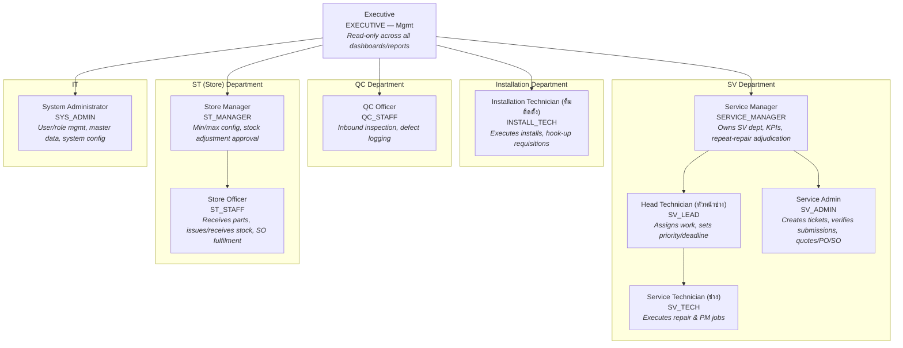
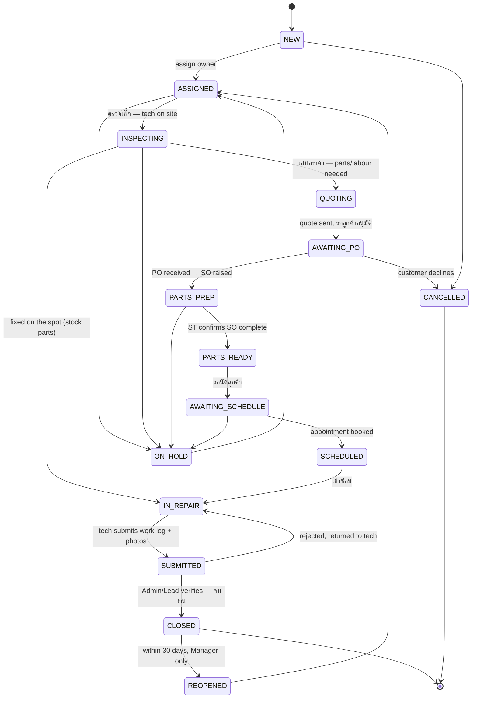
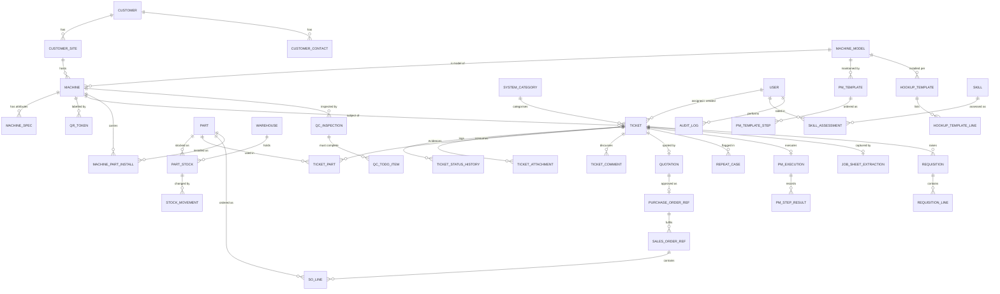

# PRD — TIL Service Management Backend

**Product:** TIL Back-Office System (industrial laundry equipment service, installation, QC & spare-parts)
**Document version:** 1.0 (draft)
**Date:** 2026-08-01
**Source:** `requirement โปรแกรมหลังบ้าน TIL.pdf` (Thai)
**Status:** For review — see §12 Open Questions before build starts

---

## 1. System Overview

### 1.1 Background

TIL sells, installs, and services industrial laundry machines (washer-extractors, dryers, ironers, and their supporting systems) for hotels, hospitals, government facilities, and commercial laundries. Service work is currently coordinated by phone, LINE, and paper job sheets. This causes four recurring problems named in the requirements:

1. **Work falls through the cracks** — jobs reported to a technician verbally never reach the Admin pool.
2. **No real-time visibility** — supervisors cannot see department progress without asking each person.
3. **Repeat repairs are invisible** — the same machine failing the same way twice is only discovered by exporting and hand-checking data at month end.
4. **Manual data entry** — technicians write paper job sheets that Admin retypes into a system.

### 1.2 Product Vision

The requirements document states the guiding principle explicitly (highlighted in the source):

> **"เข้าไว ซ่อมจบ ไม่ทำงานซ้ำ ติดตามงานได้แบบ Real time"**
> *Respond fast · Finish the repair · Never repeat the same work · Track everything in real time.*

Every feature in this PRD is justified against one of those four clauses.

### 1.3 Scope

**In scope (v1):**

| Area | Departments |
|---|---|
| Service ticket lifecycle (corrective + preventive) | SV |
| QR-code machine identification | SV, ST |
| Customer / machine / contact master data | SV |
| Machine service history & export | SV |
| Repeat-repair (KPI) detection & alerting | SV |
| Personal and departmental task pools, calendar | SV |
| Performance dashboard, skill matrix | SV |
| PM (preventive maintenance) step-enforced checklists | SV |
| AI photo-to-text job-sheet capture | SV |
| Inbound machine QC inspection & to-do lists | QC |
| Spare-parts stock, min/max, requisition, SO fulfilment alerts | ST |
| Hook-up-based installation requisition | Installation |
| Global audit log on every mutation | All |

**Out of scope (v1), flagged for later phases:**

- Customer-facing portal or customer self-service ticket creation.
- Quoting/pricing engine and invoicing (the system stores quote/PO/SO **references** and status, not the financial documents themselves — see §12 Q1).
- Payroll, HR, leave management.
- Route optimisation / technician dispatch scheduling algorithms.
- Native mobile apps beyond a PWA (see §12 Q4).

### 1.4 Architecture Summary

This PRD specifies a **backend**: a REST API plus background workers. Clients (technician mobile PWA, Admin web console, supervisor dashboards) consume it.

```
┌──────────────┐  ┌──────────────┐  ┌──────────────┐
│ Technician   │  │ Admin / SV   │  │ Manager      │
│ mobile (PWA) │  │ web console  │  │ dashboards   │
└──────┬───────┘  └──────┬───────┘  └──────┬───────┘
       │  HTTPS / JWT    │                 │
       └────────────┬────┴─────────────────┘
                    ▼
        ┌───────────────────────────┐
        │   API Gateway / REST API  │  RBAC, rate limit, audit
        └────────┬──────────────────┘
                 │
   ┌─────────────┼──────────────┬──────────────┐
   ▼             ▼              ▼              ▼
┌────────┐  ┌──────────┐  ┌──────────┐  ┌────────────┐
│Postgres│  │  Redis   │  │ S3 object│  │ Job queue  │
│(OLTP)  │  │(cache,   │  │ store    │  │ (workers)  │
│        │  │ locks)   │  │ (photos) │  │            │
└────────┘  └──────────┘  └──────────┘  └─────┬──────┘
                                              │
              ┌───────────────────────────────┼──────────────┐
              ▼               ▼               ▼              ▼
        LINE Messaging   Claude API      Push (FCM)     Email (SMTP)
        API (staff       (photo→text     mobile         reports
        notifications)   OCR)            alerts
```

**Key non-obvious constraint:** technicians work in laundry plant basements and machine rooms where mobile signal is frequently poor or absent. The client is **offline-first**; the API must therefore accept idempotent, replayed writes with client-generated IDs and client-supplied timestamps. This is specified in §5.4 and §9.6.

---

## 1.5 Organization Chart

The chart below groups roles (§2.1) by department. No explicit cross-department reporting line is stated in the requirements for `INSTALL_TECH` or `QC_STAFF`, so those departments are shown standalone under Executive.



---

## 2. User Roles & Permissions

Roles are defined first because every module's capabilities are scoped by them.

### 2.1 Role Definitions

| Role | Code | Department | Description |
|---|---|---|---|
| System Administrator | `SYS_ADMIN` | IT | User/role management, master data, system config. No business workflow privileges by default. |
| Service Manager | `SERVICE_MANAGER` | SV | Owns SV department. Sees all tickets, KPIs, dashboards. Adjudicates repeat-repair cases. |
| Head Technician | `SV_LEAD` | SV | หัวหน้าช่าง. Assigns work, sets priority/deadline, reviews submitted jobs, co-adjudicates repeat cases. |
| Service Admin | `SV_ADMIN` | SV | Creates tickets from customer calls/LINE, verifies technician submissions, manages quotes/PO/SO references. |
| Service Technician | `SV_TECH` | SV | ช่าง. Scans QR, opens/executes/submits repair and PM jobs. |
| Installation Technician | `INSTALL_TECH` | Installation | ทีมติดตั้ง. Executes installation jobs, raises hook-up-based requisitions. |
| QC Officer | `QC_STAFF` | QC | Inspects inbound machines, logs defects into the SV pool, maintains modification to-do lists. |
| Store Officer | `ST_STAFF` | ST | Receives parts, confirms SO completion, issues/receives stock, runs stock counts. |
| Store Manager | `ST_MANAGER` | ST | ST_STAFF plus min/max configuration and stock adjustment approval. |
| Executive | `EXECUTIVE` | Mgmt | Read-only across all dashboards and reports. No mutations. |

Users may hold **multiple roles** (a common case: a small branch where one person is both `SV_ADMIN` and `ST_STAFF`). Permissions are the union of all held roles.

### 2.2 Permission Matrix

Legend: **C**reate · **R**ead · **U**pdate · **D**elete/void · **A**pprove · **—** no access
"Own" = records where the user is assignee or creator.

| Capability | SYS_ADMIN | SERVICE_MANAGER | SV_LEAD | SV_ADMIN | SV_TECH | INSTALL_TECH | QC_STAFF | ST_STAFF | ST_MANAGER | EXECUTIVE |
|---|---|---|---|---|---|---|---|---|---|---|
| Users & roles | CRUD | R | R | — | — | — | — | — | — | — |
| Customers / sites | R | CRU | R | CRU | R | R | R | R | R | R |
| Customer contacts (PII) | R | CRU | R | CRU | R | R | — | — | — | R |
| Machines & specs | R | CRU | CRU | CRU | R+U¹ | R+U¹ | R+U¹ | R | R | R |
| Machine QR tokens | CRUD | CR | CR | CR | R | R | R | R | R | — |
| Tickets — create | — | C | C | C | C | C | C | — | — | — |
| Tickets — read | R | R all | R all | R all | R own + dept pool | R own | R own + SV pool | R (SO-linked) | R (SO-linked) | R all |
| Tickets — assign / priority / deadline | — | U | U | U | — | — | — | — | — | — |
| Tickets — advance status | — | U | U | U | U own | U own | U own | U² | U² | — |
| Tickets — close (จบงาน) | — | A | A | A | — | — | — | — | — | — |
| Tickets — reopen / void | — | A | A | — | — | — | — | — | — | — |
| Work log + mandatory photos | — | R | R | RU | CRU own | CRU own | CRU own | — | — | R |
| PM execution | — | R | R | R | CRU own | — | — | — | — | R |
| Quote / PO / SO reference records | — | CRU | R | CRU | R | — | — | R | R | R |
| Repeat-repair case adjudication | — | A | A | R | R | — | — | — | — | R |
| Parts catalogue | R | R | R | R | R | R | R | CRU | CRU | R |
| Stock balance lookup | R | R | R | R | R | R | R | R | R | R |
| Stock issue / receive / transfer | — | — | — | — | C³ | C³ | — | CRU | CRU | — |
| Stock adjustment (count correction) | — | — | — | — | — | — | — | C | A | — |
| Min/max thresholds | — | R | R | R | R | — | — | R | CRU | R |
| Hook-up templates | R | R | R | CRU | R | R | — | R | CRU | R |
| Installation requisition | — | R | R | R | — | CRU own | — | RU | RU | R |
| QC inbound inspection | — | R | R | R | R | — | CRU | R | R | R |
| Dashboards & KPIs | R | R all | R dept | R dept | R own | R own | R own | R dept | R dept | R all |
| Skill matrix / performance | R | CRU | CRU | R own | R own | R own | R own | R own | R own | R |
| Export machine history | — | ✓ | ✓ | ✓ | ✓ | — | ✓ | — | — | ✓ |
| Audit log | R | R | R dept | — | — | — | — | — | R dept | R |

¹ Technicians/QC may append findings and specification corrections to a machine record, not delete or rename it. All such edits are audit-logged and flagged for `SV_ADMIN` review.
² `ST_STAFF`/`ST_MANAGER` may only advance a ticket through the SO-related transition (`PARTS_PREP → PARTS_READY`), never any other transition.
³ Technicians may only *request* an issue against a ticket they own; the movement is posted when `ST_STAFF` confirms, or immediately if self-service issue is enabled for that warehouse (§6.8).

### 2.3 Data Scoping Rules

Beyond role checks, row-level scoping applies:

- `SV_TECH` / `INSTALL_TECH` see the full department pool (deliberate — the requirements state the pool exists so the team can collectively monitor for dropped work) but may only **mutate** tickets assigned to them.
- `QC_STAFF` may read SV tickets they originated, so they can follow up on defects they reported.
- `ST_STAFF` may read only the ticket header fields needed for SO fulfilment (customer, machine, parts list) — not the technician's work log or photos.
- `EXECUTIVE` is read-only and every endpoint must reject writes from an executive-only token regardless of other checks.

---

## 3. Core Repair Workflow & Ticket Statuses

### 3.1 Intake Channels

The requirements name four intake paths. All converge on a single `ticket` record in the SV pool.

| # | Path | Source enum | Notes |
|---|---|---|---|
| 1 | Customer → Technician (phone/LINE) → Technician tells Admin → Admin logs ticket | `PHONE`, `LINE` | Most common informal path. The technician may also log it directly (path 3). |
| 2 | Customer → Admin directly | `PHONE`, `LINE`, `EMAIL` | Admin logs ticket immediately. |
| 3 | Technician on site scans machine QR and opens a ticket | `QR_ONSITE` | For additional problems the customer raises during a visit. |
| 4 | QC finds a defect on an inbound machine and logs it into the SV pool | `QC_INBOUND` | Carries photos and the QC inspection reference. |

Admin ticket creation flow (from §"การเปิด Task งานของทีม SV"):

```
customer/project list → select customer
  → customer machine list (all machines TIL sold this customer)
    → select machine
      → select system category (หมวด)
        → ticket created in SV pool
```

### 3.2 System Categories (หมวดที่จะตรวจเช็ก/ซ่อม)

A seeded lookup table. The category is **load-bearing** — it is half the key for repeat-repair detection (§3.6). The requirements list:

| Code | Thai | English |
|---|---|---|
| `ELEC_CTRL` | ระบบไฟฟ้าและควบคุม | Electrical & control |
| `WATER` | ระบบน้ำ | Water |
| `STEAM` | ระบบไอน้ำ | Steam |
| `GAS` | ระบบแก๊ส | Gas |
| `AIR` | ระบบลม | Compressed air |
| `DRIVE` | ระบบขับเคลื่อน | Drive |
| `SUSPENSION` | ระบบรองรับแรงสั่นสะเทือน | Vibration damping / suspension |
| `STRUCTURE` | ระบบโครงสร้าง/ตะกร้าผ้า | Structure / basket |
| `HEATING` | ระบบทำความร้อน | Heating |
| `OTHER` | อื่นๆ | Other (free-text required) |

The list is admin-maintainable (`ฯลฯ` in the source implies it is not exhaustive). Categories may not be deleted once referenced, only deactivated.

### 3.3 Ticket Types

The department pool must hold **all** SV work, not only customer repairs — the requirements are explicit that office work must live in the same pool "เพื่อป้องกันงานของแผนกตกหล่น" (to prevent departmental work from being dropped), while being visually grouped separately.

| Type | Description | Requires machine? | Requires category? |
|---|---|---|---|
| `SERVICE` | Corrective repair / inspection for a customer | Yes | Yes |
| `PM` | Preventive maintenance, step-enforced checklist | Yes | No (PM template drives it) |
| `INSTALLATION` | New machine installation | Yes | No |
| `QC_INBOUND` | Defect/modification on a newly arrived machine | Yes | Yes |
| `OFFICE` | งาน Office SV — signage, manual translation, training, etc. | No | No |

`OFFICE` tickets share the pool, assignment, priority, deadline, and progress mechanics but skip machine/category/parts/photo requirements.

### 3.4 Service Ticket State Machine

The requirements give this progression:
`ตรวจเช็ก → เสนอราคา → รอลูกค้าอนุมัติ (PO) → จัดเตรียมอะไหล่ (SO) → รอนัดลูกค้า → เข้าซ่อม → จบงาน`

Not every ticket traverses every state — a fix completed on the spot with stock parts skips quoting entirely. The state machine below permits those shortcuts explicitly.



| Status | Thai | Terminal? | Who may enter it |
|---|---|---|---|
| `NEW` | เปิดงาน | No | Any creator role |
| `ASSIGNED` | มอบหมายแล้ว | No | `SV_ADMIN`, `SV_LEAD`, `SERVICE_MANAGER` |
| `INSPECTING` | ตรวจเช็ก | No | Assignee |
| `QUOTING` | เสนอราคา | No | `SV_ADMIN`, `SV_LEAD` |
| `AWAITING_PO` | รอลูกค้าอนุมัติ (PO) | No | `SV_ADMIN` |
| `PARTS_PREP` | จัดเตรียมอะไหล่ (SO) | No | `SV_ADMIN` |
| `PARTS_READY` | อะไหล่ครบ | No | **`ST_STAFF` only** |
| `AWAITING_SCHEDULE` | รอนัดลูกค้า | No | `SV_ADMIN`, assignee |
| `SCHEDULED` | นัดหมายแล้ว | No | `SV_ADMIN`, assignee |
| `IN_REPAIR` | เข้าซ่อม | No | Assignee |
| `SUBMITTED` | ส่งงานแล้ว | No | Assignee |
| `CLOSED` | จบงาน | Yes | `SV_ADMIN`, `SV_LEAD`, `SERVICE_MANAGER` |
| `ON_HOLD` | พักงาน | No | Assignee + above; reason mandatory |
| `CANCELLED` | ยกเลิก | Yes | `SV_ADMIN` and above; reason mandatory |
| `REOPENED` | เปิดใหม่ | No | `SERVICE_MANAGER` only |

**Timestamp requirement (mandatory, from the source):** *"ทุก Progress จะต้องมีวันที่ระบุ เพื่อให้ติดตามระยะเวลาในการทำงานได้ เพราะต้องการตั้ง KPI Mean Time to Respond (MTTR) ในอนาคต."*
Every transition writes an immutable row to `ticket_status_history` with `from_status`, `to_status`, `changed_by`, `changed_at`, `note`. MTTR and per-stage dwell times are computed from this table — never from the ticket's own `updated_at`.

> **Note on terminology:** the source writes "KPI Mean Time to respond (MTTR)". MTTR conventionally means *mean time to repair/restore*; *mean time to respond* is MTTA. The schema captures both — response time (`NEW → INSPECTING`) and repair time (`NEW → CLOSED`) — so either definition can be reported without a migration. Confirm which the business wants on the dashboard (§12 Q6).

### 3.5 Technician Execution & Submission

Flow from §"การเข้าทำงานและส่งงานของช่าง":

1. Technician scans the QR code on the machine.
2. System resolves the machine and returns **open tickets on that machine** (whether opened by Admin or another technician).
3. Technician either selects an existing ticket **or** opens a new one (for problems reported on site).
4. Technician records the work log.

**Mandatory photo evidence — enforced server-side.** A `SERVICE` ticket cannot reach `SUBMITTED` without at least one photo in each of the three categories the requirements specify:

| # | Category code | Thai | Requirement |
|---|---|---|---|
| 1 | `JOB_SHEET` | ใบงาน | ≥1 — the signed paper job sheet |
| 2 | `DEFECT_PART` | อะไหล่เสียที่ตรวจพบ | ≥1 — the failed part found |
| 3 | `REPLACED_PART` | อะไหล่ที่ทำการเปลี่ยนใหม่ | ≥1 **if** any part was replaced; waivable with a reason if no part was changed |

The `POST /tickets/{id}/submit` endpoint returns `422 TICKET_PHOTO_REQUIREMENT_UNMET` listing the missing categories. Category 3 accepts an explicit `no_parts_replaced_reason` in place of a photo; categories 1 and 2 have no waiver.

### 3.6 Repeat-Repair Detection (KPI)

From §"การตรวจสอบงานซ่อมซ้ำตาม KPI":

> KPI target: repeat repairs of the same machine for the same problem within **3 days** ≤ **1 machine/month**.

**Trigger.** When a ticket is created with `(machine_id, category_id)`, the system searches for any other ticket on the same machine and category whose `opened_at` falls within a rolling 72-hour window (configurable). On a hit it:

1. Creates a `repeat_case` record in status `PENDING_REVIEW`, linking both tickets.
2. Flags both tickets with `repeat_suspect = true`.
3. Notifies `SERVICE_MANAGER`, `SV_LEAD`, and `SV_ADMIN` **immediately** via in-app + LINE + push.

**Adjudication.** A manager or head technician reviews and sets the case to `CONFIRMED_REPEAT` (counts against the KPI) or `NOT_REPEAT` (with a mandatory reason — e.g. genuinely different faults inside the same system category). Only `CONFIRMED_REPEAT` cases enter the monthly KPI figure.

This directly replaces the current manual process the requirements describe as error-prone: *"ปัจจุบันไม่มีระบบแจ้งเตือน ทำให้การรวบรวมข้อมูลยาก ต้อง Export ข้อมูล...ทุกๆสิ้นเดือน...ซึ่งอาจทำให้การเก็บข้อมูลตกหล่นได้."*

Detection must run **synchronously within the ticket-creation transaction** so that the flag is visible to the creating user immediately; notification dispatch is queued asynchronously.

### 3.7 PM Workflow (Step-Enforced)

From §"การดำเนินงานและบันทึกงาน PM": the PM form's steps have been analysed and ordered deliberately, *"ป้องกันการทำงานข้ามไปข้ามมาสับสนและเสียเวลา"* (to prevent jumping between steps, which causes confusion and wasted time).

Rules:

- A `pm_template` is bound to a machine model and holds ordered steps `1, 2, 3, 4, …`.
- Step *n+1* is **locked** until step *n* is marked complete. Enforced server-side, not only in the UI — `POST /pm-executions/{id}/steps/{stepId}/complete` returns `409 PM_STEP_OUT_OF_ORDER` if a prior required step is incomplete.
- Steps flagged `photo_required` cannot be completed without an attached photo. The requirements name: cleaning **Before/After**, electrical current measurement (การวัดกระแสไฟฟ้า), greasing (อัดจารบี).
- Steps flagged `measurement_required` capture a numeric reading with unit; out-of-tolerance values raise a warning that the technician must acknowledge with a note.
- A PM execution cannot be submitted with any mandatory step incomplete.

### 3.8 Installation Workflow

From §"ทีมติดตั้ง": *"ให้ระบบดึง Part ต่างๆ ตามแบบ Hook-up ที่ขึ้นทะเบียนไว้ได้เลย หากขาดอะไรให้ทีมติดตั้งเพิ่มรายการภายหลัง"* — the goal is explicitly to eliminate hand-writing the full parts list, because the hook-up list already exists.

1. Installation ticket is created against a machine (and its hook-up template).
2. Requisition is **pre-populated** from `hookup_template_lines` — the technician does not type the list.
3. Technician adjusts quantities, removes not-needed lines, and **appends** extra items discovered on site (`source = ADDED_ONSITE`, which is reported separately so templates can be improved over time).
4. Requisition is submitted → ST issues stock → movements post against the ticket.

### 3.9 QC Inbound Workflow

From §"แผนก QC / งานตรวจรับเครื่องเข้าใหม่":

- QC inspects a newly arrived machine and records the result.
- If damaged or requiring modification, QC creates a ticket **directly in the SV pool** (`ticket_type = QC_INBOUND`, `source = QC_INBOUND`) with photos attached.
- QC maintains a **to-do list for machines arriving from China** that require modification or additional work — an explicitly named safeguard against omissions (`ป้องกันการตกหล่น`). Items are checklist rows against the inbound inspection, each with an owner and completion state; an inspection cannot be marked complete with open mandatory to-do items.

---

## 4. Feature Modules

### M1 — Identity, Roles & Access Control
- User CRUD, role assignment (multi-role), department membership.
- JWT access + refresh tokens; MFA required for `SERVICE_MANAGER`, `ST_MANAGER`, `SYS_ADMIN`.
- Session revocation, forced logout on role change.
- Every mutating endpoint checks role **and** row scope (§2.3).

### M2 — Customer, Site & Machine Master Data
- Customer → Site/Project → Machine hierarchy.
- `customer/project list` and `customer machine list` navigation (the exact path the requirements describe for Admin ticket creation).
- **Machine specification fields** the requirements call out by name:
  - `site_machine_no` — หมายเลขเครื่องหน้างาน (the customer's own machine number, often different from ours)
  - `spider_shaft_size` — ขนาดเพลากากบาท (critical because *"กรณีเครื่องจีนเปลี่ยน Model แต่ไม่ได้แจ้ง"* — Chinese OEMs change models without notice)
  - `shock_absorber_count` — จำนวนโช๊คอัพ (for modified machines or model changes)
  - `location_map` — map / directions to the machine
  - Arbitrary additional specs via a typed key-value extension table (the source's `ฯลฯ` is open-ended)
- **Contact roster** per site, with the exact roles named: House Keeping Manager, Laundry Manager, Laundry Supervisor, Laundry Worker (if any), Chief Engineer, Chief Engineer Assistant, เลขาช่าง (technician secretary). Each with name + phone.
- **Customer character/remark block:** free-text plus structured flags for `customer_tier` (priority), `is_government`, `is_vip`, and customer-imposed site rules (PPE, entry hours, sign-in procedure). Surfaced prominently on the ticket detail screen so *"ทีมงานทราบข้อมูลและเน้นย้ำทีมก่อนเข้าดำเนินการ"* — the team is briefed before entering site.
- Installation date and warranty expiry per machine.

### M3 — QR Code Management
- Each machine carries a QR label encoding an opaque, non-guessable token (not the serial number — see §10.5).
- Scan resolves token → machine + open tickets + PM due status.
- Label reprint with token rotation and an audit trail (a machine may be relabelled after a repaint or panel replacement).
- Parts also carry QR labels for stock issue (§M8).

### M4 — Ticket Pool & Lifecycle
- Create via all four intake channels (§3.1).
- Assignment, check-point date, deadline, priority (`URGENT | HIGH | NORMAL | LOW`).
- Status transitions with mandatory history (§3.4).
- Grouping: **งานช่าง (customer)** vs **งาน Office SV** — a first-class filter, per the requirement that they live in one pool but display as distinct groups.
- **Universal search**, the six keys named in the requirements (appearing twice in the source, so treated as high priority):
  1. Customer name (ชื่อลูกค้า)
  2. Machine serial number (Serial number เครื่อง)
  3. Part number (Part number อะไหล่)
  4. Job sheet number (เลขที่ใบงาน)
  5. PO number (เลขที่ PO)
  6. SO number (เลขที่ SO)

### M5 — Work Log & Evidence Capture
- Structured work log: symptom found, root cause, action taken, parts replaced, labour time.
- Photo upload by category with server-side mandatory-category enforcement (§3.5).
- **AI photo-to-text** (§M11) to pre-fill the log from a photographed paper job sheet.
- Admin verification step: `SUBMITTED → CLOSED` or `SUBMITTED → IN_REPAIR` (rejected, with reason returned to the technician).

### M6 — PM Templates & Execution
- Template authoring per machine model: ordered steps, photo/measurement requirements, tolerance bands.
- Execution with server-enforced sequencing (§3.7).
- PM schedule generation and due/overdue alerts.

### M7 — Machine History & Export
- Full chronological service history per machine and per project.
- **Export with one job per row** — the requirements are explicit: *"ข้อมูลแต่ละงานต้องอยู่ใน Row เดียวกันทั้งหมด"*. This is a hard formatting requirement for the export, not a suggestion; multi-line or merged-cell layouts are non-conforming.
- The export must answer the summary question the requirements pose verbatim: *when was this machine installed, when does the warranty expire, what was repaired or claimed, and what did it cost?*
- Formats: XLSX (primary), CSV. Async generation with a download link for large ranges.

### M8 — Spare Parts & Inventory
- Parts catalogue: part number, name, description, unit, **photo**, specifications, supersession links.
- **Technician stock lookup by part number** returning balance plus *"รูปอะไหล่แสดงทุกรายละเอียดที่จำเป็นให้ครบถ้วน"* — the part image and all necessary detail. This is a read-heavy, latency-sensitive endpoint used on-site; it must be cached and must degrade gracefully offline (last-known balance with an explicit staleness timestamp).
- Multi-warehouse: HQ plus the **Phuket branch office**, which the requirements single out as needing to hold customer stock but currently lacking both staff and system support.
- Movements: `RECEIPT`, `ISSUE`, `RETURN`, `TRANSFER`, `ADJUSTMENT`, `RESERVE`, `RELEASE`. Every movement is immutable and attributed.
- **Min/max levels per part per warehouse**, with automatic replenishment alerts when on-hand ≤ min.
- **Mobile QR issue:** scan the part's QR code to issue and decrement stock (`เบิกของและตัด Stock Online ผ่านแอพโดยใช้มือถือสแกน QR code`), or record the issue manually.
- Reserved-vs-available accounting so parts allocated to an open SO are not double-issued.

### M9 — Quote / PO / SO Reference Tracking
- Lightweight reference records: number, date, amount, status, linked ticket, linked parts.
- **SO fulfilment alert (ST → SV):** from §"การแจ้งเตือนอะไหล่เข้าครบตาม SO" — when ST has received everything on an SO, they change its status and the system notifies SV that the parts are complete and a technician can be dispatched. This transition is the **only** ticket status change `ST_STAFF` is permitted to make.
- Partial-receipt tracking so SV can see what is still outstanding.

### M10 — Notifications & Alerts

| Event | Recipients | Channels | Priority |
|---|---|---|---|
| Ticket assigned to me | Assignee | Push, in-app | Normal |
| Repeat-repair suspected | Manager, Lead, Admin | Push, LINE, in-app | **Critical** |
| SO parts complete | SV Admin, Lead, assignee | Push, LINE, in-app | High |
| Deadline / check-point approaching (T-24h) | Assignee, Lead | Push, in-app | Normal |
| Deadline breached | Assignee, Lead, Manager | Push, LINE, in-app | High |
| Stock at/below minimum | ST Staff, ST Manager | Push, in-app, daily email digest | Normal |
| PM due / overdue | Assignee, Lead | Push, in-app | Normal |
| Work submitted, awaiting verification | Admin, Lead | In-app | Normal |
| Submission rejected | Assignee | Push, in-app | High |

Delivery is queued, retried with exponential backoff, and recorded per-recipient per-channel in `notification_deliveries` so a missed critical alert is provable after the fact.

### M11 — AI Photo-to-Text (Job Sheet OCR)
From §"การบันทึกงานลงระบบจากใบงานช่าง": *"มี AI ช่วยแปลง Photo to text เพื่อลดเวลาการพิมพ์ และให้ Admin ตรวจสอบข้อมูลให้ถูกต้องแทน"* — AI converts the photo to text to cut typing time, and Admin's role shifts from transcription to verification.

- Input: photo of a handwritten Thai/English job sheet.
- Processing: **Claude API** (model `claude-opus-5`) with vision input and a structured-output schema, extracting: job sheet number, date, customer, machine serial, symptom, action taken, parts used (part number + qty), labour hours, technician name.
- Output is written to a `job_sheet_extraction` record in status `PENDING_VERIFICATION` — **never** directly into the ticket. Admin reviews field-by-field and accepts or corrects; only accepted values are committed.
- Every field carries a confidence indicator; low-confidence fields are highlighted for the reviewer.
- The original photo is retained and viewable side-by-side with the extracted values.
- Extraction runs asynchronously in a worker; failures are retried twice, then surfaced for full manual entry.

**Design constraint:** because handwriting on carbon-copy job sheets is frequently ambiguous, the system must never treat extraction as authoritative. The verification step is a requirement, not an optimisation.

### M12 — Dashboards, KPI & Skill Matrix
- **Real-time SV performance dashboard** — the requirements ask for as close to real time as possible (`Real time ให้มากที่สุด`). Targets: open tickets by status, ageing buckets, MTTA/MTTR trend, repeat-repair count vs the ≤1/month target, on-time closure rate, workload by technician.
- **Personal task pool** — each person manages their assigned work with priority and deadline, plus in-thread Q&A and feedback (`ส่งข้อมูลถามตอบในแผนกและ feedback ผ่าน online`).
- **Individual performance analytics and skill matrix** — explicitly so that individual KPI measurement and evaluations become *"ชัดเจนและโปร่งใสขึ้น"* (clearer and more transparent). Skill matrix: proficiency level per skill per technician, maintained by the Lead/Manager, informing assignment suggestions.
- **Calendar views** — both departmental overview and personal, used for planning (`ใช้วางแผนและจัดการงาน`).
- **Part lifespan analysis** — average service life per part type, computed from install→replace intervals, *"สำหรับการปรับปรุงคุณภาพอะไหล่/ราคาอะไหล่ในอนาคต หรือใช้ตอบคำถามลูกค้า"* (to improve part quality/pricing decisions, or to answer customer questions).

Dashboard reads are served from materialised aggregates refreshed on a short interval (target ≤60s) rather than querying the OLTP tables directly, to keep dashboard load off the transactional path.

### M13 — Audit Trail
From the final highlighted line of the requirements: *"ทุกการอัพเดทงานต้องมี Transaction ตรวจสอบข้อมูลย้อนหลังได้ว่าใครเป็นคนลง/แก้ไขข้อมูล วันที่และเวลา"* — every update must be traceable to who entered or edited it, with date and time.

- Append-only `audit_log`: actor, role used, action, entity type/ID, before/after JSON diff, timestamp, IP, device, request ID.
- Covers **every** mutation without exception, including status changes, stock movements, master-data edits, permission changes, and login events.
- No API path may delete or modify an audit row. Enforced at the database level (revoked UPDATE/DELETE grants), not merely in application code.

---

## 5. Data Model

### 5.1 Entity Relationship Overview



### 5.2 Key Table Definitions

Postgres assumed. `id` columns are UUID v7 (time-sortable, safe for offline client generation). All tables carry `created_at`, `updated_at`, `created_by`, `updated_by`.

**`ticket`** — the central entity.

| Column | Type | Notes |
|---|---|---|
| `id` | uuid PK | client-generatable for offline creation |
| `ticket_no` | text UNIQUE | human-readable, e.g. `SV-2026-08-00123` |
| `ticket_type` | enum | `SERVICE｜PM｜INSTALLATION｜QC_INBOUND｜OFFICE` |
| `status` | enum | see §3.4 |
| `priority` | enum | `URGENT｜HIGH｜NORMAL｜LOW` |
| `source` | enum | `PHONE｜LINE｜EMAIL｜QR_ONSITE｜QC_INBOUND｜ADMIN｜SYSTEM` |
| `customer_id` | uuid FK NULL | null for `OFFICE` |
| `site_id` | uuid FK NULL | |
| `machine_id` | uuid FK NULL | required except `OFFICE` |
| `category_id` | uuid FK NULL | required for `SERVICE`/`QC_INBOUND` |
| `title` | text | |
| `description` | text | reported symptom |
| `assignee_id` | uuid FK NULL | |
| `reported_by_contact_id` | uuid FK NULL | which customer contact called |
| `checkpoint_date` | date NULL | วัน check point |
| `deadline_at` | timestamptz NULL | |
| `opened_at` | timestamptz | for repeat detection & MTTA |
| `first_response_at` | timestamptz NULL | first entry into `INSPECTING` |
| `closed_at` | timestamptz NULL | |
| `repeat_suspect` | boolean | set by detector |
| `job_sheet_no` | text NULL | search key #4 |
| `parent_ticket_id` | uuid FK NULL | for reopened/split tickets |

Indexes: `(machine_id, category_id, opened_at DESC)` for repeat detection; `(status, assignee_id)`; `(deadline_at) WHERE status NOT IN terminal`; GIN trigram on `ticket_no`, `job_sheet_no`, `title`.

**`ticket_status_history`** — append-only, drives all cycle-time KPIs.

| Column | Type |
|---|---|
| `id` | uuid PK |
| `ticket_id` | uuid FK |
| `from_status` / `to_status` | enum |
| `changed_by` | uuid FK |
| `changed_at` | timestamptz |
| `note` | text NULL (mandatory for `ON_HOLD`, `CANCELLED`, rejection) |

**`ticket_attachment`**

| Column | Type | Notes |
|---|---|---|
| `id` | uuid PK | |
| `ticket_id` | uuid FK | |
| `category` | enum | `JOB_SHEET｜DEFECT_PART｜REPLACED_PART｜BEFORE｜AFTER｜MEASUREMENT｜OTHER` |
| `storage_key` | text | S3 object key — never a public URL |
| `content_type`, `size_bytes`, `checksum_sha256` | | |
| `captured_at` | timestamptz | device capture time (may precede upload when offline) |
| `geo_lat` / `geo_lng` | numeric NULL | optional site verification |
| `uploaded_by` | uuid FK | |

**`machine`**

| Column | Type | Notes |
|---|---|---|
| `id` | uuid PK | |
| `serial_no` | text UNIQUE | search key #2 |
| `model_id` | uuid FK | |
| `site_id` | uuid FK | |
| `site_machine_no` | text NULL | หมายเลขเครื่องหน้างาน |
| `installed_at` | date NULL | |
| `warranty_end` | date NULL | |
| `status` | enum | `ACTIVE｜INACTIVE｜DECOMMISSIONED` |
| `location_note` | text NULL | |
| `map_url` / `geo_lat` / `geo_lng` | | แผนที่ |

**`machine_spec`** — typed key-value for open-ended specifications.

| Column | Type | Notes |
|---|---|---|
| `machine_id` | uuid FK | |
| `spec_key` | text | `spider_shaft_size`, `shock_absorber_count`, … |
| `value_text` / `value_num` / `value_unit` | | one populated by `data_type` |
| `noted_by`, `noted_at` | | field corrections are attributed |

**`part`**

| Column | Type | Notes |
|---|---|---|
| `id` | uuid PK | |
| `part_number` | text UNIQUE | search key #3 |
| `name_th` / `name_en` | text | |
| `unit` | text | |
| `photo_key` | text NULL | required for technician lookup UX |
| `spec` | jsonb | dimensions, material, compatible models |
| `expected_lifespan_days` | int NULL | seeded; refined by M12 analysis |
| `is_active` | boolean | |

**`part_stock`** — one row per (part, warehouse).

| Column | Type |
|---|---|
| `part_id` / `warehouse_id` | uuid FK, composite unique |
| `qty_on_hand` | numeric |
| `qty_reserved` | numeric |
| `min_qty` / `max_qty` | numeric |
| `bin_location` | text NULL |
| `last_counted_at` | timestamptz NULL |

`qty_available` is derived (`on_hand - reserved`), never stored.

**`stock_movement`** — append-only ledger; `part_stock` is a projection of it.

| Column | Type | Notes |
|---|---|---|
| `id` | uuid PK | |
| `part_id`, `warehouse_id` | uuid FK | |
| `movement_type` | enum | `RECEIPT｜ISSUE｜RETURN｜TRANSFER_OUT｜TRANSFER_IN｜ADJUSTMENT｜RESERVE｜RELEASE` |
| `qty` | numeric | signed |
| `ref_type` / `ref_id` | | ticket, SO, requisition, count |
| `performed_by` | uuid FK | |
| `performed_at` | timestamptz | |
| `reason` | text NULL | mandatory for `ADJUSTMENT` |

**`machine_part_install`** — enables part-lifespan analysis (M12).

| Column | Type | Notes |
|---|---|---|
| `machine_id`, `part_id` | uuid FK | |
| `installed_at` | timestamptz | |
| `installed_ticket_id` | uuid FK | |
| `removed_at` | timestamptz NULL | set when replaced |
| `removed_ticket_id` | uuid FK NULL | |
| `lifespan_days` | int GENERATED | `removed_at - installed_at` |

**`repeat_case`**

| Column | Type | Notes |
|---|---|---|
| `id` | uuid PK | |
| `machine_id`, `category_id` | uuid FK | |
| `original_ticket_id`, `repeat_ticket_id` | uuid FK | |
| `interval_hours` | numeric | gap between the two |
| `status` | enum | `PENDING_REVIEW｜CONFIRMED_REPEAT｜NOT_REPEAT` |
| `reviewed_by`, `reviewed_at` | | |
| `review_note` | text | mandatory when `NOT_REPEAT` |
| `kpi_month` | date | month the case counts against |

**`audit_log`** — append-only; UPDATE and DELETE grants revoked at the DB role level.

| Column | Type |
|---|---|
| `id` | bigserial PK |
| `actor_id` | uuid FK NULL (null for system actions) |
| `actor_role` | text |
| `action` | text (`ticket.status_changed`, `stock.issued`, …) |
| `entity_type` / `entity_id` | text / uuid |
| `before` / `after` | jsonb |
| `request_id` | text |
| `ip_address` | inet |
| `user_agent` | text |
| `occurred_at` | timestamptz |

Partitioned monthly; retention ≥7 years (see §12 Q5).

### 5.3 Reference Data
`system_category`, `warehouse`, `machine_model`, `skill`, `contact_role`, `priority` are seeded lookups. All support soft-deactivation, never hard delete, because historical tickets reference them.

### 5.4 Offline & Idempotency Considerations
- Clients generate UUID v7 IDs for tickets, work logs, and attachments while offline.
- All mutating endpoints accept an `Idempotency-Key` header; a repeated key returns the original response rather than creating a duplicate.
- Client-captured timestamps (`captured_at`, `performed_at_client`) are stored alongside server receipt time; KPI calculations use the client time where present, with the divergence recorded.
- Conflict policy: last-write-wins **except** for status transitions and stock movements, which are validated against current server state and return `409` on conflict for explicit client resolution.

---

## 6. API Specification

### 6.1 Conventions

- Base: `https://api.til.example/v1`
- `Authorization: Bearer <JWT>`
- JSON request/response; `snake_case` fields; RFC 3339 UTC timestamps.
- Pagination: `?page=1&page_size=50` → `{ "data": [...], "meta": { "page", "page_size", "total", "total_pages" } }`
- Filtering: `?status=IN_REPAIR&assignee_id=...&opened_from=...&opened_to=...`
- Mutations accept `Idempotency-Key`.
- Every response carries `X-Request-Id` (echoed into the audit log).

### 6.2 Authentication

| Method | Path | Description |
|---|---|---|
| `POST` | `/auth/login` | Credentials → access + refresh token |
| `POST` | `/auth/mfa/verify` | TOTP for privileged roles |
| `POST` | `/auth/refresh` | Rotate access token |
| `POST` | `/auth/logout` | Revoke refresh token |
| `GET` | `/auth/me` | Current user, roles, effective permissions |

### 6.3 Tickets

| Method | Path | Roles | Description |
|---|---|---|---|
| `GET` | `/tickets` | all staff | List/filter/search the pool |
| `POST` | `/tickets` | Admin, Lead, Mgr, Tech, QC | Create ticket |
| `GET` | `/tickets/{id}` | scoped | Full detail |
| `PATCH` | `/tickets/{id}` | Admin, Lead, Mgr | Update fields |
| `POST` | `/tickets/{id}/assign` | Admin, Lead, Mgr | Assign / reassign |
| `POST` | `/tickets/{id}/status` | scoped by target status | Transition |
| `POST` | `/tickets/{id}/submit` | assignee | Submit work (validates photos) |
| `POST` | `/tickets/{id}/verify` | Admin, Lead, Mgr | Approve → `CLOSED` or reject |
| `GET` | `/tickets/{id}/history` | scoped | Status history for MTTR |
| `GET` | `/tickets/{id}/attachments` | scoped | |
| `POST` | `/tickets/{id}/attachments` | assignee, Admin | Upload evidence |
| `POST` | `/tickets/{id}/parts` | assignee, Admin | Record part usage |
| `GET`/`POST` | `/tickets/{id}/comments` | dept members | Q&A / feedback thread |

#### `POST /tickets`

```json
{
  "id": "0192f4c1-...",
  "ticket_type": "SERVICE",
  "source": "QR_ONSITE",
  "machine_id": "0192a1b2-...",
  "category_id": "0192c3d4-...",
  "title": "Drum not spinning at high speed",
  "description": "ลูกค้าแจ้งถังไม่ปั่นรอบสูง มีเสียงดังผิดปกติ",
  "priority": "HIGH",
  "reported_by_contact_id": "0192e5f6-...",
  "deadline_at": "2026-08-05T09:00:00Z",
  "opened_at_client": "2026-08-01T03:12:44Z"
}
```

`201 Created`:

```json
{
  "id": "0192f4c1-...",
  "ticket_no": "SV-2026-08-00123",
  "status": "NEW",
  "repeat_suspect": true,
  "repeat_case": {
    "id": "0192f5a0-...",
    "original_ticket_id": "0192e001-...",
    "original_ticket_no": "SV-2026-07-00981",
    "interval_hours": 41.5,
    "status": "PENDING_REVIEW",
    "message": "พบงานซ่อมซ้ำ: เครื่องเดียวกัน หมวดเดียวกัน ภายใน 3 วัน — แจ้ง Service Manager แล้ว"
  },
  "customer_alert": {
    "customer_tier": "VIP",
    "is_government": false,
    "remark": "ต้องแจ้ง Chief Engineer ก่อนเข้าพื้นที่ทุกครั้ง — ห้ามเข้าก่อน 09:00"
  },
  "created_at": "2026-08-01T03:14:02Z"
}
```

The `customer_alert` block is returned on creation and on detail reads so the briefing requirement (§M2) is satisfied without a second round trip.

#### `POST /tickets/{id}/status`

```json
{ "to_status": "IN_REPAIR", "note": "อะไหล่ครบ นัดลูกค้าเรียบร้อย", "changed_at_client": "2026-08-03T02:00:00Z" }
```

Errors: `409 INVALID_STATUS_TRANSITION` (with `allowed_transitions`), `403 STATUS_TRANSITION_FORBIDDEN_FOR_ROLE`, `409 TICKET_VERSION_CONFLICT`.

#### `POST /tickets/{id}/submit`

`422` when evidence is incomplete:

```json
{
  "error": {
    "code": "TICKET_PHOTO_REQUIREMENT_UNMET",
    "message": "กรุณาแนบรูปให้ครบตามที่กำหนด",
    "details": {
      "missing_categories": ["DEFECT_PART", "REPLACED_PART"],
      "required": {
        "JOB_SHEET": { "min": 1, "current": 1 },
        "DEFECT_PART": { "min": 1, "current": 0 },
        "REPLACED_PART": { "min": 1, "current": 0, "waivable": true }
      }
    }
  }
}
```

### 6.4 Machines & QR

| Method | Path | Description |
|---|---|---|
| `GET` | `/customers` | Customer/project list |
| `GET` | `/customers/{id}/machines` | Customer machine list |
| `GET` | `/machines/{id}` | Detail incl. specs, warranty, contacts |
| `PATCH` | `/machines/{id}` | Update; field corrections audited |
| `GET` | `/machines/{id}/history` | Full service history |
| `POST` | `/machines/{id}/history/export` | Async export (one job per row) |
| `POST` | `/qr/resolve` | Scan → machine + open tickets + PM due |
| `POST` | `/machines/{id}/qr/regenerate` | Rotate token, invalidate old label |

#### `POST /qr/resolve`

Request: `{ "token": "qr_m_8Kd93JxQ2LmP4vRt" }`

```json
{
  "type": "MACHINE",
  "machine": {
    "id": "0192a1b2-...",
    "serial_no": "TIL-WX-2019-0442",
    "model": "Washer-Extractor WX-60",
    "site_machine_no": "W-03",
    "customer_name": "Grand Beach Resort",
    "warranty_end": "2026-11-30",
    "warranty_status": "IN_WARRANTY"
  },
  "open_tickets": [
    { "id": "0192f4c1-...", "ticket_no": "SV-2026-08-00123", "status": "ASSIGNED",
      "category": "ระบบขับเคลื่อน", "assignee_name": "สมชาย ก.", "opened_at": "2026-08-01T03:14:02Z" }
  ],
  "pm_due": { "template_id": "0192b7c8-...", "due_date": "2026-08-15", "is_overdue": false },
  "customer_alert": { "customer_tier": "VIP", "remark": "แจ้ง Chief Engineer ก่อนเข้าพื้นที่" },
  "actions": ["OPEN_EXISTING_TICKET", "CREATE_NEW_TICKET", "START_PM"]
}
```

This single response drives the entire on-site technician decision described in the requirements ("the system links the data Admin opened and shows the technician whether to work the existing job or open a new one").

### 6.5 PM

| Method | Path | Description |
|---|---|---|
| `GET` | `/pm-templates?model_id=` | Templates for a model |
| `POST` | `/pm-executions` | Start a PM run against a ticket |
| `GET` | `/pm-executions/{id}` | Steps + completion state |
| `POST` | `/pm-executions/{id}/steps/{stepId}/complete` | Complete a step |
| `POST` | `/pm-executions/{id}/submit` | Submit (all mandatory steps required) |

`409 PM_STEP_OUT_OF_ORDER`:

```json
{
  "error": {
    "code": "PM_STEP_OUT_OF_ORDER",
    "message": "ต้องทำขั้นตอนก่อนหน้าให้เสร็จก่อน",
    "details": { "attempted_step": 3, "next_allowed_step": 2,
                 "incomplete_prior_steps": [{ "step_no": 2, "name": "ทำความสะอาดตัวกรอง (Before/After)" }] }
  }
}
```

### 6.6 Parts & Inventory

| Method | Path | Roles | Description |
|---|---|---|---|
| `GET` | `/parts?q=&part_number=` | all staff | Catalogue search |
| `GET` | `/parts/{id}` | all staff | Detail incl. photo |
| `GET` | `/parts/{id}/stock` | all staff | Balance across warehouses |
| `GET` | `/parts/lookup?part_number=` | all staff | **Technician on-site lookup** |
| `POST` | `/stock/issue` | ST, Tech(req) | Issue against a ticket |
| `POST` | `/stock/receive` | ST | Receive against SO/PO |
| `POST` | `/stock/transfer` | ST | Between warehouses |
| `POST` | `/stock/adjust` | ST (ST_MANAGER approves) | Count correction |
| `GET` | `/stock/alerts` | ST, SV | Parts at/below min |
| `PUT` | `/parts/{id}/stock/{warehouseId}/thresholds` | ST_MANAGER | Set min/max |

#### `GET /parts/lookup?part_number=WX-BRG-6206`

```json
{
  "part": {
    "id": "0192d1e2-...",
    "part_number": "WX-BRG-6206",
    "name_th": "ลูกปืนเพลาหลัก 6206",
    "name_en": "Main shaft bearing 6206",
    "unit": "pcs",
    "photo_url": "https://cdn.til.example/parts/0192d1e2.jpg?sig=...",
    "spec": { "bore_mm": 30, "od_mm": 62, "width_mm": 16, "type": "deep groove ball bearing" },
    "compatible_models": ["WX-60", "WX-80"],
    "expected_lifespan_days": 730,
    "avg_actual_lifespan_days": 611
  },
  "stock": [
    { "warehouse": "HQ Bangkok", "qty_on_hand": 12, "qty_reserved": 4, "qty_available": 8,
      "min_qty": 5, "max_qty": 20, "status": "OK", "bin_location": "A-03-14" },
    { "warehouse": "Phuket Office", "qty_on_hand": 2, "qty_reserved": 0, "qty_available": 2,
      "min_qty": 3, "max_qty": 10, "status": "BELOW_MIN", "bin_location": "P-01-02" }
  ],
  "as_of": "2026-08-01T03:20:00Z"
}
```

`avg_actual_lifespan_days` comes from M12's analysis and is what lets the team answer customer questions about part longevity.

#### `POST /stock/issue`

```json
{
  "warehouse_id": "0192w1a2-...",
  "ticket_id": "0192f4c1-...",
  "lines": [
    { "part_id": "0192d1e2-...", "qty": 2, "qr_token": "qr_p_9Fj28Kd0" }
  ],
  "note": "เบิกหน้างาน"
}
```

`409 INSUFFICIENT_STOCK` returns `available` vs `requested` per line.

### 6.7 SO / PO / Quote

| Method | Path | Roles | Description |
|---|---|---|---|
| `POST` | `/quotations` | Admin, Mgr | Record a quote against a ticket |
| `POST` | `/purchase-orders` | Admin, Mgr | Record customer PO |
| `POST` | `/sales-orders` | Admin, Mgr | Raise SO for parts |
| `GET` | `/sales-orders/{id}` | scoped | Lines + receipt progress |
| `POST` | `/sales-orders/{id}/receive` | **ST only** | Record partial/full receipt |
| `POST` | `/sales-orders/{id}/complete` | **ST only** | Mark complete → notifies SV |

`POST /sales-orders/{id}/complete` performs three actions atomically: sets SO status `COMPLETE`, transitions linked tickets `PARTS_PREP → PARTS_READY`, and enqueues the SV notification.

### 6.8 Installation & QC

| Method | Path | Description |
|---|---|---|
| `GET` | `/hookup-templates?model_id=` | Registered hook-up template |
| `POST` | `/requisitions` | Create, **pre-populated from hook-up template** |
| `PATCH` | `/requisitions/{id}/lines` | Adjust quantities, add on-site items |
| `POST` | `/requisitions/{id}/submit` | Submit to ST |
| `POST` | `/qc-inspections` | Log inbound machine inspection |
| `POST` | `/qc-inspections/{id}/defect` | Create SV ticket from a defect + photos |
| `GET`/`POST` | `/qc-inspections/{id}/todos` | Modification to-do list |

`POST /requisitions` with `{ "ticket_id": "...", "machine_id": "...", "prefill_from_hookup": true }` returns the fully populated line list — the technician edits rather than types, which is the stated goal.

### 6.9 Search, Dashboards & Reports

| Method | Path | Description |
|---|---|---|
| `GET` | `/search?q=&types=` | **Universal search across all six keys** (§M4) |
| `GET` | `/dashboards/sv-performance` | Real-time SV metrics |
| `GET` | `/dashboards/my-tasks` | Personal pool |
| `GET` | `/calendar?scope=dept\|me&from=&to=` | Calendar view |
| `GET` | `/reports/mttr?from=&to=&group_by=` | Response/repair cycle times |
| `GET` | `/reports/repeat-cases?month=` | KPI: repeat repairs vs ≤1/month |
| `GET` | `/reports/part-lifespan?part_id=` | Average part service life |
| `GET` | `/reports/technician-performance` | Individual metrics |
| `GET` | `/skills/matrix` | Skill matrix grid |
| `POST` | `/exports` | Async export job |
| `GET` | `/exports/{id}` | Status + signed download URL |

#### `GET /search?q=WX-BRG-6206`

```json
{
  "query": "WX-BRG-6206",
  "matched_key": "PART_NUMBER",
  "results": {
    "parts":    [{ "id": "0192d1e2-...", "part_number": "WX-BRG-6206", "name_th": "ลูกปืนเพลาหลัก 6206" }],
    "tickets":  [{ "id": "0192f4c1-...", "ticket_no": "SV-2026-08-00123", "status": "IN_REPAIR",
                   "machine_serial": "TIL-WX-2019-0442", "customer_name": "Grand Beach Resort" }],
    "machines": [{ "id": "0192a1b2-...", "serial_no": "TIL-WX-2019-0442", "usage_count": 3 }],
    "sales_orders": [{ "id": "0192s1o2-...", "so_no": "SO-2026-0455", "status": "COMPLETE" }]
  },
  "totals": { "parts": 1, "tickets": 7, "machines": 3, "sales_orders": 2 }
}
```

### 6.10 AI Job-Sheet Extraction

| Method | Path | Description |
|---|---|---|
| `POST` | `/job-sheets/extract` | Submit photo → async extraction job |
| `GET` | `/job-sheets/extractions/{id}` | Extracted fields + confidence |
| `POST` | `/job-sheets/extractions/{id}/verify` | Admin accepts/corrects → commits to ticket |

`GET /job-sheets/extractions/{id}`:

```json
{
  "id": "0192j1s2-...",
  "status": "PENDING_VERIFICATION",
  "source_image_url": "https://cdn.til.example/jobsheets/0192j1s2.jpg?sig=...",
  "extracted": {
    "job_sheet_no":   { "value": "JS-004512", "confidence": 0.96 },
    "service_date":   { "value": "2026-07-30", "confidence": 0.91 },
    "machine_serial": { "value": "TIL-WX-2019-0442", "confidence": 0.88 },
    "symptom":        { "value": "ถังไม่ปั่นรอบสูง มีเสียงดัง", "confidence": 0.79 },
    "action_taken":   { "value": "เปลี่ยนลูกปืนเพลาหลัก ปรับตั้งสายพาน", "confidence": 0.74 },
    "parts_used":     { "value": [{ "part_number": "WX-BRG-6206", "qty": 2 }], "confidence": 0.83 },
    "labour_hours":   { "value": 3.5, "confidence": 0.69 }
  },
  "low_confidence_fields": ["labour_hours", "action_taken"],
  "model": "claude-opus-5",
  "extracted_at": "2026-08-01T03:25:11Z"
}
```

Fields below the confidence threshold (default 0.80) are highlighted for the reviewer. Nothing is written to the ticket until `/verify` is called.

### 6.11 Notifications & Audit

| Method | Path | Description |
|---|---|---|
| `GET` | `/notifications` | In-app inbox |
| `POST` | `/notifications/{id}/read` | Mark read |
| `PUT` | `/notifications/preferences` | Per-channel opt-in |
| `POST` | `/devices/register` | Register push token |
| `GET` | `/audit-logs?entity_type=&entity_id=` | Audit trail (scoped) |

---

## 7. Error Handling

### 7.1 Error Envelope

Every non-2xx response uses one shape:

```json
{
  "error": {
    "code": "TICKET_PHOTO_REQUIREMENT_UNMET",
    "message": "กรุณาแนบรูปให้ครบตามที่กำหนด",
    "message_en": "Required photo categories are missing",
    "details": { },
    "request_id": "req_01J8XKQ2M4",
    "timestamp": "2026-08-01T03:14:02Z"
  }
}
```

Both Thai and English messages are always present — Thai is shown to field staff, English is used in logs and by developers.

### 7.2 HTTP Status Usage

| Status | Meaning | Retryable |
|---|---|---|
| 400 | Malformed request | No |
| 401 | Missing/invalid/expired token | After refresh |
| 403 | Authenticated but not permitted (role or row scope) | No |
| 404 | Not found, or not visible under the caller's scope | No |
| 409 | State conflict — invalid transition, version conflict, insufficient stock | After resolution |
| 422 | Business-rule violation — missing photos, out-of-order PM step | After correction |
| 429 | Rate limited (`Retry-After` header set) | Yes |
| 500 | Unexpected server error | Yes, with backoff |
| 503 | Dependency unavailable (`Retry-After` set) | Yes, with backoff |

**404-over-403 rule:** when a record exists but lies outside the caller's row scope, return `404`, not `403` — a `403` confirms existence and leaks, for example, that a given customer is a client of TIL.

### 7.3 Error Code Catalogue (excerpt)

| Code | HTTP | Trigger |
|---|---|---|
| `AUTH_INVALID_CREDENTIALS` | 401 | Bad username/password |
| `AUTH_MFA_REQUIRED` | 401 | Privileged role without MFA |
| `AUTH_TOKEN_EXPIRED` | 401 | Expired access token |
| `PERMISSION_DENIED` | 403 | Role lacks capability |
| `READ_ONLY_ROLE` | 403 | `EXECUTIVE` attempted a write |
| `INVALID_STATUS_TRANSITION` | 409 | Not permitted by the state machine |
| `STATUS_TRANSITION_FORBIDDEN_FOR_ROLE` | 403 | Valid transition, wrong role (e.g. SV setting `PARTS_READY`) |
| `TICKET_VERSION_CONFLICT` | 409 | Concurrent edit |
| `TICKET_PHOTO_REQUIREMENT_UNMET` | 422 | Missing mandatory photo category |
| `TICKET_ALREADY_CLOSED` | 409 | Mutation on a terminal ticket |
| `PM_STEP_OUT_OF_ORDER` | 409 | Step sequence violated |
| `PM_STEP_PHOTO_REQUIRED` | 422 | Step needs a photo |
| `INSUFFICIENT_STOCK` | 409 | Issue exceeds available |
| `STOCK_NEGATIVE_NOT_ALLOWED` | 409 | Movement would drive balance below zero |
| `DUPLICATE_IDEMPOTENCY_KEY_MISMATCH` | 409 | Key reused with a different payload |
| `QR_TOKEN_INVALID` | 404 | Unknown or rotated token |
| `QR_TOKEN_REVOKED` | 410 | Superseded label scanned |
| `EXTRACTION_FAILED` | 422 | OCR could not process the image |
| `EXPORT_TOO_LARGE` | 422 | Export exceeds row cap; narrow the range |
| `RATE_LIMITED` | 429 | Throttle exceeded |
| `DEPENDENCY_UNAVAILABLE` | 503 | LINE/AI/storage down |

### 7.4 Failure Handling Policies

- **Validation** runs at the edge (schema) and again in the domain layer (business rules). Never trust client-side validation for photo requirements, PM sequencing, stock sufficiency, or role checks.
- **Transactions:** stock movements, status transitions, and audit writes commit atomically. A partial stock issue is never persisted.
- **External dependency failure:**
  - LINE / push / email down → notification is queued and retried (exponential backoff, max 24h); the business action still succeeds. Notification failure never blocks a ticket transition.
  - Claude API down or rate-limited → the extraction job retries twice with backoff, then moves to `MANUAL_ENTRY_REQUIRED` and alerts Admin.
  - Object storage down → uploads are rejected with `503` and a `Retry-After`; the client keeps the photo in its local queue and retries. **Ticket submission is blocked** until evidence uploads succeed, because the evidence requirement is non-negotiable.
- **Offline sync failures:** clients queue mutations, replay with the original `Idempotency-Key`, and surface a per-item conflict resolution UI for `409` responses. Unsynced items are visibly flagged in the client so a technician never believes a job was filed when it was not.
- **Structured logging:** every error logs `request_id`, `actor_id`, `endpoint`, `error_code`, and a stack trace. `request_id` correlates API log ↔ audit log ↔ client report.

---

## 8. Security Requirements

### 8.1 Authentication & Session
- Argon2id password hashing; minimum 10 characters with a breach-list check.
- JWT access tokens (15 min) + rotating refresh tokens (7 days, single-use, reuse detection revokes the family).
- **MFA (TOTP) mandatory** for `SYS_ADMIN`, `SERVICE_MANAGER`, `ST_MANAGER`.
- Account lockout after 5 failures in 15 minutes; lockouts are audit-logged.
- Role change or deactivation revokes all live sessions immediately.

### 8.2 Authorisation
- Deny-by-default. Every endpoint declares required permissions explicitly; an endpoint with no declaration fails closed and CI rejects it.
- Two-layer enforcement: role capability, then row-level scope (§2.3).
- The `PARTS_PREP → PARTS_READY` transition is restricted to ST roles at the domain layer, not just the API layer, so no internal call path can bypass it.
- Privilege changes require a second `SYS_ADMIN` approval for `SERVICE_MANAGER` and above.

### 8.3 Data Protection
- TLS 1.3 in transit; AES-256 at rest for database and object storage.
- Photos served only through **short-lived signed URLs** (≤15 min). Buckets are private with public access blocked at the account level.
- Uploads validated by magic-byte content sniffing (not file extension), size-capped (25 MB/image), EXIF-stripped except retained capture time and optional geotag, and virus-scanned before becoming retrievable.
- Database credentials and API keys live in a secrets manager, never in source or environment files committed to the repo.

### 8.4 PDPA Compliance (Thailand)
The system stores personal data of customer staff — the named contact roles in §M2 carry names and phone numbers, and technician performance records are employee personal data. Thailand's **Personal Data Protection Act B.E. 2562 (2019)** therefore applies:

- Lawful basis recorded per data category (contract performance for customer contacts; legitimate interest/employment for staff performance data).
- Data subject rights supported: access, rectification, erasure, and export, via `SYS_ADMIN` tooling.
- Contact PII is visible only to roles that need it (see the matrix — `ST_STAFF` and `QC_STAFF` do not get contact PII).
- PII fields are masked in exports unless the exporting role holds explicit PII-export permission.
- Retention: contact data purged 24 months after a customer relationship ends unless a legal hold applies.
- Breach notification workflow with a 72-hour internal escalation target.

### 8.5 Audit & Non-Repudiation
- `audit_log` is append-only and enforced at the database grant level, not just in code.
- Every mutation writes an audit row in the same transaction as the change — an action that is not audited must not commit.
- Audit records include the specific role used, so a multi-role user's action is attributable to a capability.
- Audit logs are exported nightly to write-once storage.
- Minimum 7-year retention (pending §12 Q5).

### 8.6 API Hardening
- Rate limits: 100 req/min per user for reads, 30 req/min for writes, 5 req/min for auth. Bulk export endpoints are separately throttled.
- Strict request-body size caps; multipart uploads go through a dedicated upload endpoint with its own limits.
- Parameterised queries only; ORM-level protection plus a CI check banning raw string-interpolated SQL.
- CORS restricted to registered client origins. Security headers: HSTS, `X-Content-Type-Options`, `Referrer-Policy`, CSP for the web console.
- Webhook receivers (LINE) verify signatures and reject replayed timestamps.
- Dependency scanning and secret scanning in CI; releases blocked on high-severity findings.

### 8.7 Operational Security
- Environment separation (dev/staging/prod) with no production data in lower environments; staging is seeded with anonymised data.
- Least-privilege database roles: the application role holds no DDL rights and no DELETE on audit or ledger tables.
- Backups: daily full + continuous WAL archiving, 30-day point-in-time recovery, quarterly restore drills.
- Alerting on authentication-failure spikes, permission-denied spikes, and unusual export volume.

---

## 9. Non-Functional Requirements

| # | Requirement | Target |
|---|---|---|
| 9.1 | API read latency (p95) | ≤300 ms |
| 9.2 | API write latency (p95) | ≤600 ms |
| 9.3 | QR resolve latency (p95) | ≤400 ms (on-site, poor network) |
| 9.4 | Dashboard freshness | ≤60 s behind live |
| 9.5 | Availability (business hours 07:00–20:00 ICT) | 99.5% |
| 9.6 | Offline capability | Technician client works fully offline; queued mutations sync on reconnect |
| 9.7 | Concurrent users | 150 named users, 60 concurrent at peak |
| 9.8 | Data volume (year 3) | ~120k tickets, ~600k photos, ~15k parts |
| 9.9 | Photo upload | Client-side compression to ≤2 MB before upload; resumable |
| 9.10 | Localisation | Thai primary, English secondary; all user-facing strings externalised |
| 9.11 | Timezone | Store UTC, display Asia/Bangkok (UTC+7) |
| 9.12 | Browser/device | Modern mobile browsers; Android 10+ / iOS 15+ PWA |
| 9.13 | Export size | Up to 50k rows async; larger ranges rejected with guidance |

---

## 10. Third-Party Integrations

| # | Integration | Purpose | Criticality | Failure behaviour |
|---|---|---|---|---|
| 10.1 | **LINE Messaging API** (LINE Official Account) | Staff alerts — repeat-repair, SO complete, deadline breach | High | Queue + retry; in-app notification is the fallback and is never dependent on LINE |
| 10.2 | **Claude API** (`claude-opus-5`) | Job-sheet photo-to-text extraction | Medium | Retry ×2 → `MANUAL_ENTRY_REQUIRED`; manual entry always available |
| 10.3 | **Firebase Cloud Messaging / APNs** | Mobile push | High | Queue + retry; in-app inbox is the fallback |
| 10.4 | **S3-compatible object storage** | Photos, exports, job sheets | Critical | Upload blocked with `503`; client retries from its local queue |
| 10.5 | **QR code generation** (server-side library) | Machine and part labels | Medium | Local library, no external dependency. Tokens are opaque random strings — **not** serial numbers — so a photographed label cannot be used to enumerate machines |
| 10.6 | **SMTP / transactional email** | Report delivery, digests | Low | Queue + retry |
| 10.7 | **Google Maps** (link-out only) | Site directions from `map_url`/coordinates | Low | Plain coordinates shown if unavailable |
| 10.8 | **ERP / accounting system** | PO and SO document source of record | **TBD** | See §12 Q1 — this is the largest open integration question |

**Important note on LINE:** LINE Notify was discontinued on 2025-03-31. This design uses the **LINE Messaging API** with a LINE Official Account and per-user linking (staff link their LINE account to their TIL user once). Any legacy LINE Notify token-based approach must not be used.

---

## 11. Delivery Phases

Sequenced so that each phase is independently useful in the field.

**Phase 1 — Foundation (weeks 1–6)**
M1 identity/RBAC · M2 master data · M3 QR · M13 audit log · minimal M4 (create, assign, status, close).
*Exit criteria:* a ticket can be opened by Admin, executed and closed by a technician via QR scan, with a full audit trail.

**Phase 2 — Field Execution (weeks 7–12)**
M5 work log + mandatory photos · offline sync · M7 history + export · M4 universal search.
*Exit criteria:* paper job sheets are no longer the system of record; machine history export matches the one-row-per-job format.

**Phase 3 — Inventory & Coordination (weeks 13–18)**
M8 parts/stock incl. Phuket warehouse and QR issue · M9 quote/PO/SO with the ST→SV completion alert · M10 notifications.
*Exit criteria:* technicians can check stock on site; ST completing an SO automatically releases the job to SV.

**Phase 4 — Quality & Prevention (weeks 19–24)**
M6 PM templates · **M12's repeat-repair KPI** (detection ships earlier if the manual pain justifies it) · M12 dashboards, skill matrix, part lifespan · QC inbound module · installation hook-up requisition.
*Exit criteria:* repeat-repair alerts fire in real time; the month-end manual export process is retired.

**Phase 5 — Automation (weeks 25–28)**
M11 AI photo-to-text · report automation · performance tuning.
*Exit criteria:* Admin's role on job-sheet entry is verification rather than transcription.

> **Recommendation:** consider pulling the repeat-repair detector (§3.6) forward into Phase 2. It is a small piece of logic and it addresses the single problem the requirements describe most concretely as broken today (manual month-end export and hand-checking, with acknowledged data loss). It only needs tickets with machine + category, which Phase 1 already delivers.

---

## 12. Open Questions & Assumptions

These need business answers before or during the phase in which they land. Each states the assumption the design currently makes, so implementation is not blocked.

| # | Question | Current assumption | Blocks |
|---|---|---|---|
| **Q1** | Where do PO and SO numbers originate — is there an existing ERP/accounting system that owns them? | This system stores them as **reference records** entered by Admin, and is not the source of record. If an ERP exists, a sync integration is required and §10.8 must be specified. | Phase 3 |
| **Q2** | Is the repeat-repair window exactly 72 hours, and is "same problem" exactly "same system category", or is a finer fault code needed? | 72 hours (configurable) and same system category, per the literal requirement text. A finer fault-code taxonomy can be layered later without schema change. | Phase 4 (Phase 2 if pulled forward) |
| **Q3** | How many warehouses beyond HQ and Phuket? Do technician vans hold consignment stock? | HQ + Phuket only; the schema supports N warehouses, so van stock can be added as warehouses later. | Phase 3 |
| **Q4** | Native mobile apps or PWA? | PWA — faster to ship, works offline via service worker, no app-store cycle. Revisit if camera/scanner performance proves inadequate. | Phase 2 |
| **Q5** | Audit log and photo retention period? | 7 years for audit, 5 years for photos, based on typical Thai commercial record-keeping practice. **Needs legal confirmation.** | Phase 1 |
| **Q6** | For the KPI, is the target metric mean time to *respond* (MTTA) or mean time to *repair* (MTTR)? The source names MTTR but writes "time to respond". | Both are captured in `ticket_status_history`; the dashboard shows both. Confirm which is the contractual KPI. | Phase 4 |
| **Q7** | Should customers ever see ticket status directly? | No customer portal in v1. The data model does not preclude one. | Post-v1 |
| **Q8** | Are PM templates already documented per machine model, or must they be authored during the project? | Assumed to exist on paper and require digitisation; a template-authoring UI is in scope, template *content* is a customer-side deliverable. | Phase 4 |
| **Q9** | Does labour cost/pricing need to appear in machine history exports? The requirement asks "มูลค่าเท่าไหร่บ้าง" (what was the value). | Parts cost plus a labour figure entered by Admin. If full pricing must be authoritative, Q1's ERP integration is a prerequisite. | Phase 2 |

---

## Appendix A — Requirements Traceability

Every requirement in the source document maps to a section of this PRD.

| Source section (Thai) | PRD coverage |
|---|---|
| แนวคิด: เข้าไว ซ่อมจบ ไม่ทำงานซ้ำ ติดตาม Real time | §1.2 (vision), §3.4, §3.6, §M12 |
| การรับงานจากลูกค้าของแผนก SV | §3.1 intake channels |
| การเปิด Task งานของทีม SV (Admin เปิดงานให้) | §3.1, §M2, §6.4 |
| ช่างเปิดงานเอง (QR scan) | §3.1 path 3, §M3, §6.4 `/qr/resolve` |
| การเข้าทำงานและส่งงานของช่าง + บังคับลงรูป 3 ประเภท | §3.5, §M5, §6.3 `/submit` |
| หน้ารวม Task งานแผนก SV (Office vs ช่าง, priority, deadline, progress) | §3.3, §M4 |
| Progress ต้องมีวันที่ระบุ (MTTR) | §3.4 timestamp requirement, `ticket_status_history` |
| ค้นหาตาม 6 keys | §M4, §6.9 `/search` |
| Pool Task งานเฉพาะบุคคล + feedback + Skill Matrix | §M12 |
| ปฏิทินแสดง Task งาน (dept + personal) | §M12, §6.9 `/calendar` |
| ประวัติเครื่องลูกค้า + export (row เดียวกัน) | §M7, §6.4 |
| ประวัติข้อมูลจำเพาะเครื่องจักร/ลูกค้า (เพลากากบาท, โช๊คอัพ, แผนที่, ผู้ติดต่อ, Remark/Tier/VIP) | §M2, `machine_spec`, `customer_contact` |
| การตรวจสอบงานซ่อมซ้ำตาม KPI (≤1 เครื่อง/เดือน, 3 วัน) | §3.6, `repeat_case`, §6.9 |
| การค้นหาจำนวนคงเหลืออะไหล่ (Part number + รูป) | §M8, §6.6 `/parts/lookup` |
| การดำเนินงานและบันทึกงาน PM (ขั้นตอน 1-4 บังคับ, รูป Before/After) | §3.7, §M6, §6.5 |
| การบันทึกงานลงระบบจากใบงานช่าง (AI Photo to text) | §M11, §6.10 |
| Performance Dashboard แผนก SV (Real time) | §M12, §6.9 |
| การสรุปข้อมูล Part lifespan | §M12, `machine_part_install`, §6.6 |
| ทีมติดตั้ง — เบิกอุปกรณ์ตาม Hook-up | §3.8, §M8, §6.8 |
| แผนก QC — งานตรวจรับเครื่องเข้าใหม่ + To do list เครื่องจากจีน | §3.9, §6.8 |
| แผนก ST — แจ้งเตือนอะไหล่เข้าครบตาม SO | §M9, §6.7 `/sales-orders/{id}/complete` |
| แผนก ST — จัดการ Stock ภูเก็ต, QR เบิก, Max-Min | §M8, §6.6 |
| ทุกการอัพเดทต้องมี Transaction ย้อนหลังได้ | §M13, §8.5, `audit_log` |
