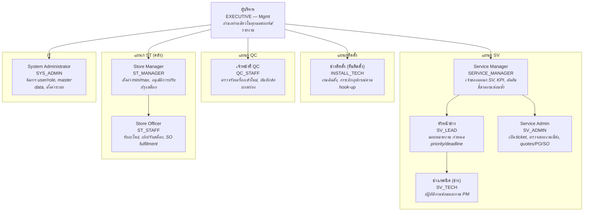
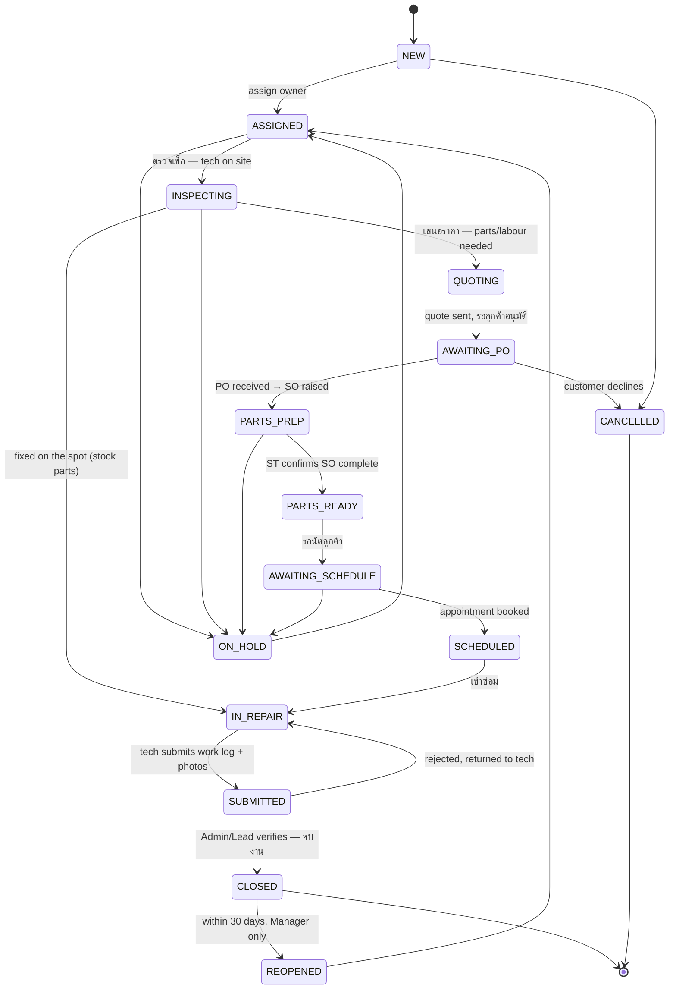
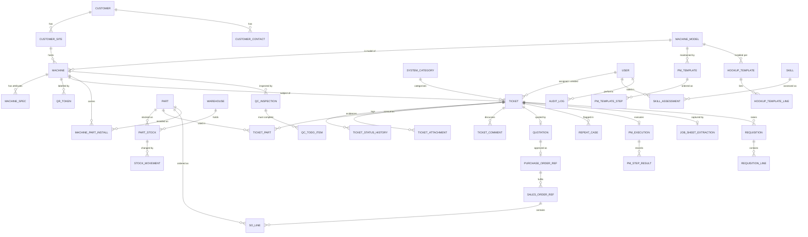

# PRD — TIL Service Management Backend

**ผลิตภัณฑ์:** TIL Back-Office System (ระบบหลังบ้านสำหรับงานบริการ ติดตั้ง ตรวจสอบคุณภาพ (QC) และอะไหล่ ของเครื่องซักผ้าอุตสาหกรรม)
**เวอร์ชันเอกสาร:** 1.0 (ฉบับร่าง)
**วันที่:** 2026-08-01
**แหล่งที่มา:** `requirement โปรแกรมหลังบ้าน TIL.pdf` (ภาษาไทย)
**สถานะ:** รอการรีวิว — โปรดดู §12 คำถามที่ยังเปิดอยู่ ก่อนเริ่มพัฒนา

---

## 1. ภาพรวมระบบ (System Overview)

### 1.1 ความเป็นมา (Background)

TIL จำหน่าย ติดตั้ง และให้บริการเครื่องซักผ้าอุตสาหกรรม (washer-extractors, dryers, ironers และระบบสนับสนุนที่เกี่ยวข้อง) ให้กับโรงแรม โรงพยาบาล หน่วยงานราชการ และร้านซักรีดเชิงพาณิชย์ ปัจจุบันงานบริการถูกประสานงานผ่านโทรศัพท์ LINE และใบงานกระดาษ (paper job sheets) ซึ่งก่อให้เกิดปัญหาซ้ำๆ 4 ข้อ ตามที่ระบุไว้ในเอกสารความต้องการ (requirements):

1. **งานตกหล่น** — งานที่แจ้งกับช่างด้วยวาจาไม่เคยถูกส่งต่อไปยังพูล (pool) ของ Admin
2. **ไม่มีการมองเห็นแบบเรียลไทม์ (real-time visibility)** — หัวหน้างานไม่สามารถเห็นความคืบหน้าของแผนกได้โดยไม่ต้องถามทีละคน
3. **งานซ่อมซ้ำที่มองไม่เห็น** — เครื่องเดิมเสียซ้ำด้วยอาการเดิมจะถูกพบก็ต่อเมื่อมีการ export ข้อมูลมาตรวจสอบด้วยมือในช่วงสิ้นเดือนเท่านั้น
4. **การคีย์ข้อมูลด้วยมือ** — ช่างเขียนใบงานกระดาษแล้ว Admin ต้องพิมพ์เข้าระบบใหม่

### 1.2 วิสัยทัศน์ผลิตภัณฑ์ (Product Vision)

เอกสารความต้องการระบุหลักการชี้นำไว้อย่างชัดเจน (ไฮไลต์ในต้นฉบับ):

> **"เข้าไว ซ่อมจบ ไม่ทำงานซ้ำ ติดตามงานได้แบบ Real time"**
> *ตอบสนองรวดเร็ว · ซ่อมให้จบ · ไม่ทำงานซ้ำ · ติดตามทุกอย่างแบบเรียลไทม์*

ทุกฟีเจอร์ใน PRD ฉบับนี้ถูกอ้างอิงเหตุผลจากหนึ่งใน 4 ข้อดังกล่าว

### 1.3 ขอบเขตงาน (Scope)

**ในขอบเขต (v1):**

| ส่วนงาน (Area) | แผนกที่เกี่ยวข้อง (Departments) |
|---|---|
| วงจรชีวิตของ service ticket (งานซ่อม + งานป้องกัน) | SV |
| การระบุตัวเครื่องจักรด้วย QR-code | SV, ST |
| ข้อมูลหลักของลูกค้า / เครื่องจักร / ผู้ติดต่อ (master data) | SV |
| ประวัติการบริการเครื่องจักร & การ export | SV |
| การตรวจจับและแจ้งเตือนงานซ่อมซ้ำ (repeat-repair KPI) | SV |
| พูลงานส่วนบุคคลและระดับแผนก, ปฏิทิน | SV |
| แดชบอร์ดประสิทธิภาพ, skill matrix | SV |
| PM (preventive maintenance) checklist ที่บังคับลำดับขั้นตอน | SV |
| การจับข้อความจากรูปถ่ายใบงานด้วย AI (AI photo-to-text job-sheet capture) | SV |
| การตรวจสอบคุณภาพเครื่องจักรขาเข้า (inbound QC inspection) และ to-do list | QC |
| สต็อกอะไหล่, min/max, การเบิก (requisition), การแจ้งเตือน SO fulfilment | ST |
| การเบิกอุปกรณ์ติดตั้งตาม Hook-up | Installation |
| Audit log ระดับ global สำหรับทุกการแก้ไขข้อมูล (mutation) | ทุกแผนก |

**นอกขอบเขต (v1) — จัดไว้สำหรับเฟสถัดไป:**

- พอร์ทัลสำหรับลูกค้า (customer-facing portal) หรือการให้ลูกค้าเปิด ticket ด้วยตนเอง
- ระบบเสนอราคา/ตั้งราคา (quoting/pricing engine) และการออกใบแจ้งหนี้ (invoicing) — ระบบนี้เก็บเพียง **การอ้างอิง (references)** ของ quote/PO/SO และสถานะ ไม่ใช่ตัวเอกสารทางการเงินจริง (ดู §12 Q1)
- Payroll, HR, การจัดการวันลา
- อัลกอริทึมการหาเส้นทางที่เหมาะสม (route optimisation) / การจัดตารางส่งช่าง (technician dispatch scheduling)
- แอปมือถือแบบ native นอกเหนือจาก PWA (ดู §12 Q4)

### 1.4 สรุปสถาปัตยกรรม (Architecture Summary)

PRD ฉบับนี้ระบุ **backend**: REST API พร้อม background workers ไคลเอนต์ (technician mobile PWA, Admin web console, supervisor dashboards) จะเรียกใช้งานผ่าน API นี้

```
┌──────────────┐  ┌──────────────┐  ┌──────────────┐
│ Technician   │  │ Admin / SV   │  │ Manager      │
│ mobile (PWA) │  │ web console  │  │ dashboards   │
└──────┬───────┘  └──────┬───────┘  └──────┬───────┘
       │  HTTPS / JWT    │                 │
       └────────────┬────┴─────────────────┘
                    ▼
        ┌───────────────────────────┐
        │   API Gateway / REST API  │  RBAC, rate limit, audit
        └────────┬──────────────────┘
                 │
   ┌─────────────┼──────────────┬──────────────┐
   ▼             ▼              ▼              ▼
┌────────┐  ┌──────────┐  ┌──────────┐  ┌────────────┐
│Postgres│  │  Redis   │  │ S3 object│  │ Job queue  │
│(OLTP)  │  │(cache,   │  │ store    │  │ (workers)  │
│        │  │ locks)   │  │ (photos) │  │            │
└────────┘  └──────────┘  └──────────┘  └─────┬──────┘
                                              │
              ┌───────────────────────────────┼──────────────┐
              ▼               ▼               ▼              ▼
        LINE Messaging   Claude API      Push (FCM)     Email (SMTP)
        API (staff       (photo→text     mobile         reports
        notifications)   OCR)            alerts
```

**ข้อจำกัดสำคัญที่ไม่ชัดเจนในตัว (Key non-obvious constraint):** ช่างเทคนิคทำงานอยู่ในห้องใต้ดินและห้องเครื่องของโรงซักผ้า ซึ่งสัญญาณมือถือมักอ่อนหรือไม่มีสัญญาณเลย ไคลเอนต์จึงต้องเป็นแบบ **offline-first** ดังนั้น API ต้องรองรับการเขียนข้อมูล (writes) ที่เป็น idempotent และถูกส่งซ้ำ (replayed) โดยใช้ client-generated IDs และ client-supplied timestamps รายละเอียดระบุไว้ใน §5.4 และ §9.6

---

## 1.5 ผังโครงสร้างองค์กร (Organization Chart)

แผนภาพด้านล่างจัดกลุ่มบทบาท (§2.1) ตามแผนก เอกสารความต้องการไม่ได้ระบุสายบังคับบัญชาข้ามแผนกไว้อย่างชัดเจนสำหรับ `INSTALL_TECH` หรือ `QC_STAFF` จึงแสดงสองแผนกนี้แยกเดี่ยวขึ้นตรงต่อ Executive



---

## 2. บทบาทผู้ใช้และสิทธิ์การเข้าถึง (User Roles & Permissions)

บทบาท (Roles) ถูกกำหนดไว้เป็นลำดับแรก เพราะความสามารถของทุกโมดูลถูกจำกัดขอบเขตด้วยบทบาทเหล่านี้

### 2.1 คำนิยามบทบาท (Role Definitions)

| Role | Code | Department | คำอธิบาย |
|---|---|---|---|
| System Administrator | `SYS_ADMIN` | IT | จัดการ user/role, master data, ตั้งค่าระบบ ไม่มีสิทธิ์ในเวิร์กโฟลว์ธุรกิจ (business workflow) โดยดีฟอลต์ |
| Service Manager | `SERVICE_MANAGER` | SV | เจ้าของแผนก SV เห็น ticket, KPI, แดชบอร์ดทั้งหมด ตัดสินชี้ขาดกรณีงานซ่อมซ้ำ (repeat-repair) |
| Head Technician | `SV_LEAD` | SV | หัวหน้าช่าง มอบหมายงาน กำหนด priority/deadline รีวิวงานที่ช่างส่ง ร่วมตัดสินชี้ขาดกรณีงานซ้ำ |
| Service Admin | `SV_ADMIN` | SV | เปิด ticket จากสายโทรศัพท์/LINE ของลูกค้า ตรวจสอบงานที่ช่างส่งมา จัดการ quotes/PO/SO references |
| Service Technician | `SV_TECH` | SV | ช่าง สแกน QR เปิด/ทำ/ส่งงานซ่อมและงาน PM |
| Installation Technician | `INSTALL_TECH` | Installation | ทีมติดตั้ง ทำงานติดตั้ง เปิดคำขอเบิกอุปกรณ์ตาม hook-up |
| QC Officer | `QC_STAFF` | QC | ตรวจสอบเครื่องจักรขาเข้า บันทึกข้อบกพร่องเข้าพูลของ SV ดูแล to-do list การดัดแปลงเครื่อง |
| Store Officer | `ST_STAFF` | ST | รับอะไหล่ ยืนยันการปิด SO เบิก/รับสต็อก ทำการนับสต็อก |
| Store Manager | `ST_MANAGER` | ST | มีสิทธิ์เหมือน ST_STAFF บวกกับการตั้งค่า min/max และอนุมัติการปรับปรุงสต็อก |
| Executive | `EXECUTIVE` | Mgmt | อ่านอย่างเดียว (read-only) ในทุกแดชบอร์ดและรายงาน ไม่มีสิทธิ์แก้ไขข้อมูล |

ผู้ใช้สามารถถือ **หลายบทบาทพร้อมกัน (multiple roles)** ได้ (กรณีที่พบบ่อย: สาขาเล็กที่คนเดียวเป็นทั้ง `SV_ADMIN` และ `ST_STAFF`) สิทธิ์การเข้าถึงคือผลรวม (union) ของทุกบทบาทที่ถืออยู่

### 2.2 ตารางสิทธิ์การเข้าถึง (Permission Matrix)

คำอธิบายสัญลักษณ์: **C**reate (สร้าง) · **R**ead (อ่าน) · **U**pdate (แก้ไข) · **D**elete/void (ลบ/ยกเลิก) · **A**pprove (อนุมัติ) · **—** ไม่มีสิทธิ์เข้าถึง
"Own" = เรคคอร์ดที่ผู้ใช้เป็นผู้รับมอบหมาย (assignee) หรือผู้สร้าง (creator)

| ความสามารถ (Capability) | SYS_ADMIN | SERVICE_MANAGER | SV_LEAD | SV_ADMIN | SV_TECH | INSTALL_TECH | QC_STAFF | ST_STAFF | ST_MANAGER | EXECUTIVE |
|---|---|---|---|---|---|---|---|---|---|---|
| Users & roles | CRUD | R | R | — | — | — | — | — | — | — |
| Customers / sites | R | CRU | R | CRU | R | R | R | R | R | R |
| Customer contacts (PII) | R | CRU | R | CRU | R | R | — | — | — | R |
| Machines & specs | R | CRU | CRU | CRU | R+U¹ | R+U¹ | R+U¹ | R | R | R |
| Machine QR tokens | CRUD | CR | CR | CR | R | R | R | R | R | — |
| Tickets — create | — | C | C | C | C | C | C | — | — | — |
| Tickets — read | R | R all | R all | R all | R own + dept pool | R own | R own + SV pool | R (SO-linked) | R (SO-linked) | R all |
| Tickets — assign / priority / deadline | — | U | U | U | — | — | — | — | — | — |
| Tickets — advance status | — | U | U | U | U own | U own | U own | U² | U² | — |
| Tickets — close (จบงาน) | — | A | A | A | — | — | — | — | — | — |
| Tickets — reopen / void | — | A | A | — | — | — | — | — | — | — |
| Work log + mandatory photos | — | R | R | RU | CRU own | CRU own | CRU own | — | — | R |
| PM execution | — | R | R | R | CRU own | — | — | — | — | R |
| Quote / PO / SO reference records | — | CRU | R | CRU | R | — | — | R | R | R |
| Repeat-repair case adjudication | — | A | A | R | R | — | — | — | — | R |
| Parts catalogue | R | R | R | R | R | R | R | CRU | CRU | R |
| Stock balance lookup | R | R | R | R | R | R | R | R | R | R |
| Stock issue / receive / transfer | — | — | — | — | C³ | C³ | — | CRU | CRU | — |
| Stock adjustment (count correction) | — | — | — | — | — | — | — | C | A | — |
| Min/max thresholds | — | R | R | R | R | — | — | R | CRU | R |
| Hook-up templates | R | R | R | CRU | R | R | — | R | CRU | R |
| Installation requisition | — | R | R | R | — | CRU own | — | RU | RU | R |
| QC inbound inspection | — | R | R | R | R | — | CRU | R | R | R |
| Dashboards & KPIs | R | R all | R dept | R dept | R own | R own | R own | R dept | R dept | R all |
| Skill matrix / performance | R | CRU | CRU | R own | R own | R own | R own | R own | R own | R |
| Export machine history | — | ✓ | ✓ | ✓ | ✓ | — | ✓ | — | — | ✓ |
| Audit log | R | R | R dept | — | — | — | — | — | R dept | R |

¹ ช่างเทคนิค/QC สามารถเพิ่มเติม (append) ผลการตรวจพบและแก้ไขข้อมูลจำเพาะ (specification corrections) ในเรคคอร์ดเครื่องจักรได้ แต่ลบหรือเปลี่ยนชื่อไม่ได้ การแก้ไขทั้งหมดนี้ถูกบันทึกลง audit log และถูก flag ให้ `SV_ADMIN` รีวิว
² `ST_STAFF`/`ST_MANAGER` สามารถเลื่อนสถานะ ticket ได้เฉพาะ transition ที่เกี่ยวกับ SO เท่านั้น (`PARTS_PREP → PARTS_READY`) ไม่สามารถเลื่อนสถานะอื่นได้
³ ช่างเทคนิคสามารถ *ขอ (request)* การเบิกกับ ticket ที่ตนเองเป็นเจ้าของได้เท่านั้น การเคลื่อนไหวสต็อก (movement) จะถูกบันทึกเมื่อ `ST_STAFF` ยืนยัน หรือทันทีหากคลังนั้นเปิดใช้งาน self-service issue (§6.8)

### 2.3 กฎการจำกัดขอบเขตข้อมูล (Data Scoping Rules)

นอกเหนือจากการตรวจสอบ role แล้ว ยังมีการจำกัดขอบเขตระดับแถวข้อมูล (row-level scoping) ดังนี้:

- `SV_TECH` / `INSTALL_TECH` เห็นพูลงานทั้งหมดของแผนก (ตั้งใจให้เป็นเช่นนี้ — เอกสารความต้องการระบุว่าพูลนี้มีไว้เพื่อให้ทีมช่วยกันตรวจสอบงานที่ตกหล่น) แต่สามารถ **แก้ไข (mutate)** ได้เฉพาะ ticket ที่มอบหมายให้ตนเองเท่านั้น
- `QC_STAFF` สามารถอ่าน ticket ของ SV ที่ตนเองเป็นผู้ริเริ่ม (originated) ได้ เพื่อติดตามผลข้อบกพร่องที่ตนแจ้งไว้
- `ST_STAFF` อ่านได้เฉพาะฟิลด์ส่วนหัวของ ticket ที่จำเป็นสำหรับการดำเนินการ SO (ลูกค้า, เครื่องจักร, รายการอะไหล่) เท่านั้น — ไม่รวม work log หรือรูปถ่ายของช่าง
- `EXECUTIVE` เป็น read-only เท่านั้น และทุก endpoint ต้องปฏิเสธการเขียนข้อมูลจาก token ของ executive-only โดยไม่มีข้อยกเว้น ไม่ว่าจะผ่านการตรวจสอบอื่นใดก็ตาม

---

## 3. เวิร์กโฟลว์งานซ่อมหลักและสถานะ Ticket (Core Repair Workflow & Ticket Statuses)

### 3.1 ช่องทางการรับงาน (Intake Channels)

เอกสารความต้องการระบุช่องทางการรับงาน 4 ช่องทาง ทั้งหมดจะรวมเข้าสู่เรคคอร์ด `ticket` เดียวในพูลของ SV

| # | เส้นทาง (Path) | Source enum | หมายเหตุ |
|---|---|---|---|
| 1 | ลูกค้า → ช่าง (โทร/LINE) → ช่างแจ้ง Admin → Admin เปิด ticket | `PHONE`, `LINE` | เส้นทางที่ไม่เป็นทางการที่พบบ่อยที่สุด ช่างอาจเปิดงานเองโดยตรงก็ได้ (เส้นทางที่ 3) |
| 2 | ลูกค้า → Admin โดยตรง | `PHONE`, `LINE`, `EMAIL` | Admin เปิด ticket ทันที |
| 3 | ช่างสแกน QR เครื่องจักรที่หน้างานและเปิด ticket | `QR_ONSITE` | สำหรับปัญหาเพิ่มเติมที่ลูกค้าแจ้งระหว่างการเข้างาน |
| 4 | QC พบข้อบกพร่องในเครื่องจักรขาเข้าและบันทึกเข้าพูลของ SV | `QC_INBOUND` | มีรูปถ่ายและการอ้างอิงผลตรวจ QC แนบมาด้วย |

ขั้นตอนการเปิด ticket โดย Admin (จาก §"การเปิด Task งานของทีม SV"):

```
customer/project list → เลือกลูกค้า
  → customer machine list (เครื่องจักรทั้งหมดที่ TIL ขายให้ลูกค้ารายนี้)
    → เลือกเครื่องจักร
      → เลือกหมวดระบบ (หมวด)
        → เปิด ticket ในพูลของ SV
```

### 3.2 หมวดระบบ (System Categories — หมวดที่จะตรวจเช็ก/ซ่อม)

เป็นตาราง lookup ที่ seed ไว้ล่วงหน้า หมวดนี้ **มีน้ำหนักสำคัญ (load-bearing)** — เป็นครึ่งหนึ่งของคีย์ที่ใช้ตรวจจับงานซ่อมซ้ำ (repeat-repair detection) (§3.6) เอกสารความต้องการระบุรายการดังนี้:

| Code | ภาษาไทย | English |
|---|---|---|
| `ELEC_CTRL` | ระบบไฟฟ้าและควบคุม | Electrical & control |
| `WATER` | ระบบน้ำ | Water |
| `STEAM` | ระบบไอน้ำ | Steam |
| `GAS` | ระบบแก๊ส | Gas |
| `AIR` | ระบบลม | Compressed air |
| `DRIVE` | ระบบขับเคลื่อน | Drive |
| `SUSPENSION` | ระบบรองรับแรงสั่นสะเทือน | Vibration damping / suspension |
| `STRUCTURE` | ระบบโครงสร้าง/ตะกร้าผ้า | Structure / basket |
| `HEATING` | ระบบทำความร้อน | Heating |
| `OTHER` | อื่นๆ | Other (จำเป็นต้องกรอกข้อความเพิ่มเติม) |

รายการนี้ Admin สามารถแก้ไขเพิ่มเติมได้ (`ฯลฯ` ในต้นฉบับสื่อว่ารายการนี้ยังไม่ครบถ้วนสมบูรณ์) หมวดหมู่จะ **ลบไม่ได้เมื่อถูกอ้างอิงแล้ว** ทำได้แค่ปิดใช้งาน (deactivate) เท่านั้น

### 3.3 ประเภท Ticket (Ticket Types)

พูลของแผนกต้องบรรจุงาน SV **ทั้งหมด** ไม่ใช่แค่งานซ่อมของลูกค้า — เอกสารความต้องการระบุชัดเจนว่างานสำนักงานต้องอยู่ในพูลเดียวกัน "เพื่อป้องกันงานของแผนกตกหล่น" แต่ให้จัดกลุ่มแสดงผลแยกกันในเชิงภาพ

| Type | คำอธิบาย | ต้องมีเครื่องจักร? | ต้องมีหมวด? |
|---|---|---|---|
| `SERVICE` | งานซ่อม/ตรวจสอบเชิงแก้ไขให้ลูกค้า | Yes | Yes |
| `PM` | งานบำรุงรักษาเชิงป้องกัน, checklist ที่บังคับลำดับขั้นตอน | Yes | No (ขับเคลื่อนด้วย PM template) |
| `INSTALLATION` | การติดตั้งเครื่องจักรใหม่ | Yes | No |
| `QC_INBOUND` | ข้อบกพร่อง/การดัดแปลงบนเครื่องจักรที่เพิ่งเข้ามาใหม่ | Yes | Yes |
| `OFFICE` | งาน Office SV — ป้ายสัญลักษณ์, การแปลคู่มือ, การอบรม ฯลฯ | No | No |

ticket ประเภท `OFFICE` ใช้กลไกพูล, การมอบหมาย, priority, deadline และการติดตามความคืบหน้าร่วมกับประเภทอื่น แต่ข้ามข้อกำหนดเรื่องเครื่องจักร/หมวด/อะไหล่/รูปถ่าย

### 3.4 State Machine ของ Service Ticket

เอกสารความต้องการระบุลำดับขั้นตอนไว้ดังนี้:
`ตรวจเช็ก → เสนอราคา → รอลูกค้าอนุมัติ (PO) → จัดเตรียมอะไหล่ (SO) → รอนัดลูกค้า → เข้าซ่อม → จบงาน`

ไม่ใช่ทุก ticket ที่จะผ่านทุกสถานะ — งานที่ซ่อมเสร็จหน้างานด้วยอะไหล่ในสต็อกจะข้ามขั้นตอนเสนอราคาไปเลย state machine ด้านล่างอนุญาตให้ลัดขั้นตอนดังกล่าวได้อย่างชัดเจน



| Status | ภาษาไทย | สถานะสิ้นสุด? | ใครเข้าสถานะนี้ได้ |
|---|---|---|---|
| `NEW` | เปิดงาน | No | บทบาทที่เป็นผู้สร้างงานใดๆ |
| `ASSIGNED` | มอบหมายแล้ว | No | `SV_ADMIN`, `SV_LEAD`, `SERVICE_MANAGER` |
| `INSPECTING` | ตรวจเช็ก | No | ผู้รับมอบหมาย (Assignee) |
| `QUOTING` | เสนอราคา | No | `SV_ADMIN`, `SV_LEAD` |
| `AWAITING_PO` | รอลูกค้าอนุมัติ (PO) | No | `SV_ADMIN` |
| `PARTS_PREP` | จัดเตรียมอะไหล่ (SO) | No | `SV_ADMIN` |
| `PARTS_READY` | อะไหล่ครบ | No | **`ST_STAFF` เท่านั้น** |
| `AWAITING_SCHEDULE` | รอนัดลูกค้า | No | `SV_ADMIN`, ผู้รับมอบหมาย |
| `SCHEDULED` | นัดหมายแล้ว | No | `SV_ADMIN`, ผู้รับมอบหมาย |
| `IN_REPAIR` | เข้าซ่อม | No | ผู้รับมอบหมาย |
| `SUBMITTED` | ส่งงานแล้ว | No | ผู้รับมอบหมาย |
| `CLOSED` | จบงาน | Yes | `SV_ADMIN`, `SV_LEAD`, `SERVICE_MANAGER` |
| `ON_HOLD` | พักงาน | No | ผู้รับมอบหมาย + บทบาทข้างต้น; ต้องระบุเหตุผลบังคับ |
| `CANCELLED` | ยกเลิก | Yes | `SV_ADMIN` ขึ้นไป; ต้องระบุเหตุผลบังคับ |
| `REOPENED` | เปิดใหม่ | No | `SERVICE_MANAGER` เท่านั้น |

**ข้อกำหนดเรื่อง timestamp (บังคับ, จากต้นฉบับ):** *"ทุก Progress จะต้องมีวันที่ระบุ เพื่อให้ติดตามระยะเวลาในการทำงานได้ เพราะต้องการตั้ง KPI Mean Time to Respond (MTTR) ในอนาคต."*
ทุกการเปลี่ยนสถานะ (transition) จะเขียนแถวข้อมูลที่ไม่เปลี่ยนแปลง (immutable) ลงใน `ticket_status_history` ประกอบด้วย `from_status`, `to_status`, `changed_by`, `changed_at`, `note` ค่า MTTR และระยะเวลาที่ค้างในแต่ละขั้น (per-stage dwell time) จะคำนวณจากตารางนี้เท่านั้น — ไม่ใช้ `updated_at` ของ ticket เอง

> **หมายเหตุเรื่องคำศัพท์:** ต้นฉบับเขียนว่า "KPI Mean Time to respond (MTTR)" โดยทั่วไป MTTR หมายถึง *mean time to repair/restore* (เวลาเฉลี่ยในการซ่อม/คืนสภาพ) ส่วน *mean time to respond* คือ MTTA (เวลาเฉลี่ยในการตอบสนอง) schema นี้เก็บข้อมูลทั้งสองแบบ — เวลาตอบสนอง (`NEW → INSPECTING`) และเวลาซ่อม (`NEW → CLOSED`) — เพื่อให้รายงานได้ตามนิยามใดก็ได้โดยไม่ต้อง migration เพิ่ม โปรดยืนยันกับทางธุรกิจว่าต้องการแบบใดบนแดชบอร์ด (§12 Q6)

### 3.5 การเข้าทำงานและส่งงานของช่าง (Technician Execution & Submission)

ขั้นตอนจาก §"การเข้าทำงานและส่งงานของช่าง":

1. ช่างสแกน QR code บนเครื่องจักร
2. ระบบระบุ (resolve) เครื่องจักรและคืนค่า **ticket ที่เปิดอยู่บนเครื่องนั้น** (ไม่ว่าจะเปิดโดย Admin หรือช่างคนอื่น)
3. ช่างเลือก ticket ที่มีอยู่แล้ว **หรือ** เปิด ticket ใหม่ (สำหรับปัญหาที่พบเพิ่มเติมหน้างาน)
4. ช่างบันทึก work log

**หลักฐานรูปถ่ายที่บังคับ — บังคับที่ฝั่งเซิร์ฟเวอร์ (server-side)** ticket ประเภท `SERVICE` จะเข้าสถานะ `SUBMITTED` ไม่ได้ ถ้าไม่มีรูปถ่ายอย่างน้อย 1 รูปในแต่ละ 3 หมวดหมู่ตามที่เอกสารความต้องการระบุ:

| # | Category code | ภาษาไทย | ข้อกำหนด |
|---|---|---|---|
| 1 | `JOB_SHEET` | ใบงาน | ≥1 — ใบงานกระดาษที่มีลายเซ็น |
| 2 | `DEFECT_PART` | อะไหล่เสียที่ตรวจพบ | ≥1 — ชิ้นส่วนที่เสียซึ่งตรวจพบ |
| 3 | `REPLACED_PART` | อะไหล่ที่ทำการเปลี่ยนใหม่ | ≥1 **ถ้า** มีการเปลี่ยนอะไหล่; สามารถยกเว้นได้พร้อมเหตุผล ถ้าไม่มีการเปลี่ยนอะไหล่ |

Endpoint `POST /tickets/{id}/submit` จะคืนค่า `422 TICKET_PHOTO_REQUIREMENT_UNMET` พร้อมรายการหมวดหมู่ที่ขาด หมวดหมู่ที่ 3 สามารถใช้ `no_parts_replaced_reason` แทนรูปถ่ายได้ ส่วนหมวดหมู่ 1 และ 2 ไม่มีการยกเว้น

### 3.6 การตรวจจับงานซ่อมซ้ำ (Repeat-Repair Detection — KPI)

จาก §"การตรวจสอบงานซ่อมซ้ำตาม KPI":

> เป้าหมาย KPI: งานซ่อมซ้ำของเครื่องจักรเดียวกันด้วยปัญหาเดียวกันภายใน **3 วัน** ≤ **1 เครื่อง/เดือน**

**ตัวกระตุ้น (Trigger):** เมื่อมีการสร้าง ticket ด้วย `(machine_id, category_id)` ระบบจะค้นหา ticket อื่นบนเครื่องจักรและหมวดเดียวกันที่มี `opened_at` อยู่ในช่วงเวลาหมุนเวียน (rolling window) 72 ชั่วโมง (ปรับตั้งค่าได้) เมื่อพบว่าตรงกัน ระบบจะ:

1. สร้างเรคคอร์ด `repeat_case` ในสถานะ `PENDING_REVIEW` เชื่อมโยงทั้งสอง ticket
2. ตั้งค่า flag `repeat_suspect = true` บนทั้งสอง ticket
3. แจ้งเตือน `SERVICE_MANAGER`, `SV_LEAD`, และ `SV_ADMIN` **ทันที** ผ่าน in-app + LINE + push

**การตัดสินชี้ขาด (Adjudication):** ผู้จัดการหรือหัวหน้าช่างจะรีวิวและกำหนดสถานะ case เป็น `CONFIRMED_REPEAT` (นับเข้า KPI) หรือ `NOT_REPEAT` (ต้องระบุเหตุผลบังคับ — เช่น เป็นความผิดปกติที่แตกต่างกันจริงแต่อยู่ในหมวดระบบเดียวกัน) มีเพียง case ที่เป็น `CONFIRMED_REPEAT` เท่านั้นที่นับเข้าตัวเลข KPI รายเดือน

การทำงานนี้เข้ามาแทนที่กระบวนการแบบแมนวลในปัจจุบันที่เอกสารความต้องการระบุว่าเสี่ยงต่อความผิดพลาด: *"ปัจจุบันไม่มีระบบแจ้งเตือน ทำให้การรวบรวมข้อมูลยาก ต้อง Export ข้อมูล...ทุกๆสิ้นเดือน...ซึ่งอาจทำให้การเก็บข้อมูลตกหล่นได้."*

การตรวจจับต้องทำงาน **แบบ synchronous ภายใน transaction เดียวกับการสร้าง ticket** เพื่อให้ flag ปรากฏต่อผู้ใช้ที่สร้าง ticket ได้ทันที ส่วนการส่งการแจ้งเตือน (notification dispatch) จะถูก queue แบบ asynchronous

### 3.7 เวิร์กโฟลว์ PM (บังคับลำดับขั้นตอน)

จาก §"การดำเนินงานและบันทึกงาน PM": ขั้นตอนของฟอร์ม PM ได้ถูกวิเคราะห์และจัดลำดับไว้อย่างตั้งใจ *"ป้องกันการทำงานข้ามไปข้ามมาสับสนและเสียเวลา"*

กฎ:

- `pm_template` ผูกกับ machine model และมีขั้นตอนเรียงลำดับ `1, 2, 3, 4, …`
- ขั้นตอนที่ *n+1* จะถูก **ล็อก** จนกว่าขั้นตอนที่ *n* จะถูกทำเครื่องหมายว่าเสร็จสมบูรณ์ บังคับใช้ที่ฝั่งเซิร์ฟเวอร์ ไม่ใช่แค่ที่ UI — `POST /pm-executions/{id}/steps/{stepId}/complete` จะคืนค่า `409 PM_STEP_OUT_OF_ORDER` หากขั้นตอนก่อนหน้าที่จำเป็นยังไม่เสร็จ
- ขั้นตอนที่ตั้งค่า `photo_required` จะทำเครื่องหมายว่าเสร็จไม่ได้ถ้าไม่มีรูปถ่ายแนบ เอกสารความต้องการระบุตัวอย่าง: การทำความสะอาด **ก่อน/หลัง (Before/After)**, การวัดกระแสไฟฟ้า, การอัดจารบี
- ขั้นตอนที่ตั้งค่า `measurement_required` จะบันทึกค่าตัวเลขพร้อมหน่วย ค่าที่อยู่นอกช่วงที่กำหนด (out-of-tolerance) จะขึ้นคำเตือนที่ช่างต้องกดรับทราบพร้อมระบุหมายเหตุ
- PM execution จะส่ง (submit) ไม่ได้ถ้ายังมีขั้นตอนบังคับที่ไม่เสร็จสมบูรณ์

### 3.8 เวิร์กโฟลว์การติดตั้ง (Installation Workflow)

จาก §"ทีมติดตั้ง": *"ให้ระบบดึง Part ต่างๆ ตามแบบ Hook-up ที่ขึ้นทะเบียนไว้ได้เลย หากขาดอะไรให้ทีมติดตั้งเพิ่มรายการภายหลัง"* — เป้าหมายคือขจัดการเขียนรายการอะไหล่ทั้งหมดด้วยมือ เพราะรายการ hook-up มีอยู่แล้วในระบบ

1. เปิด ticket ติดตั้งผูกกับเครื่องจักร (และ hook-up template ของมัน)
2. คำขอเบิก (Requisition) จะถูก **เติมข้อมูลล่วงหน้า (pre-populated)** จาก `hookup_template_lines` — ช่างไม่ต้องพิมพ์รายการเอง
3. ช่างปรับจำนวน, ลบรายการที่ไม่จำเป็น, และ **เพิ่ม** รายการพิเศษที่พบหน้างาน (`source = ADDED_ONSITE` ซึ่งจะถูกรายงานแยกต่างหากเพื่อนำไปปรับปรุง template ในอนาคต)
4. ส่งคำขอเบิก → ST เบิกจ่ายสต็อก → การเคลื่อนไหวสต็อกถูกบันทึกผูกกับ ticket

### 3.9 เวิร์กโฟลว์ QC เครื่องจักรขาเข้า (QC Inbound Workflow)

จาก §"แผนก QC / งานตรวจรับเครื่องเข้าใหม่":

- QC ตรวจสอบเครื่องจักรที่เพิ่งมาถึงใหม่และบันทึกผล
- ถ้าชำรุดหรือต้องการดัดแปลง QC จะสร้าง ticket **โดยตรงในพูลของ SV** (`ticket_type = QC_INBOUND`, `source = QC_INBOUND`) พร้อมแนบรูปถ่าย
- QC ดูแล **to-do list สำหรับเครื่องจักรที่มาจากประเทศจีน** ที่ต้องการดัดแปลงหรืองานเพิ่มเติม — เป็นมาตรการป้องกันการตกหล่นที่ระบุไว้อย่างชัดเจน (`ป้องกันการตกหล่น`) แต่ละรายการเป็นแถว checklist ที่ผูกกับผลตรวจขาเข้า มีเจ้าของงานและสถานะความสมบูรณ์ของตนเอง การตรวจสอบ (inspection) จะทำเครื่องหมายว่าเสร็จสมบูรณ์ไม่ได้ถ้ายังมีรายการ to-do บังคับที่ยังเปิดอยู่

---

## 4. โมดูลฟีเจอร์ (Feature Modules)

### M1 — Identity, Roles & Access Control
- User CRUD, การกำหนด role (multi-role), การเป็นสมาชิกแผนก (department membership)
- JWT access + refresh tokens; บังคับ MFA สำหรับ `SERVICE_MANAGER`, `ST_MANAGER`, `SYS_ADMIN`
- การเพิกถอน session (Session revocation), บังคับ logout เมื่อมีการเปลี่ยน role
- ทุก endpoint ที่แก้ไขข้อมูล (mutating) จะตรวจสอบทั้ง role **และ** row scope (§2.3)

### M2 — Customer, Site & Machine Master Data
- ลำดับชั้น Customer → Site/Project → Machine
- การนำทาง `customer/project list` และ `customer machine list` (เส้นทางเดียวกับที่เอกสารความต้องการระบุไว้สำหรับการเปิด ticket ของ Admin)
- **ฟิลด์ข้อมูลจำเพาะเครื่องจักร (Machine specification fields)** ที่เอกสารความต้องการระบุชื่อไว้:
  - `site_machine_no` — หมายเลขเครื่องหน้างาน (หมายเลขเครื่องของลูกค้าเอง ซึ่งมักต่างจากหมายเลขของเรา)
  - `spider_shaft_size` — ขนาดเพลากากบาท (สำคัญเพราะ *"กรณีเครื่องจีนเปลี่ยน Model แต่ไม่ได้แจ้ง"* — ผู้ผลิต OEM จีนเปลี่ยนโมเดลโดยไม่แจ้งล่วงหน้า)
  - `shock_absorber_count` — จำนวนโช๊คอัพ (สำหรับเครื่องที่ถูกดัดแปลงหรือเปลี่ยนโมเดล)
  - `location_map` — แผนที่/เส้นทางไปยังเครื่องจักร
  - ข้อมูลจำเพาะเพิ่มเติมแบบไม่จำกัดรูปแบบ ผ่านตาราง key-value ที่มีชนิดข้อมูล (typed extension table) (`ฯลฯ` ในต้นฉบับสื่อว่าเปิดกว้างไม่จำกัด)
- **ทำเนียบผู้ติดต่อ (Contact roster)** ต่อไซต์งาน พร้อมบทบาทที่ระบุไว้ชัดเจน: House Keeping Manager, Laundry Manager, Laundry Supervisor, Laundry Worker (ถ้ามี), Chief Engineer, Chief Engineer Assistant, เลขาช่าง (technician secretary) แต่ละคนมีชื่อ + เบอร์โทร
- **บล็อกลักษณะ/หมายเหตุลูกค้า (Customer character/remark block):** ข้อความอิสระ (free-text) บวก flag แบบมีโครงสร้างสำหรับ `customer_tier` (ระดับความสำคัญ), `is_government`, `is_vip`, และกฎเฉพาะไซต์ที่ลูกค้ากำหนด (PPE, ช่วงเวลาเข้างาน, ขั้นตอนการลงชื่อเข้า-ออก) แสดงอย่างเด่นชัดบนหน้ารายละเอียด ticket เพื่อให้ *"ทีมงานทราบข้อมูลและเน้นย้ำทีมก่อนเข้าดำเนินการ"*
- วันที่ติดตั้งและวันหมดประกันต่อเครื่องจักร

### M3 — QR Code Management
- เครื่องจักรทุกเครื่องมีป้าย QR ที่เข้ารหัส token ที่ไม่สามารถเดาได้ (opaque, non-guessable) (ไม่ใช่หมายเลขซีเรียล — ดู §10.5)
- การสแกนจะ resolve token → เครื่องจักร + ticket ที่เปิดอยู่ + สถานะครบกำหนด PM
- การพิมพ์ป้ายใหม่พร้อมการหมุนเวียน token (token rotation) และ audit trail (เครื่องจักรอาจถูกติดป้ายใหม่หลังทาสีใหม่หรือเปลี่ยนแผงเครื่อง)
- อะไหล่ก็มีป้าย QR สำหรับการเบิกสต็อกเช่นกัน (§M8)

### M4 — Ticket Pool & Lifecycle
- สร้างผ่านทั้ง 4 ช่องทางการรับงาน (§3.1)
- การมอบหมาย, วัน check point, deadline, priority (`URGENT | HIGH | NORMAL | LOW`)
- การเปลี่ยนสถานะพร้อมประวัติที่บังคับบันทึก (§3.4)
- การจัดกลุ่ม: **งานช่าง (customer)** vs **งาน Office SV** — เป็นตัวกรอง (filter) หลักระดับ first-class ตามข้อกำหนดที่ทั้งสองประเภทอยู่ในพูลเดียวกันแต่แสดงผลแยกกลุ่มกัน
- **การค้นหาสากล (Universal search)**, 6 คีย์ตามที่เอกสารความต้องการระบุ (ปรากฏซ้ำสองครั้งในต้นฉบับ จึงถือว่ามีความสำคัญสูง):
  1. ชื่อลูกค้า (ชื่อลูกค้า)
  2. หมายเลขซีเรียลเครื่องจักร (Serial number เครื่อง)
  3. หมายเลขอะไหล่ (Part number อะไหล่)
  4. เลขที่ใบงาน (เลขที่ใบงาน)
  5. เลขที่ PO (เลขที่ PO)
  6. เลขที่ SO (เลขที่ SO)

### M5 — Work Log & Evidence Capture
- Work log แบบมีโครงสร้าง: อาการที่พบ, สาเหตุที่แท้จริง (root cause), การดำเนินการ, อะไหล่ที่เปลี่ยน, เวลาที่ใช้ (labour time)
- อัปโหลดรูปถ่ายตามหมวดหมู่ พร้อมการบังคับหมวดหมู่ที่ฝั่งเซิร์ฟเวอร์ (§3.5)
- **AI photo-to-text** (§M11) เพื่อเติมข้อมูล work log ล่วงหน้าจากรูปถ่ายใบงานกระดาษ
- ขั้นตอนตรวจสอบโดย Admin: `SUBMITTED → CLOSED` หรือ `SUBMITTED → IN_REPAIR` (ถูกปฏิเสธ พร้อมเหตุผลที่ส่งกลับไปยังช่าง)

### M6 — PM Templates & Execution
- การสร้าง template ต่อ machine model: ขั้นตอนเรียงลำดับ, ข้อกำหนดรูปถ่าย/การวัด, ช่วงค่าที่ยอมรับได้ (tolerance bands)
- การทำงาน (execution) ที่บังคับลำดับจากฝั่งเซิร์ฟเวอร์ (§3.7)
- การสร้างตารางเวลา PM และการแจ้งเตือนครบกำหนด/เลยกำหนด

### M7 — Machine History & Export
- ประวัติการบริการแบบเรียงตามลำดับเวลา ต่อเครื่องจักรและต่อโปรเจกต์
- **การ export แบบหนึ่งงานต่อหนึ่งแถว** — เอกสารความต้องการระบุอย่างชัดเจน: *"ข้อมูลแต่ละงานต้องอยู่ใน Row เดียวกันทั้งหมด"* นี่เป็นข้อกำหนดรูปแบบที่บังคับสำหรับการ export ไม่ใช่ข้อเสนอแนะ; รูปแบบหลายบรรทัดหรือ merged-cell ถือว่าไม่ถูกต้องตามข้อกำหนด
- การ export ต้องตอบคำถามสรุปตามที่เอกสารความต้องการระบุไว้ตรงตัว: เครื่องนี้ติดตั้งเมื่อไร, ประกันหมดอายุเมื่อไร, ซ่อมหรือเคลมอะไรไปบ้าง, และมีค่าใช้จ่ายเท่าไร?
- รูปแบบไฟล์: XLSX (หลัก), CSV สร้างแบบ async พร้อมลิงก์ดาวน์โหลดสำหรับช่วงข้อมูลขนาดใหญ่

### M8 — Spare Parts & Inventory
- Parts catalogue: หมายเลขอะไหล่, ชื่อ, คำอธิบาย, หน่วยนับ, **รูปภาพ**, ข้อมูลจำเพาะ, การเชื่อมโยงอะไหล่ที่ใช้ทดแทน (supersession links)
- **การค้นหาสต็อกโดยช่างด้วยหมายเลขอะไหล่ (Technician stock lookup by part number)** ที่คืนค่ายอดคงเหลือพร้อม *"รูปอะไหล่แสดงทุกรายละเอียดที่จำเป็นให้ครบถ้วน"* endpoint นี้อ่านข้อมูลบ่อยและไวต่อ latency ใช้งานหน้างาน จึงต้อง cache และต้อง degrade อย่างสวยงามเมื่อออฟไลน์ (ใช้ยอดคงเหลือล่าสุดที่ทราบพร้อม timestamp ระบุความล้าสมัยอย่างชัดเจน)
- หลายคลัง (Multi-warehouse): HQ บวก **สำนักงานสาขาภูเก็ต** ซึ่งเอกสารความต้องการระบุไว้เป็นพิเศษว่าต้องเก็บสต็อกของลูกค้า แต่ปัจจุบันยังขาดทั้งบุคลากรและระบบสนับสนุน
- การเคลื่อนไหวสต็อก (Movements): `RECEIPT`, `ISSUE`, `RETURN`, `TRANSFER`, `ADJUSTMENT`, `RESERVE`, `RELEASE` ทุกการเคลื่อนไหวเป็น immutable และระบุผู้กระทำ (attributed)
- **ระดับ min/max ต่ออะไหล่ต่อคลัง** พร้อมการแจ้งเตือนเติมสต็อกอัตโนมัติเมื่อยอดคงเหลือ ≤ min
- **การเบิกด้วย QR บนมือถือ (Mobile QR issue):** สแกน QR code ของอะไหล่เพื่อเบิกและตัดสต็อก (`เบิกของและตัด Stock Online ผ่านแอพโดยใช้มือถือสแกน QR code`) หรือบันทึกการเบิกด้วยมือ
- การบัญชีแบบจอง-เทียบ-พร้อมใช้ (Reserved-vs-available accounting) เพื่อไม่ให้อะไหล่ที่จองไว้กับ SO ที่เปิดอยู่ถูกเบิกซ้ำสอง (double-issued)

### M9 — Quote / PO / SO Reference Tracking
- เรคคอร์ดอ้างอิงแบบเบา (Lightweight reference records): เลขที่, วันที่, จำนวนเงิน, สถานะ, ticket ที่เชื่อมโยง, อะไหล่ที่เชื่อมโยง
- **การแจ้งเตือน SO fulfilment (ST → SV):** จาก §"การแจ้งเตือนอะไหล่เข้าครบตาม SO" — เมื่อ ST ได้รับของครบตาม SO แล้ว พวกเขาจะเปลี่ยนสถานะและระบบจะแจ้ง SV ว่าอะไหล่พร้อมแล้วและสามารถส่งช่างได้ transition นี้เป็น transition **เดียวเท่านั้น** ที่ `ST_STAFF` มีสิทธิ์เปลี่ยนสถานะ ticket ได้
- การติดตามการรับของบางส่วน (Partial-receipt tracking) เพื่อให้ SV เห็นว่ายังเหลืออะไรที่ยังไม่ได้รับ

### M10 — Notifications & Alerts

| เหตุการณ์ (Event) | ผู้รับ (Recipients) | ช่องทาง (Channels) | ระดับความสำคัญ (Priority) |
|---|---|---|---|
| Ticket ถูกมอบหมายให้ฉัน | ผู้รับมอบหมาย | Push, in-app | Normal |
| สงสัยว่าเป็นงานซ่อมซ้ำ | Manager, Lead, Admin | Push, LINE, in-app | **Critical** |
| อะไหล่ตาม SO ครบแล้ว | SV Admin, Lead, ผู้รับมอบหมาย | Push, LINE, in-app | High |
| ใกล้ถึง deadline / check-point (T-24 ชม.) | ผู้รับมอบหมาย, Lead | Push, in-app | Normal |
| เลย deadline | ผู้รับมอบหมาย, Lead, Manager | Push, LINE, in-app | High |
| สต็อกถึง/ต่ำกว่า min | ST Staff, ST Manager | Push, in-app, สรุปอีเมลรายวัน | Normal |
| PM ครบกำหนด / เลยกำหนด | ผู้รับมอบหมาย, Lead | Push, in-app | Normal |
| ส่งงานแล้ว รอการตรวจสอบ | Admin, Lead | In-app | Normal |
| การส่งงานถูกปฏิเสธ | ผู้รับมอบหมาย | Push, in-app | High |

การจัดส่ง (Delivery) ถูก queue, retry ด้วย exponential backoff, และบันทึกต่อผู้รับ-ต่อช่องทางใน `notification_deliveries` เพื่อให้พิสูจน์ได้ภายหลังหากการแจ้งเตือนระดับ critical ถูกพลาดไป

### M11 — AI Photo-to-Text (Job Sheet OCR)
จาก §"การบันทึกงานลงระบบจากใบงานช่าง": *"มี AI ช่วยแปลง Photo to text เพื่อลดเวลาการพิมพ์ และให้ Admin ตรวจสอบข้อมูลให้ถูกต้องแทน"* — AI แปลงรูปถ่ายเป็นข้อความเพื่อลดเวลาการพิมพ์ และบทบาทของ Admin เปลี่ยนจากการคัดลอกข้อมูล (transcription) เป็นการตรวจสอบ (verification)

- อินพุต: รูปถ่ายใบงานลายมือภาษาไทย/อังกฤษ
- การประมวลผล: **Claude API** (model `claude-opus-5`) พร้อมอินพุตแบบ vision และ structured-output schema ที่ดึงข้อมูล: เลขที่ใบงาน, วันที่, ลูกค้า, ซีเรียลเครื่องจักร, อาการ, การดำเนินการ, อะไหล่ที่ใช้ (หมายเลขอะไหล่ + จำนวน), ชั่วโมงแรงงาน, ชื่อช่าง
- ผลลัพธ์จะถูกเขียนลงเรคคอร์ด `job_sheet_extraction` ในสถานะ `PENDING_VERIFICATION` — **ไม่มีทาง** เขียนตรงเข้า ticket Admin จะรีวิวทีละฟิลด์แล้วยอมรับหรือแก้ไข มีเพียงค่าที่ถูกยอมรับเท่านั้นที่จะถูก commit
- ทุกฟิลด์มีตัวบ่งชี้ความมั่นใจ (confidence indicator); ฟิลด์ที่ความมั่นใจต่ำจะถูกไฮไลต์ให้ผู้รีวิว
- รูปถ่ายต้นฉบับถูกเก็บไว้และแสดงเทียบเคียง (side-by-side) กับค่าที่สกัดได้
- การสกัดข้อมูล (Extraction) ทำงานแบบ asynchronous ใน worker; หากล้มเหลวจะ retry สองครั้ง จากนั้นจะแสดงผลให้กรอกด้วยมือทั้งหมด

**ข้อจำกัดด้านการออกแบบ:** เนื่องจากลายมือบนใบงานกระดาษก๊อปปี้คาร์บอน (carbon-copy) มักกำกวม ระบบจึงต้องไม่ถือว่าผลการสกัดข้อมูลเป็นข้อมูลที่ยืนยันแล้ว (authoritative) ขั้นตอนการตรวจสอบเป็นข้อกำหนดบังคับ ไม่ใช่ทางเลือกเสริม

### M12 — Dashboards, KPI & Skill Matrix
- **แดชบอร์ดประสิทธิภาพ SV แบบเรียลไทม์** — เอกสารความต้องการขอให้ใกล้เคียงเรียลไทม์มากที่สุด (`Real time ให้มากที่สุด`) เป้าหมาย: ticket ที่เปิดอยู่แยกตามสถานะ, ช่วงอายุงาน (ageing buckets), แนวโน้ม MTTA/MTTR, จำนวนงานซ่อมซ้ำเทียบเป้าหมาย ≤1/เดือน, อัตราการปิดงานตรงเวลา, ภาระงานต่อช่าง
- **พูลงานส่วนบุคคล (Personal task pool)** — แต่ละคนจัดการงานที่ตนได้รับมอบหมายพร้อม priority และ deadline บวกกระทู้ถาม-ตอบและ feedback (`ส่งข้อมูลถามตอบในแผนกและ feedback ผ่าน online`)
- **การวิเคราะห์ประสิทธิภาพรายบุคคลและ skill matrix** — เพื่อให้การวัด KPI และการประเมินรายบุคคล *"ชัดเจนและโปร่งใสขึ้น"* skill matrix: ระดับความชำนาญต่อทักษะต่อช่าง ดูแลโดย Lead/Manager ใช้ประกอบคำแนะนำในการมอบหมายงาน
- **มุมมองปฏิทิน (Calendar views)** — ทั้งภาพรวมระดับแผนกและส่วนบุคคล ใช้สำหรับวางแผน (`ใช้วางแผนและจัดการงาน`)
- **การวิเคราะห์อายุการใช้งานอะไหล่ (Part lifespan analysis)** — อายุการใช้งานเฉลี่ยต่อประเภทอะไหล่ คำนวณจากช่วงเวลาติดตั้ง→เปลี่ยน *"สำหรับการปรับปรุงคุณภาพอะไหล่/ราคาอะไหล่ในอนาคต หรือใช้ตอบคำถามลูกค้า"*

ข้อมูลแดชบอร์ดถูกดึงมาจากชุดข้อมูลสรุปที่คำนวณล่วงหน้า (materialised aggregates) ที่ refresh ในช่วงเวลาสั้นๆ (เป้าหมาย ≤60 วินาที) แทนที่จะ query ตาราง OLTP โดยตรง เพื่อไม่ให้การอ่านของแดชบอร์ดกระทบ transactional path

### M13 — Audit Trail
จากบรรทัดสุดท้ายที่ไฮไลต์ในเอกสารความต้องการ: *"ทุกการอัพเดทงานต้องมี Transaction ตรวจสอบข้อมูลย้อนหลังได้ว่าใครเป็นคนลง/แก้ไขข้อมูล วันที่และเวลา"* — ทุกการอัปเดตต้องสามารถตรวจสอบย้อนกลับได้ว่าใครเป็นผู้บันทึก/แก้ไขข้อมูล พร้อมวันที่และเวลา

- `audit_log` แบบ append-only: ผู้กระทำ (actor), role ที่ใช้, การกระทำ, ประเภท/ID ของ entity, JSON diff ก่อน/หลัง, timestamp, IP, อุปกรณ์, request ID
- ครอบคลุม **ทุก** การแก้ไขข้อมูลโดยไม่มีข้อยกเว้น รวมถึงการเปลี่ยนสถานะ, การเคลื่อนไหวสต็อก, การแก้ไข master data, การเปลี่ยนสิทธิ์, และเหตุการณ์ login
- ไม่มี API path ใดสามารถลบหรือแก้ไขแถวข้อมูลใน audit ได้ บังคับใช้ที่ระดับฐานข้อมูล (เพิกถอนสิทธิ์ UPDATE/DELETE) ไม่ใช่แค่ในระดับ application code

---

## 5. Data Model

### 5.1 ภาพรวมความสัมพันธ์ของเอนทิตี (Entity Relationship Overview)



### 5.2 คำนิยามตารางหลัก (Key Table Definitions)

สมมติฐานใช้ Postgres คอลัมน์ `id` เป็น UUID v7 (เรียงตามเวลาได้ (time-sortable), ปลอดภัยสำหรับการสร้างค่าฝั่งไคลเอนต์แบบออฟไลน์) ทุกตารางมี `created_at`, `updated_at`, `created_by`, `updated_by`

**`ticket`** — เอนทิตีศูนย์กลาง

| Column | Type | หมายเหตุ |
|---|---|---|
| `id` | uuid PK | สร้างได้จากฝั่งไคลเอนต์สำหรับการสร้างแบบออฟไลน์ |
| `ticket_no` | text UNIQUE | อ่านง่ายสำหรับมนุษย์ เช่น `SV-2026-08-00123` |
| `ticket_type` | enum | `SERVICE｜PM｜INSTALLATION｜QC_INBOUND｜OFFICE` |
| `status` | enum | ดู §3.4 |
| `priority` | enum | `URGENT｜HIGH｜NORMAL｜LOW` |
| `source` | enum | `PHONE｜LINE｜EMAIL｜QR_ONSITE｜QC_INBOUND｜ADMIN｜SYSTEM` |
| `customer_id` | uuid FK NULL | null สำหรับ `OFFICE` |
| `site_id` | uuid FK NULL | |
| `machine_id` | uuid FK NULL | บังคับยกเว้น `OFFICE` |
| `category_id` | uuid FK NULL | บังคับสำหรับ `SERVICE`/`QC_INBOUND` |
| `title` | text | |
| `description` | text | อาการที่ถูกแจ้ง |
| `assignee_id` | uuid FK NULL | |
| `reported_by_contact_id` | uuid FK NULL | ผู้ติดต่อฝั่งลูกค้าที่โทรแจ้ง |
| `checkpoint_date` | date NULL | วัน check point |
| `deadline_at` | timestamptz NULL | |
| `opened_at` | timestamptz | สำหรับการตรวจจับงานซ้ำ & MTTA |
| `first_response_at` | timestamptz NULL | เวลาแรกที่เข้าสถานะ `INSPECTING` |
| `closed_at` | timestamptz NULL | |
| `repeat_suspect` | boolean | ตั้งค่าโดยตัวตรวจจับ |
| `job_sheet_no` | text NULL | คีย์ค้นหา #4 |
| `parent_ticket_id` | uuid FK NULL | สำหรับ ticket ที่เปิดใหม่/แยกออกมา |

Index: `(machine_id, category_id, opened_at DESC)` สำหรับตรวจจับงานซ้ำ; `(status, assignee_id)`; `(deadline_at) WHERE status NOT IN terminal`; GIN trigram บน `ticket_no`, `job_sheet_no`, `title`

**`ticket_status_history`** — append-only, เป็นแหล่งข้อมูลหลักของ KPI ด้านระยะเวลา (cycle-time)

| Column | Type |
|---|---|
| `id` | uuid PK |
| `ticket_id` | uuid FK |
| `from_status` / `to_status` | enum |
| `changed_by` | uuid FK |
| `changed_at` | timestamptz |
| `note` | text NULL (บังคับสำหรับ `ON_HOLD`, `CANCELLED`, การปฏิเสธ) |

**`ticket_attachment`**

| Column | Type | หมายเหตุ |
|---|---|---|
| `id` | uuid PK | |
| `ticket_id` | uuid FK | |
| `category` | enum | `JOB_SHEET｜DEFECT_PART｜REPLACED_PART｜BEFORE｜AFTER｜MEASUREMENT｜OTHER` |
| `storage_key` | text | S3 object key — ไม่ใช่ public URL |
| `content_type`, `size_bytes`, `checksum_sha256` | | |
| `captured_at` | timestamptz | เวลาที่อุปกรณ์ถ่ายภาพ (อาจเกิดก่อนเวลาอัปโหลดในกรณีออฟไลน์) |
| `geo_lat` / `geo_lng` | numeric NULL | สำหรับยืนยันสถานที่ (ทางเลือก) |
| `uploaded_by` | uuid FK | |

**`machine`**

| Column | Type | หมายเหตุ |
|---|---|---|
| `id` | uuid PK | |
| `serial_no` | text UNIQUE | คีย์ค้นหา #2 |
| `model_id` | uuid FK | |
| `site_id` | uuid FK | |
| `site_machine_no` | text NULL | หมายเลขเครื่องหน้างาน |
| `installed_at` | date NULL | |
| `warranty_end` | date NULL | |
| `status` | enum | `ACTIVE｜INACTIVE｜DECOMMISSIONED` |
| `location_note` | text NULL | |
| `map_url` / `geo_lat` / `geo_lng` | | แผนที่ |

**`machine_spec`** — key-value ที่มีชนิดข้อมูล สำหรับข้อมูลจำเพาะแบบเปิดกว้าง

| Column | Type | หมายเหตุ |
|---|---|---|
| `machine_id` | uuid FK | |
| `spec_key` | text | `spider_shaft_size`, `shock_absorber_count`, … |
| `value_text` / `value_num` / `value_unit` | | ค่าใดค่าหนึ่งจะถูกกรอกตาม `data_type` |
| `noted_by`, `noted_at` | | การแก้ไขฟิลด์ระบุผู้กระทำได้ (attributed) |

**`part`**

| Column | Type | หมายเหตุ |
|---|---|---|
| `id` | uuid PK | |
| `part_number` | text UNIQUE | คีย์ค้นหา #3 |
| `name_th` / `name_en` | text | |
| `unit` | text | |
| `photo_key` | text NULL | จำเป็นสำหรับ UX การค้นหาโดยช่าง |
| `spec` | jsonb | ขนาด, วัสดุ, โมเดลที่ใช้ร่วมกันได้ |
| `expected_lifespan_days` | int NULL | seed ไว้ล่วงหน้า; ปรับปรุงโดยการวิเคราะห์ใน M12 |
| `is_active` | boolean | |

**`part_stock`** — หนึ่งแถวต่อ (part, warehouse)

| Column | Type |
|---|---|
| `part_id` / `warehouse_id` | uuid FK, composite unique |
| `qty_on_hand` | numeric |
| `qty_reserved` | numeric |
| `min_qty` / `max_qty` | numeric |
| `bin_location` | text NULL |
| `last_counted_at` | timestamptz NULL |

`qty_available` เป็นค่าที่คำนวณได้ (`on_hand - reserved`) ไม่ถูกเก็บโดยตรง

**`stock_movement`** — บัญชีแบบ append-only; `part_stock` เป็นภาพสรุป (projection) ของตารางนี้

| Column | Type | หมายเหตุ |
|---|---|---|
| `id` | uuid PK | |
| `part_id`, `warehouse_id` | uuid FK | |
| `movement_type` | enum | `RECEIPT｜ISSUE｜RETURN｜TRANSFER_OUT｜TRANSFER_IN｜ADJUSTMENT｜RESERVE｜RELEASE` |
| `qty` | numeric | มีเครื่องหมาย (signed) |
| `ref_type` / `ref_id` | | ticket, SO, requisition, count |
| `performed_by` | uuid FK | |
| `performed_at` | timestamptz | |
| `reason` | text NULL | บังคับสำหรับ `ADJUSTMENT` |

**`machine_part_install`** — รองรับการวิเคราะห์อายุการใช้งานอะไหล่ (M12)

| Column | Type | หมายเหตุ |
|---|---|---|
| `machine_id`, `part_id` | uuid FK | |
| `installed_at` | timestamptz | |
| `installed_ticket_id` | uuid FK | |
| `removed_at` | timestamptz NULL | ตั้งค่าเมื่อถูกเปลี่ยน |
| `removed_ticket_id` | uuid FK NULL | |
| `lifespan_days` | int GENERATED | `removed_at - installed_at` |

**`repeat_case`**

| Column | Type | หมายเหตุ |
|---|---|---|
| `id` | uuid PK | |
| `machine_id`, `category_id` | uuid FK | |
| `original_ticket_id`, `repeat_ticket_id` | uuid FK | |
| `interval_hours` | numeric | ช่วงเวลาระหว่างสองงาน |
| `status` | enum | `PENDING_REVIEW｜CONFIRMED_REPEAT｜NOT_REPEAT` |
| `reviewed_by`, `reviewed_at` | | |
| `review_note` | text | บังคับเมื่อเป็น `NOT_REPEAT` |
| `kpi_month` | date | เดือนที่ case นี้นับเข้า KPI |

**`audit_log`** — append-only; สิทธิ์ UPDATE และ DELETE ถูกเพิกถอนที่ระดับ DB role

| Column | Type |
|---|---|
| `id` | bigserial PK |
| `actor_id` | uuid FK NULL (null สำหรับการกระทำของระบบ) |
| `actor_role` | text |
| `action` | text (`ticket.status_changed`, `stock.issued`, …) |
| `entity_type` / `entity_id` | text / uuid |
| `before` / `after` | jsonb |
| `request_id` | text |
| `ip_address` | inet |
| `user_agent` | text |
| `occurred_at` | timestamptz |

แบ่ง partition รายเดือน; retention ≥7 ปี (ดู §12 Q5)

### 5.3 ข้อมูลอ้างอิง (Reference Data)
`system_category`, `warehouse`, `machine_model`, `skill`, `contact_role`, `priority` เป็น lookup ที่ seed ไว้ล่วงหน้า ทั้งหมดรองรับการปิดใช้งานแบบ soft-deactivation เท่านั้น ไม่ลบแบบถาวร (hard delete) เพราะ ticket ในอดีตยังอ้างอิงถึงอยู่

### 5.4 ข้อพิจารณาเรื่องออฟไลน์และ Idempotency
- ไคลเอนต์สร้าง UUID v7 ID สำหรับ ticket, work log, และ attachment ขณะออฟไลน์
- ทุก endpoint ที่แก้ไขข้อมูลรองรับ header `Idempotency-Key`; คีย์ที่ถูกส่งซ้ำจะคืนค่า response เดิมแทนการสร้างข้อมูลซ้ำ
- Timestamp ที่บันทึกจากฝั่งไคลเอนต์ (`captured_at`, `performed_at_client`) จะถูกเก็บควบคู่กับเวลาที่เซิร์ฟเวอร์รับ (server receipt time); การคำนวณ KPI จะใช้เวลาฝั่งไคลเอนต์เมื่อมีข้อมูล พร้อมบันทึกส่วนต่าง (divergence)
- นโยบายการชนกันของข้อมูล (Conflict policy): last-write-wins **ยกเว้น** การเปลี่ยนสถานะและการเคลื่อนไหวสต็อก ซึ่งจะถูกตรวจสอบเทียบกับสถานะปัจจุบันฝั่งเซิร์ฟเวอร์ และคืนค่า `409` เมื่อชนกัน เพื่อให้ไคลเอนต์แก้ไขข้อขัดแย้งอย่างชัดเจน

---

## 6. ข้อกำหนด API (API Specification)

### 6.1 ข้อตกลงร่วม (Conventions)

- Base: `https://api.til.example/v1`
- `Authorization: Bearer <JWT>`
- JSON request/response; ฟิลด์แบบ `snake_case`; timestamp แบบ RFC 3339 UTC
- Pagination: `?page=1&page_size=50` → `{ "data": [...], "meta": { "page", "page_size", "total", "total_pages" } }`
- Filtering: `?status=IN_REPAIR&assignee_id=...&opened_from=...&opened_to=...`
- การแก้ไขข้อมูลรองรับ `Idempotency-Key`
- ทุก response มี `X-Request-Id` (สะท้อนกลับเข้า audit log)

### 6.2 การยืนยันตัวตน (Authentication)

| Method | Path | คำอธิบาย |
|---|---|---|
| `POST` | `/auth/login` | ข้อมูลรับรอง → access + refresh token |
| `POST` | `/auth/mfa/verify` | TOTP สำหรับบทบาทสิทธิ์สูง |
| `POST` | `/auth/refresh` | หมุนเวียน access token |
| `POST` | `/auth/logout` | เพิกถอน refresh token |
| `GET` | `/auth/me` | ผู้ใช้ปัจจุบัน, roles, สิทธิ์ที่มีผลจริง |

### 6.3 Tickets

| Method | Path | Roles | คำอธิบาย |
|---|---|---|---|
| `GET` | `/tickets` | staff ทั้งหมด | รายการ/กรอง/ค้นหาในพูล |
| `POST` | `/tickets` | Admin, Lead, Mgr, Tech, QC | สร้าง ticket |
| `GET` | `/tickets/{id}` | ตามขอบเขต | รายละเอียดทั้งหมด |
| `PATCH` | `/tickets/{id}` | Admin, Lead, Mgr | แก้ไขฟิลด์ |
| `POST` | `/tickets/{id}/assign` | Admin, Lead, Mgr | มอบหมาย / มอบหมายใหม่ |
| `POST` | `/tickets/{id}/status` | ตาม target status | เปลี่ยนสถานะ |
| `POST` | `/tickets/{id}/submit` | ผู้รับมอบหมาย | ส่งงาน (ตรวจสอบรูปถ่าย) |
| `POST` | `/tickets/{id}/verify` | Admin, Lead, Mgr | อนุมัติ → `CLOSED` หรือปฏิเสธ |
| `GET` | `/tickets/{id}/history` | ตามขอบเขต | ประวัติสถานะสำหรับ MTTR |
| `GET` | `/tickets/{id}/attachments` | ตามขอบเขต | |
| `POST` | `/tickets/{id}/attachments` | ผู้รับมอบหมาย, Admin | อัปโหลดหลักฐาน |
| `POST` | `/tickets/{id}/parts` | ผู้รับมอบหมาย, Admin | บันทึกการใช้อะไหล่ |
| `GET`/`POST` | `/tickets/{id}/comments` | สมาชิกแผนก | กระทู้ถาม-ตอบ / feedback |

#### `POST /tickets`

```json
{
  "id": "0192f4c1-...",
  "ticket_type": "SERVICE",
  "source": "QR_ONSITE",
  "machine_id": "0192a1b2-...",
  "category_id": "0192c3d4-...",
  "title": "Drum not spinning at high speed",
  "description": "ลูกค้าแจ้งถังไม่ปั่นรอบสูง มีเสียงดังผิดปกติ",
  "priority": "HIGH",
  "reported_by_contact_id": "0192e5f6-...",
  "deadline_at": "2026-08-05T09:00:00Z",
  "opened_at_client": "2026-08-01T03:12:44Z"
}
```

`201 Created`:

```json
{
  "id": "0192f4c1-...",
  "ticket_no": "SV-2026-08-00123",
  "status": "NEW",
  "repeat_suspect": true,
  "repeat_case": {
    "id": "0192f5a0-...",
    "original_ticket_id": "0192e001-...",
    "original_ticket_no": "SV-2026-07-00981",
    "interval_hours": 41.5,
    "status": "PENDING_REVIEW",
    "message": "พบงานซ่อมซ้ำ: เครื่องเดียวกัน หมวดเดียวกัน ภายใน 3 วัน — แจ้ง Service Manager แล้ว"
  },
  "customer_alert": {
    "customer_tier": "VIP",
    "is_government": false,
    "remark": "ต้องแจ้ง Chief Engineer ก่อนเข้าพื้นที่ทุกครั้ง — ห้ามเข้าก่อน 09:00"
  },
  "created_at": "2026-08-01T03:14:02Z"
}
```

บล็อก `customer_alert` จะถูกคืนค่าทั้งตอนสร้างและตอนอ่านรายละเอียด เพื่อให้ข้อกำหนดเรื่องการบรีฟทีมก่อนเข้างาน (§M2) สำเร็จได้โดยไม่ต้องมี round trip ที่สอง

#### `POST /tickets/{id}/status`

```json
{ "to_status": "IN_REPAIR", "note": "อะไหล่ครบ นัดลูกค้าเรียบร้อย", "changed_at_client": "2026-08-03T02:00:00Z" }
```

Errors: `409 INVALID_STATUS_TRANSITION` (พร้อม `allowed_transitions`), `403 STATUS_TRANSITION_FORBIDDEN_FOR_ROLE`, `409 TICKET_VERSION_CONFLICT`

#### `POST /tickets/{id}/submit`

`422` เมื่อหลักฐานไม่ครบ:

```json
{
  "error": {
    "code": "TICKET_PHOTO_REQUIREMENT_UNMET",
    "message": "กรุณาแนบรูปให้ครบตามที่กำหนด",
    "details": {
      "missing_categories": ["DEFECT_PART", "REPLACED_PART"],
      "required": {
        "JOB_SHEET": { "min": 1, "current": 1 },
        "DEFECT_PART": { "min": 1, "current": 0 },
        "REPLACED_PART": { "min": 1, "current": 0, "waivable": true }
      }
    }
  }
}
```

### 6.4 Machines & QR

| Method | Path | คำอธิบาย |
|---|---|---|
| `GET` | `/customers` | รายชื่อลูกค้า/โปรเจกต์ |
| `GET` | `/customers/{id}/machines` | รายการเครื่องจักรของลูกค้า |
| `GET` | `/machines/{id}` | รายละเอียด รวมข้อมูลจำเพาะ, ประกัน, ผู้ติดต่อ |
| `PATCH` | `/machines/{id}` | แก้ไข; การแก้ไขฟิลด์ถูก audit |
| `GET` | `/machines/{id}/history` | ประวัติการบริการทั้งหมด |
| `POST` | `/machines/{id}/history/export` | Export แบบ async (หนึ่งงานต่อหนึ่งแถว) |
| `POST` | `/qr/resolve` | สแกน → เครื่องจักร + ticket ที่เปิดอยู่ + สถานะครบกำหนด PM |
| `POST` | `/machines/{id}/qr/regenerate` | หมุนเวียน token, ทำให้ป้ายเดิมใช้ไม่ได้ |

#### `POST /qr/resolve`

Request: `{ "token": "qr_m_8Kd93JxQ2LmP4vRt" }`

```json
{
  "type": "MACHINE",
  "machine": {
    "id": "0192a1b2-...",
    "serial_no": "TIL-WX-2019-0442",
    "model": "Washer-Extractor WX-60",
    "site_machine_no": "W-03",
    "customer_name": "Grand Beach Resort",
    "warranty_end": "2026-11-30",
    "warranty_status": "IN_WARRANTY"
  },
  "open_tickets": [
    { "id": "0192f4c1-...", "ticket_no": "SV-2026-08-00123", "status": "ASSIGNED",
      "category": "ระบบขับเคลื่อน", "assignee_name": "สมชาย ก.", "opened_at": "2026-08-01T03:14:02Z" }
  ],
  "pm_due": { "template_id": "0192b7c8-...", "due_date": "2026-08-15", "is_overdue": false },
  "customer_alert": { "customer_tier": "VIP", "remark": "แจ้ง Chief Engineer ก่อนเข้าพื้นที่" },
  "actions": ["OPEN_EXISTING_TICKET", "CREATE_NEW_TICKET", "START_PM"]
}
```

response เดียวนี้ขับเคลื่อนการตัดสินใจของช่างหน้างานทั้งหมดตามที่เอกสารความต้องการอธิบายไว้ ("ระบบเชื่อมโยงข้อมูลที่ Admin เปิดไว้ และแสดงให้ช่างเห็นว่าจะทำงานเดิมที่มีอยู่หรือเปิดงานใหม่")

### 6.5 PM

| Method | Path | คำอธิบาย |
|---|---|---|
| `GET` | `/pm-templates?model_id=` | Template สำหรับโมเดลนั้นๆ |
| `POST` | `/pm-executions` | เริ่มรอบ PM ผูกกับ ticket |
| `GET` | `/pm-executions/{id}` | ขั้นตอน + สถานะความสมบูรณ์ |
| `POST` | `/pm-executions/{id}/steps/{stepId}/complete` | ทำเครื่องหมายขั้นตอนว่าเสร็จ |
| `POST` | `/pm-executions/{id}/submit` | ส่งงาน (ต้องครบทุกขั้นตอนบังคับ) |

`409 PM_STEP_OUT_OF_ORDER`:

```json
{
  "error": {
    "code": "PM_STEP_OUT_OF_ORDER",
    "message": "ต้องทำขั้นตอนก่อนหน้าให้เสร็จก่อน",
    "details": { "attempted_step": 3, "next_allowed_step": 2,
                 "incomplete_prior_steps": [{ "step_no": 2, "name": "ทำความสะอาดตัวกรอง (Before/After)" }] }
  }
}
```

### 6.6 Parts & Inventory

| Method | Path | Roles | คำอธิบาย |
|---|---|---|---|
| `GET` | `/parts?q=&part_number=` | staff ทั้งหมด | ค้นหาใน catalogue |
| `GET` | `/parts/{id}` | staff ทั้งหมด | รายละเอียด รวมรูปภาพ |
| `GET` | `/parts/{id}/stock` | staff ทั้งหมด | ยอดคงเหลือในทุกคลัง |
| `GET` | `/parts/lookup?part_number=` | staff ทั้งหมด | **การค้นหาโดยช่างหน้างาน** |
| `POST` | `/stock/issue` | ST, Tech(req) | เบิกจ่ายผูกกับ ticket |
| `POST` | `/stock/receive` | ST | รับสินค้าเข้าผูกกับ SO/PO |
| `POST` | `/stock/transfer` | ST | ย้ายระหว่างคลัง |
| `POST` | `/stock/adjust` | ST (ST_MANAGER อนุมัติ) | ปรับปรุงยอดจากการนับ |
| `GET` | `/stock/alerts` | ST, SV | อะไหล่ที่ถึง/ต่ำกว่า min |
| `PUT` | `/parts/{id}/stock/{warehouseId}/thresholds` | ST_MANAGER | ตั้งค่า min/max |

#### `GET /parts/lookup?part_number=WX-BRG-6206`

```json
{
  "part": {
    "id": "0192d1e2-...",
    "part_number": "WX-BRG-6206",
    "name_th": "ลูกปืนเพลาหลัก 6206",
    "name_en": "Main shaft bearing 6206",
    "unit": "pcs",
    "photo_url": "https://cdn.til.example/parts/0192d1e2.jpg?sig=...",
    "spec": { "bore_mm": 30, "od_mm": 62, "width_mm": 16, "type": "deep groove ball bearing" },
    "compatible_models": ["WX-60", "WX-80"],
    "expected_lifespan_days": 730,
    "avg_actual_lifespan_days": 611
  },
  "stock": [
    { "warehouse": "HQ Bangkok", "qty_on_hand": 12, "qty_reserved": 4, "qty_available": 8,
      "min_qty": 5, "max_qty": 20, "status": "OK", "bin_location": "A-03-14" },
    { "warehouse": "Phuket Office", "qty_on_hand": 2, "qty_reserved": 0, "qty_available": 2,
      "min_qty": 3, "max_qty": 10, "status": "BELOW_MIN", "bin_location": "P-01-02" }
  ],
  "as_of": "2026-08-01T03:20:00Z"
}
```

`avg_actual_lifespan_days` มาจากการวิเคราะห์ของ M12 และเป็นสิ่งที่ทำให้ทีมสามารถตอบคำถามลูกค้าเรื่องอายุการใช้งานอะไหล่ได้

#### `POST /stock/issue`

```json
{
  "warehouse_id": "0192w1a2-...",
  "ticket_id": "0192f4c1-...",
  "lines": [
    { "part_id": "0192d1e2-...", "qty": 2, "qr_token": "qr_p_9Fj28Kd0" }
  ],
  "note": "เบิกหน้างาน"
}
```

`409 INSUFFICIENT_STOCK` คืนค่า `available` เทียบกับ `requested` ต่อบรรทัด

### 6.7 SO / PO / Quote

| Method | Path | Roles | คำอธิบาย |
|---|---|---|---|
| `POST` | `/quotations` | Admin, Mgr | บันทึกใบเสนอราคาผูกกับ ticket |
| `POST` | `/purchase-orders` | Admin, Mgr | บันทึก PO ของลูกค้า |
| `POST` | `/sales-orders` | Admin, Mgr | เปิด SO สำหรับเบิกอะไหล่ |
| `GET` | `/sales-orders/{id}` | ตามขอบเขต | รายการ + ความคืบหน้าการรับของ |
| `POST` | `/sales-orders/{id}/receive` | **ST เท่านั้น** | บันทึกการรับของบางส่วน/ครบ |
| `POST` | `/sales-orders/{id}/complete` | **ST เท่านั้น** | ทำเครื่องหมายเสร็จสมบูรณ์ → แจ้ง SV |

`POST /sales-orders/{id}/complete` ทำ 3 การกระทำแบบ atomic: ตั้งสถานะ SO เป็น `COMPLETE`, เปลี่ยนสถานะ ticket ที่เชื่อมโยง `PARTS_PREP → PARTS_READY`, และคิว (enqueue) การแจ้งเตือน SV

### 6.8 Installation & QC

| Method | Path | คำอธิบาย |
|---|---|---|
| `GET` | `/hookup-templates?model_id=` | Hook-up template ที่ขึ้นทะเบียนไว้ |
| `POST` | `/requisitions` | สร้าง, **เติมข้อมูลล่วงหน้าจาก hook-up template** |
| `PATCH` | `/requisitions/{id}/lines` | ปรับจำนวน, เพิ่มรายการที่พบหน้างาน |
| `POST` | `/requisitions/{id}/submit` | ส่งให้ ST |
| `POST` | `/qc-inspections` | บันทึกผลตรวจเครื่องจักรขาเข้า |
| `POST` | `/qc-inspections/{id}/defect` | สร้าง ticket ของ SV จากข้อบกพร่อง + รูปถ่าย |
| `GET`/`POST` | `/qc-inspections/{id}/todos` | To-do list การดัดแปลง |

`POST /requisitions` ด้วย `{ "ticket_id": "...", "machine_id": "...", "prefill_from_hookup": true }` จะคืนค่ารายการที่เติมข้อมูลครบแล้ว — ช่างแก้ไขแทนที่จะพิมพ์เอง ซึ่งเป็นเป้าหมายที่ระบุไว้

### 6.9 Search, Dashboards & Reports

| Method | Path | คำอธิบาย |
|---|---|---|
| `GET` | `/search?q=&types=` | **การค้นหาสากลครอบคลุมทั้ง 6 คีย์** (§M4) |
| `GET` | `/dashboards/sv-performance` | เมทริกซ์ SV แบบเรียลไทม์ |
| `GET` | `/dashboards/my-tasks` | พูลส่วนบุคคล |
| `GET` | `/calendar?scope=dept\|me&from=&to=` | มุมมองปฏิทิน |
| `GET` | `/reports/mttr?from=&to=&group_by=` | ระยะเวลาตอบสนอง/ซ่อมเสร็จ |
| `GET` | `/reports/repeat-cases?month=` | KPI: งานซ่อมซ้ำเทียบเป้าหมาย ≤1/เดือน |
| `GET` | `/reports/part-lifespan?part_id=` | อายุการใช้งานอะไหล่เฉลี่ย |
| `GET` | `/reports/technician-performance` | เมทริกซ์รายบุคคล |
| `GET` | `/skills/matrix` | ตาราง skill matrix |
| `POST` | `/exports` | งาน export แบบ async |
| `GET` | `/exports/{id}` | สถานะ + signed download URL |

#### `GET /search?q=WX-BRG-6206`

```json
{
  "query": "WX-BRG-6206",
  "matched_key": "PART_NUMBER",
  "results": {
    "parts":    [{ "id": "0192d1e2-...", "part_number": "WX-BRG-6206", "name_th": "ลูกปืนเพลาหลัก 6206" }],
    "tickets":  [{ "id": "0192f4c1-...", "ticket_no": "SV-2026-08-00123", "status": "IN_REPAIR",
                   "machine_serial": "TIL-WX-2019-0442", "customer_name": "Grand Beach Resort" }],
    "machines": [{ "id": "0192a1b2-...", "serial_no": "TIL-WX-2019-0442", "usage_count": 3 }],
    "sales_orders": [{ "id": "0192s1o2-...", "so_no": "SO-2026-0455", "status": "COMPLETE" }]
  },
  "totals": { "parts": 1, "tickets": 7, "machines": 3, "sales_orders": 2 }
}
```

### 6.10 AI Job-Sheet Extraction

| Method | Path | คำอธิบาย |
|---|---|---|
| `POST` | `/job-sheets/extract` | ส่งรูปถ่าย → งานสกัดข้อมูลแบบ async |
| `GET` | `/job-sheets/extractions/{id}` | ฟิลด์ที่สกัดได้ + confidence |
| `POST` | `/job-sheets/extractions/{id}/verify` | Admin ยอมรับ/แก้ไข → commit เข้า ticket |

`GET /job-sheets/extractions/{id}`:

```json
{
  "id": "0192j1s2-...",
  "status": "PENDING_VERIFICATION",
  "source_image_url": "https://cdn.til.example/jobsheets/0192j1s2.jpg?sig=...",
  "extracted": {
    "job_sheet_no":   { "value": "JS-004512", "confidence": 0.96 },
    "service_date":   { "value": "2026-07-30", "confidence": 0.91 },
    "machine_serial": { "value": "TIL-WX-2019-0442", "confidence": 0.88 },
    "symptom":        { "value": "ถังไม่ปั่นรอบสูง มีเสียงดัง", "confidence": 0.79 },
    "action_taken":   { "value": "เปลี่ยนลูกปืนเพลาหลัก ปรับตั้งสายพาน", "confidence": 0.74 },
    "parts_used":     { "value": [{ "part_number": "WX-BRG-6206", "qty": 2 }], "confidence": 0.83 },
    "labour_hours":   { "value": 3.5, "confidence": 0.69 }
  },
  "low_confidence_fields": ["labour_hours", "action_taken"],
  "model": "claude-opus-5",
  "extracted_at": "2026-08-01T03:25:11Z"
}
```

ฟิลด์ที่ต่ำกว่าเกณฑ์ความมั่นใจ (default 0.80) จะถูกไฮไลต์ให้ผู้รีวิว จะไม่มีการเขียนข้อมูลใดๆ เข้า ticket จนกว่าจะเรียก `/verify`

### 6.11 Notifications & Audit

| Method | Path | คำอธิบาย |
|---|---|---|
| `GET` | `/notifications` | กล่องข้อความ in-app |
| `POST` | `/notifications/{id}/read` | ทำเครื่องหมายว่าอ่านแล้ว |
| `PUT` | `/notifications/preferences` | เลือกรับต่อช่องทาง |
| `POST` | `/devices/register` | ลงทะเบียน push token |
| `GET` | `/audit-logs?entity_type=&entity_id=` | Audit trail (ตามขอบเขต) |

---

## 7. การจัดการข้อผิดพลาด (Error Handling)

### 7.1 รูปแบบ Error (Error Envelope)

ทุก response ที่ไม่ใช่ 2xx ใช้รูปแบบเดียวกัน:

```json
{
  "error": {
    "code": "TICKET_PHOTO_REQUIREMENT_UNMET",
    "message": "กรุณาแนบรูปให้ครบตามที่กำหนด",
    "message_en": "Required photo categories are missing",
    "details": { },
    "request_id": "req_01J8XKQ2M4",
    "timestamp": "2026-08-01T03:14:02Z"
  }
}
```

ข้อความมีทั้งภาษาไทยและอังกฤษเสมอ — ภาษาไทยแสดงให้พนักงานภาคสนาม, ภาษาอังกฤษใช้ใน log และโดยนักพัฒนา

### 7.2 การใช้งาน HTTP Status

| Status | ความหมาย | Retryable |
|---|---|---|
| 400 | คำขอผิดรูปแบบ | ไม่ได้ |
| 401 | Token หายไป/ไม่ถูกต้อง/หมดอายุ | หลัง refresh |
| 403 | ยืนยันตัวตนแล้วแต่ไม่มีสิทธิ์ (role หรือ row scope) | ไม่ได้ |
| 404 | ไม่พบ หรือไม่อยู่ในขอบเขตของผู้เรียก | ไม่ได้ |
| 409 | สถานะขัดแย้งกัน — transition ไม่ถูกต้อง, version conflict, สต็อกไม่พอ | หลังแก้ไข |
| 422 | ละเมิดกฎทางธุรกิจ — ขาดรูปถ่าย, ขั้นตอน PM ผิดลำดับ | หลังแก้ไข |
| 429 | ถูกจำกัดอัตรา (มี header `Retry-After`) | ได้ |
| 500 | ข้อผิดพลาดที่ไม่คาดคิดของเซิร์ฟเวอร์ | ได้ พร้อม backoff |
| 503 | Dependency ใช้งานไม่ได้ (มี `Retry-After`) | ได้ พร้อม backoff |

**กฎ 404-แทน-403:** เมื่อเรคคอร์ดมีอยู่จริงแต่อยู่นอกขอบเขตของผู้เรียก ให้คืนค่า `404` ไม่ใช่ `403` — เพราะ `403` เป็นการยืนยันว่าเรคคอร์ดนั้นมีอยู่จริง ซึ่งจะรั่วไหลข้อมูล เช่น ยืนยันว่าลูกค้ารายหนึ่งเป็นลูกค้าของ TIL

### 7.3 รายการรหัสข้อผิดพลาด (บางส่วน)

| Code | HTTP | ตัวกระตุ้น (Trigger) |
|---|---|---|
| `AUTH_INVALID_CREDENTIALS` | 401 | Username/password ผิด |
| `AUTH_MFA_REQUIRED` | 401 | บทบาทสิทธิ์สูงที่ยังไม่ผ่าน MFA |
| `AUTH_TOKEN_EXPIRED` | 401 | Access token หมดอายุ |
| `PERMISSION_DENIED` | 403 | Role ไม่มีความสามารถนั้น |
| `READ_ONLY_ROLE` | 403 | `EXECUTIVE` พยายามเขียนข้อมูล |
| `INVALID_STATUS_TRANSITION` | 409 | ไม่ได้รับอนุญาตโดย state machine |
| `STATUS_TRANSITION_FORBIDDEN_FOR_ROLE` | 403 | transition ถูกต้องแต่ role ไม่ถูกต้อง (เช่น SV ตั้งค่า `PARTS_READY`) |
| `TICKET_VERSION_CONFLICT` | 409 | มีการแก้ไขพร้อมกัน (concurrent edit) |
| `TICKET_PHOTO_REQUIREMENT_UNMET` | 422 | ขาดรูปถ่ายในหมวดที่บังคับ |
| `TICKET_ALREADY_CLOSED` | 409 | พยายามแก้ไข ticket ที่จบแล้ว (terminal) |
| `PM_STEP_OUT_OF_ORDER` | 409 | ละเมิดลำดับขั้นตอน |
| `PM_STEP_PHOTO_REQUIRED` | 422 | ขั้นตอนต้องการรูปถ่าย |
| `INSUFFICIENT_STOCK` | 409 | เบิกเกินยอดที่พร้อมใช้ |
| `STOCK_NEGATIVE_NOT_ALLOWED` | 409 | การเคลื่อนไหวจะทำให้ยอดคงเหลือติดลบ |
| `DUPLICATE_IDEMPOTENCY_KEY_MISMATCH` | 409 | ใช้คีย์ซ้ำแต่ payload ต่างกัน |
| `QR_TOKEN_INVALID` | 404 | Token ไม่รู้จักหรือถูกหมุนเวียนไปแล้ว |
| `QR_TOKEN_REVOKED` | 410 | สแกนป้ายที่ถูกแทนที่แล้ว |
| `EXTRACTION_FAILED` | 422 | OCR ประมวลผลรูปภาพไม่สำเร็จ |
| `EXPORT_TOO_LARGE` | 422 | Export เกินจำนวนแถวสูงสุด; ให้แคบช่วงข้อมูลลง |
| `RATE_LIMITED` | 429 | เกิน throttle ที่กำหนด |
| `DEPENDENCY_UNAVAILABLE` | 503 | LINE/AI/storage ใช้งานไม่ได้ |

### 7.4 นโยบายการจัดการความล้มเหลว (Failure Handling Policies)

- **การตรวจสอบข้อมูล (Validation)** ทำงานทั้งที่ขอบ (schema) และซ้ำอีกครั้งที่ domain layer (กฎทางธุรกิจ) ห้ามเชื่อการตรวจสอบฝั่งไคลเอนต์สำหรับข้อกำหนดรูปถ่าย, ลำดับขั้นตอน PM, ความเพียงพอของสต็อก, หรือการตรวจสอบสิทธิ์
- **Transactions:** การเคลื่อนไหวสต็อก, การเปลี่ยนสถานะ, และการเขียน audit จะ commit แบบ atomic การเบิกสต็อกที่ไม่สมบูรณ์จะไม่ถูกบันทึกเลย
- **ความล้มเหลวของ dependency ภายนอก:**
  - LINE / push / email ล่ม → การแจ้งเตือนจะถูก queue และ retry (exponential backoff, สูงสุด 24 ชม.); การกระทำทางธุรกิจยังคงสำเร็จ ความล้มเหลวของการแจ้งเตือนจะไม่บล็อกการเปลี่ยนสถานะ ticket
  - Claude API ล่มหรือถูกจำกัดอัตรา → งานสกัดข้อมูลจะ retry 2 ครั้งพร้อม backoff จากนั้นเปลี่ยนเป็น `MANUAL_ENTRY_REQUIRED` และแจ้งเตือน Admin
  - Object storage ล่ม → การอัปโหลดจะถูกปฏิเสธด้วย `503` พร้อม `Retry-After`; ไคลเอนต์จะเก็บรูปถ่ายไว้ในคิวท้องถิ่นและ retry ต่อไป **การส่งงาน (submission) ของ ticket จะถูกบล็อก** จนกว่าการอัปโหลดหลักฐานจะสำเร็จ เพราะข้อกำหนดเรื่องหลักฐานไม่สามารถต่อรองได้
- **ความล้มเหลวของการซิงค์ออฟไลน์:** ไคลเอนต์จะ queue การแก้ไขข้อมูล, replay ด้วย `Idempotency-Key` เดิม, และแสดง UI แก้ไขข้อขัดแย้งต่อรายการสำหรับ response `409` รายการที่ยังไม่ซิงค์จะถูกทำเครื่องหมายให้เห็นชัดเจนในไคลเอนต์ เพื่อไม่ให้ช่างเข้าใจผิดว่างานถูกบันทึกแล้วทั้งที่ยังไม่ได้บันทึก
- **Structured logging:** ทุก error จะบันทึก `request_id`, `actor_id`, `endpoint`, `error_code`, และ stack trace `request_id` ใช้เชื่อมโยง API log ↔ audit log ↔ รายงานปัญหาจากไคลเอนต์

---

## 8. ข้อกำหนดด้านความปลอดภัย (Security Requirements)

### 8.1 การยืนยันตัวตน & Session
- Argon2id password hashing; ขั้นต่ำ 10 ตัวอักษร พร้อมตรวจสอบกับ breach-list
- JWT access tokens (15 นาที) + rotating refresh tokens (7 วัน, ใช้ได้ครั้งเดียว (single-use), หากตรวจพบการใช้ซ้ำจะเพิกถอนทั้ง family)
- **บังคับ MFA (TOTP)** สำหรับ `SYS_ADMIN`, `SERVICE_MANAGER`, `ST_MANAGER`
- ล็อกบัญชีหลังผิด 5 ครั้งใน 15 นาที; การล็อกบัญชีถูกบันทึกใน audit log
- การเปลี่ยน role หรือปิดใช้งานบัญชีจะเพิกถอน session ที่ใช้งานอยู่ทั้งหมดทันที

### 8.2 การให้สิทธิ์ (Authorisation)
- ปฏิเสธเป็นค่าเริ่มต้น (Deny-by-default) ทุก endpoint ต้องประกาศสิทธิ์ที่จำเป็นอย่างชัดเจน; endpoint ที่ไม่ได้ประกาศจะปฏิเสธโดยดีฟอลต์ (fail closed) และ CI จะปฏิเสธการ merge
- บังคับใช้สองชั้น: ความสามารถของ role จากนั้นจึงเป็น row-level scope (§2.3)
- transition `PARTS_PREP → PARTS_READY` จำกัดให้เฉพาะ role ของ ST ที่ domain layer ไม่ใช่แค่ที่ API layer เพื่อไม่ให้ internal call path ใดสามารถข้ามผ่านได้
- การเปลี่ยนสิทธิ์ต้องได้รับการอนุมัติซ้ำจาก `SYS_ADMIN` คนที่สอง สำหรับ `SERVICE_MANAGER` ขึ้นไป

### 8.3 การปกป้องข้อมูล (Data Protection)
- TLS 1.3 ระหว่างส่งข้อมูล; AES-256 สำหรับข้อมูลที่พักไว้ (at rest) ทั้งฐานข้อมูลและ object storage
- รูปถ่ายให้บริการผ่าน **signed URL ที่มีอายุสั้น (≤15 นาที)** เท่านั้น Bucket เป็นแบบ private และปิดกั้นการเข้าถึงสาธารณะที่ระดับบัญชี
- การอัปโหลดถูกตรวจสอบด้วย magic-byte content sniffing (ไม่ใช่นามสกุลไฟล์), จำกัดขนาด (25 MB/รูป), ลบ EXIF ยกเว้นเวลาที่ถ่ายภาพและ geotag (ทางเลือก), และสแกนไวรัสก่อนจะเรียกดูได้
- Database credentials และ API keys เก็บใน secrets manager เท่านั้น ไม่เก็บใน source code หรือไฟล์ environment ที่ commit เข้า repo

### 8.4 การปฏิบัติตาม PDPA (ประเทศไทย)
ระบบเก็บข้อมูลส่วนบุคคลของพนักงานลูกค้า — บทบาทผู้ติดต่อที่ระบุใน §M2 มีชื่อและเบอร์โทร และข้อมูลผลงานของช่างก็เป็นข้อมูลส่วนบุคคลของพนักงาน ดังนั้น **พระราชบัญญัติคุ้มครองข้อมูลส่วนบุคคล พ.ศ. 2562 (PDPA)** จึงมีผลบังคับใช้:

- บันทึกฐานทางกฎหมาย (lawful basis) ต่อประเภทข้อมูล (การปฏิบัติตามสัญญาสำหรับผู้ติดต่อลูกค้า; ประโยชน์โดยชอบด้วยกฎหมาย/การจ้างงานสำหรับข้อมูลผลงานพนักงาน)
- รองรับสิทธิ์ของเจ้าของข้อมูล (data subject rights): การเข้าถึง, การแก้ไข, การลบ, และการ export ผ่านเครื่องมือของ `SYS_ADMIN`
- ข้อมูล PII ของผู้ติดต่อมองเห็นได้เฉพาะ role ที่จำเป็นต้องใช้เท่านั้น (ดูตารางสิทธิ์ — `ST_STAFF` และ `QC_STAFF` ไม่ได้รับสิทธิ์เข้าถึง PII ของผู้ติดต่อ)
- ฟิลด์ PII จะถูกปิดบัง (masked) ในการ export เว้นแต่ role ที่ export มีสิทธิ์ export PII อย่างชัดเจน
- Retention: ข้อมูลผู้ติดต่อจะถูกลบ 24 เดือนหลังความสัมพันธ์กับลูกค้าสิ้นสุดลง เว้นแต่มี legal hold
- มีเวิร์กโฟลว์แจ้งเตือนการรั่วไหลของข้อมูล (breach notification) พร้อมเป้าหมายการยกระดับภายใน (internal escalation) ภายใน 72 ชั่วโมง

### 8.5 Audit & Non-Repudiation
- `audit_log` เป็นแบบ append-only และบังคับใช้ที่ระดับสิทธิ์ฐานข้อมูล (database grant) ไม่ใช่แค่ในโค้ด
- ทุกการแก้ไขข้อมูลจะเขียนแถว audit ใน transaction เดียวกับการเปลี่ยนแปลงนั้น — การกระทำที่ไม่ถูก audit จะต้อง commit ไม่ได้
- เรคคอร์ด audit บันทึก role ที่ใช้ในการกระทำนั้นๆ อย่างเจาะจง เพื่อให้การกระทำของผู้ใช้ที่มีหลาย role สามารถอ้างอิงกลับไปยังความสามารถ (capability) ที่ใช้ได้
- Audit log จะถูก export ทุกคืนไปยัง write-once storage
- Retention ขั้นต่ำ 7 ปี (รอการยืนยันใน §12 Q5)

### 8.6 การเสริมความแข็งแกร่งของ API (API Hardening)
- Rate limits: 100 req/นาที ต่อผู้ใช้สำหรับการอ่าน, 30 req/นาที สำหรับการเขียน, 5 req/นาที สำหรับ auth Endpoint export จำนวนมากถูกจำกัดอัตราแยกต่างหาก
- จำกัดขนาด request body อย่างเข้มงวด; การอัปโหลดแบบ multipart ผ่าน endpoint อัปโหลดเฉพาะที่มีขีดจำกัดของตัวเอง
- ใช้ parameterised queries เท่านั้น; ป้องกันระดับ ORM บวกการตรวจสอบใน CI ที่ห้ามใช้ raw string-interpolated SQL
- CORS จำกัดเฉพาะ origin ของไคลเอนต์ที่ลงทะเบียนไว้ Security headers: HSTS, `X-Content-Type-Options`, `Referrer-Policy`, CSP สำหรับ web console
- Webhook receiver (LINE) ตรวจสอบลายเซ็นและปฏิเสธ timestamp ที่ถูกส่งซ้ำ (replayed)
- มีการสแกน dependency และสแกน secret ใน CI; การ release จะถูกบล็อกเมื่อพบช่องโหว่ระดับ high-severity

### 8.7 ความปลอดภัยด้านปฏิบัติการ (Operational Security)
- แยก environment (dev/staging/prod) โดยไม่มีข้อมูล production ใน environment ระดับล่าง; staging ใช้ข้อมูลจำลองที่ไม่ระบุตัวตน (anonymised)
- Database role แบบ least-privilege: application role ไม่มีสิทธิ์ DDL และไม่มีสิทธิ์ DELETE บนตาราง audit หรือ ledger
- Backups: full backup รายวัน + WAL archiving แบบต่อเนื่อง, point-in-time recovery 30 วัน, ซ้อมกู้คืนข้อมูล (restore drill) ทุกไตรมาส
- แจ้งเตือนเมื่อพบการล็อกอินผิดพลาดที่พุ่งสูง, permission-denied ที่พุ่งสูง, และปริมาณการ export ที่ผิดปกติ

---

## 9. ข้อกำหนดที่ไม่ใช่เชิงฟังก์ชัน (Non-Functional Requirements)

| # | ข้อกำหนด | เป้าหมาย |
|---|---|---|
| 9.1 | API read latency (p95) | ≤300 ms |
| 9.2 | API write latency (p95) | ≤600 ms |
| 9.3 | QR resolve latency (p95) | ≤400 ms (หน้างาน, สัญญาณอ่อน) |
| 9.4 | ความสดใหม่ของแดชบอร์ด (Dashboard freshness) | ล่าช้าจากเวลาจริงไม่เกิน ≤60 วินาที |
| 9.5 | ความพร้อมใช้งาน (ช่วงเวลาทำการ 07:00–20:00 น. ตามเวลาไทย) | 99.5% |
| 9.6 | ความสามารถออฟไลน์ | ไคลเอนต์ของช่างทำงานได้เต็มรูปแบบแบบออฟไลน์; การแก้ไขข้อมูลที่ queue ไว้จะซิงค์เมื่อเชื่อมต่อใหม่ |
| 9.7 | ผู้ใช้พร้อมกัน | ผู้ใช้ที่ลงทะเบียน 150 คน, ใช้งานพร้อมกันสูงสุด 60 คน |
| 9.8 | ปริมาณข้อมูล (ปีที่ 3) | ~120,000 ticket, ~600,000 รูปภาพ, ~15,000 อะไหล่ |
| 9.9 | การอัปโหลดรูปภาพ | บีบอัดฝั่งไคลเอนต์เหลือ ≤2 MB ก่อนอัปโหลด; รองรับการอัปโหลดต่อได้ (resumable) |
| 9.10 | การแปลภาษา (Localisation) | ภาษาไทยเป็นหลัก, ภาษาอังกฤษเป็นรอง; ข้อความที่แสดงผู้ใช้ทั้งหมดแยกออกเป็นไฟล์ภายนอก (externalised) |
| 9.11 | เขตเวลา (Timezone) | เก็บเป็น UTC, แสดงผลเป็น Asia/Bangkok (UTC+7) |
| 9.12 | เบราว์เซอร์/อุปกรณ์ | เบราว์เซอร์มือถือสมัยใหม่; Android 10+ / iOS 15+ แบบ PWA |
| 9.13 | ขนาดการ export | สูงสุด 50,000 แถวแบบ async; ช่วงข้อมูลที่ใหญ่กว่านี้จะถูกปฏิเสธพร้อมคำแนะนำ |

---

## 10. การเชื่อมต่อกับบุคคลที่สาม (Third-Party Integrations)

| # | การเชื่อมต่อ | วัตถุประสงค์ | ความสำคัญ (Criticality) | พฤติกรรมเมื่อล้มเหลว |
|---|---|---|---|---|
| 10.1 | **LINE Messaging API** (LINE Official Account) | แจ้งเตือนพนักงาน — งานซ่อมซ้ำ, SO ครบ, เลย deadline | High | Queue + retry; การแจ้งเตือน in-app เป็นทางเลือกสำรองเสมอและไม่พึ่งพา LINE |
| 10.2 | **Claude API** (`claude-opus-5`) | สกัดข้อความจากรูปถ่ายใบงาน | Medium | Retry ×2 → `MANUAL_ENTRY_REQUIRED`; การกรอกด้วยมือใช้งานได้เสมอ |
| 10.3 | **Firebase Cloud Messaging / APNs** | Push บนมือถือ | High | Queue + retry; กล่องข้อความ in-app เป็นทางเลือกสำรอง |
| 10.4 | **S3-compatible object storage** | รูปภาพ, การ export, ใบงาน | Critical | การอัปโหลดถูกบล็อกด้วย `503`; ไคลเอนต์ retry จากคิวท้องถิ่น |
| 10.5 | **การสร้าง QR code** (server-side library) | ป้ายเครื่องจักรและอะไหล่ | Medium | ใช้ library ภายใน ไม่พึ่งพาภายนอก Token เป็นสตริงสุ่มที่ไม่มีความหมาย (opaque) — **ไม่ใช่** หมายเลขซีเรียล — เพื่อไม่ให้ป้ายที่ถูกถ่ายรูปนำไปใช้ไล่เลขเครื่องจักรได้ |
| 10.6 | **SMTP / อีเมลธุรกรรม** | ส่งรายงาน, สรุปข้อมูล | Low | Queue + retry |
| 10.7 | **Google Maps** (ลิงก์ออกเท่านั้น) | เส้นทางไปยังไซต์งานจาก `map_url`/พิกัด | Low | แสดงพิกัดธรรมดาถ้าใช้งานไม่ได้ |
| 10.8 | **ระบบ ERP / บัญชี** | แหล่งข้อมูลหลักของเอกสาร PO และ SO | **TBD** | ดู §12 Q1 — เป็นคำถามการเชื่อมต่อระบบที่ยังเปิดอยู่ใหญ่ที่สุด |

**หมายเหตุสำคัญเรื่อง LINE:** LINE Notify ถูกยกเลิกไปเมื่อวันที่ 2025-03-31 การออกแบบนี้ใช้ **LINE Messaging API** ผ่าน LINE Official Account และการเชื่อมบัญชีต่อผู้ใช้ (พนักงานเชื่อมบัญชี LINE กับบัญชี TIL ของตนเองครั้งเดียว) ห้ามใช้แนวทางแบบเดิมที่อิง LINE Notify token โดยเด็ดขาด

---

## 11. เฟสการส่งมอบ (Delivery Phases)

จัดลำดับให้แต่ละเฟสมีประโยชน์ใช้งานได้จริงในภาคสนามด้วยตัวเอง

**เฟส 1 — Foundation (สัปดาห์ที่ 1–6)**
M1 identity/RBAC · M2 master data · M3 QR · M13 audit log · M4 ขั้นต่ำ (สร้าง, มอบหมาย, เปลี่ยนสถานะ, ปิดงาน)
*เกณฑ์ผ่านเฟส:* ticket สามารถถูกเปิดโดย Admin, ดำเนินการและปิดงานโดยช่างผ่านการสแกน QR พร้อม audit trail ครบถ้วน

**เฟส 2 — Field Execution (สัปดาห์ที่ 7–12)**
M5 work log + รูปถ่ายบังคับ · การซิงค์ออฟไลน์ · M7 ประวัติ + export · M4 การค้นหาสากล
*เกณฑ์ผ่านเฟส:* ใบงานกระดาษไม่ใช่ระบบหลักในการบันทึกข้อมูลอีกต่อไป; การ export ประวัติเครื่องจักรตรงตามรูปแบบหนึ่งงานต่อหนึ่งแถว

**เฟส 3 — Inventory & Coordination (สัปดาห์ที่ 13–18)**
M8 อะไหล่/สต็อก รวมคลังภูเก็ตและการเบิกด้วย QR · M9 quote/PO/SO พร้อมการแจ้งเตือน ST→SV เมื่อ SO เสร็จ · M10 การแจ้งเตือน
*เกณฑ์ผ่านเฟส:* ช่างตรวจสอบสต็อกได้หน้างาน; เมื่อ ST ปิด SO งานจะถูกปล่อยให้ SV โดยอัตโนมัติ

**เฟส 4 — Quality & Prevention (สัปดาห์ที่ 19–24)**
M6 PM templates · **KPI งานซ่อมซ้ำของ M12** (การตรวจจับอาจส่งมอบเร็วกว่านี้หากความเจ็บปวดจากงานแมนวลคุ้มค่า) · M12 แดชบอร์ด, skill matrix, part lifespan · โมดูล QC ขาเข้า · การเบิกอุปกรณ์ติดตั้งตาม hook-up
*เกณฑ์ผ่านเฟส:* การแจ้งเตือนงานซ่อมซ้ำทำงานแบบเรียลไทม์; กระบวนการ export ด้วยมือช่วงสิ้นเดือนถูกยกเลิกไป

**เฟส 5 — Automation (สัปดาห์ที่ 25–28)**
M11 AI photo-to-text · การทำรายงานอัตโนมัติ · การปรับจูนประสิทธิภาพ
*เกณฑ์ผ่านเฟส:* บทบาทของ Admin ในการกรอกใบงานเปลี่ยนเป็นการตรวจสอบแทนการคัดลอกข้อมูล

> **ข้อเสนอแนะ:** พิจารณาดึงตัวตรวจจับงานซ่อมซ้ำ (§3.6) มาไว้ในเฟส 2 แทน เนื่องจากเป็น logic ขนาดเล็กและแก้ปัญหาที่เอกสารความต้องการระบุว่าเสียหายชัดเจนที่สุดในปัจจุบัน (การ export ด้วยมือช่วงสิ้นเดือนและการตรวจสอบข้อมูล ที่ยอมรับว่ามีข้อมูลตกหล่นได้) โดยต้องการเพียง ticket ที่มีเครื่องจักร + หมวด ซึ่งเฟส 1 มีให้อยู่แล้ว

---

## 12. คำถามที่ยังเปิดอยู่และข้อสมมติฐาน (Open Questions & Assumptions)

รายการนี้ต้องการคำตอบทางธุรกิจก่อนหรือระหว่างเฟสที่เกี่ยวข้อง แต่ละข้อระบุข้อสมมติฐานที่การออกแบบใช้อยู่ในปัจจุบัน เพื่อไม่ให้การพัฒนาต้องหยุดรอ

| # | คำถาม | ข้อสมมติฐานปัจจุบัน | บล็อกเฟสใด |
|---|---|---|---|
| **Q1** | เลขที่ PO และ SO มาจากที่ใด — มีระบบ ERP/บัญชีที่เป็นเจ้าของข้อมูลนี้อยู่แล้วหรือไม่? | ระบบนี้เก็บไว้เป็น **เรคคอร์ดอ้างอิง (reference records)** ที่ Admin กรอกเข้าไป และไม่ใช่แหล่งข้อมูลหลัก (source of record) หากมี ERP อยู่แล้ว จำเป็นต้องมี integration แบบ sync และต้องระบุรายละเอียดใน §10.8 | เฟส 3 |
| **Q2** | ช่วงเวลาตรวจจับงานซ่อมซ้ำคือ 72 ชั่วโมงพอดีหรือไม่ และ "ปัญหาเดียวกัน" หมายถึง "หมวดระบบเดียวกัน" พอดีหรือไม่ หรือจำเป็นต้องมีรหัสความผิดปกติ (fault code) ที่ละเอียดกว่านี้? | 72 ชั่วโมง (ปรับตั้งค่าได้) และหมวดระบบเดียวกัน ตามข้อความในต้นฉบับ สามารถเพิ่ม fault-code taxonomy ที่ละเอียดขึ้นภายหลังได้โดยไม่ต้อง migrate schema | เฟส 4 (เฟส 2 หากดึงมาเร็วขึ้น) |
| **Q3** | มีคลังสินค้ากี่แห่งนอกเหนือจาก HQ และภูเก็ต? รถของช่างเก็บสต็อกแบบฝากขาย (consignment) หรือไม่? | เฉพาะ HQ + ภูเก็ตเท่านั้น; schema รองรับ N คลัง ดังนั้นสต็อกในรถสามารถเพิ่มเป็นคลังได้ภายหลัง | เฟส 3 |
| **Q4** | แอปมือถือแบบ native หรือ PWA? | PWA — ส่งมอบได้เร็วกว่า, ทำงานออฟไลน์ได้ผ่าน service worker, ไม่ต้องผ่านรอบ app-store ทบทวนใหม่หากประสิทธิภาพกล้อง/สแกนเนอร์ไม่เพียงพอ | เฟส 2 |
| **Q5** | ระยะเวลาเก็บรักษา audit log และรูปภาพนานเท่าไร? | 7 ปีสำหรับ audit, 5 ปีสำหรับรูปภาพ อิงตามแนวปฏิบัติทั่วไปในการเก็บบันทึกเชิงพาณิชย์ของไทย **ต้องได้รับการยืนยันทางกฎหมาย** | เฟส 1 |
| **Q6** | สำหรับ KPI ตัวชี้วัดเป้าหมายคือเวลาเฉลี่ยในการ *ตอบสนอง* (MTTA) หรือเวลาเฉลี่ยในการ *ซ่อม* (MTTR)? ต้นฉบับใช้ชื่อ MTTR แต่เขียนว่า "time to respond" | เก็บข้อมูลทั้งสองแบบไว้ใน `ticket_status_history`; แดชบอร์ดแสดงทั้งคู่ ต้องยืนยันว่าตัวใดเป็น KPI ตามสัญญา | เฟส 4 |
| **Q7** | ลูกค้าควรเห็นสถานะ ticket โดยตรงหรือไม่? | ไม่มีพอร์ทัลลูกค้าใน v1 data model ไม่ได้ปิดกั้นความเป็นไปได้นี้ในอนาคต | หลัง v1 |
| **Q8** | Template ของ PM มีเอกสารอยู่แล้วต่อ machine model หรือต้องจัดทำขึ้นระหว่างโปรเจกต์? | สมมติว่ามีอยู่บนกระดาษแล้วและต้องแปลงเป็นดิจิทัล; UI สำหรับสร้าง template อยู่ในขอบเขต แต่เนื้อหา *content* ของ template เป็นสิ่งที่ลูกค้าต้องส่งมอบ | เฟส 4 |
| **Q9** | ต้นทุนแรงงาน/ราคาต้องปรากฏในรายงาน export ประวัติเครื่องจักรหรือไม่? เอกสารความต้องการถามว่า "มูลค่าเท่าไหร่บ้าง" | ค่าอะไหล่บวกตัวเลขค่าแรงที่ Admin กรอกเอง หากต้องการราคาที่สมบูรณ์และเป็นทางการ การเชื่อมต่อ ERP ใน Q1 เป็นสิ่งจำเป็นก่อน | เฟส 2 |

---

## ภาคผนวก A — การสอบย้อนกลับของข้อกำหนด (Requirements Traceability)

ทุกข้อกำหนดในเอกสารต้นฉบับถูกเชื่อมโยงเข้ากับหัวข้อใน PRD ฉบับนี้

| หัวข้อต้นฉบับ (ภาษาไทย) | หัวข้อใน PRD ที่ครอบคลุม |
|---|---|
| แนวคิด: เข้าไว ซ่อมจบ ไม่ทำงานซ้ำ ติดตาม Real time | §1.2 (วิสัยทัศน์), §3.4, §3.6, §M12 |
| การรับงานจากลูกค้าของแผนก SV | §3.1 ช่องทางการรับงาน |
| การเปิด Task งานของทีม SV (Admin เปิดงานให้) | §3.1, §M2, §6.4 |
| ช่างเปิดงานเอง (QR scan) | §3.1 เส้นทางที่ 3, §M3, §6.4 `/qr/resolve` |
| การเข้าทำงานและส่งงานของช่าง + บังคับลงรูป 3 ประเภท | §3.5, §M5, §6.3 `/submit` |
| หน้ารวม Task งานแผนก SV (Office vs ช่าง, priority, deadline, progress) | §3.3, §M4 |
| Progress ต้องมีวันที่ระบุ (MTTR) | §3.4 ข้อกำหนดเรื่อง timestamp, `ticket_status_history` |
| ค้นหาตาม 6 keys | §M4, §6.9 `/search` |
| Pool Task งานเฉพาะบุคคล + feedback + Skill Matrix | §M12 |
| ปฏิทินแสดง Task งาน (dept + personal) | §M12, §6.9 `/calendar` |
| ประวัติเครื่องลูกค้า + export (row เดียวกัน) | §M7, §6.4 |
| ประวัติข้อมูลจำเพาะเครื่องจักร/ลูกค้า (เพลากากบาท, โช๊คอัพ, แผนที่, ผู้ติดต่อ, Remark/Tier/VIP) | §M2, `machine_spec`, `customer_contact` |
| การตรวจสอบงานซ่อมซ้ำตาม KPI (≤1 เครื่อง/เดือน, 3 วัน) | §3.6, `repeat_case`, §6.9 |
| การค้นหาจำนวนคงเหลืออะไหล่ (Part number + รูป) | §M8, §6.6 `/parts/lookup` |
| การดำเนินงานและบันทึกงาน PM (ขั้นตอน 1-4 บังคับ, รูป Before/After) | §3.7, §M6, §6.5 |
| การบันทึกงานลงระบบจากใบงานช่าง (AI Photo to text) | §M11, §6.10 |
| Performance Dashboard แผนก SV (Real time) | §M12, §6.9 |
| การสรุปข้อมูล Part lifespan | §M12, `machine_part_install`, §6.6 |
| ทีมติดตั้ง — เบิกอุปกรณ์ตาม Hook-up | §3.8, §M8, §6.8 |
| แผนก QC — งานตรวจรับเครื่องเข้าใหม่ + To do list เครื่องจากจีน | §3.9, §6.8 |
| แผนก ST — แจ้งเตือนอะไหล่เข้าครบตาม SO | §M9, §6.7 `/sales-orders/{id}/complete` |
| แผนก ST — จัดการ Stock ภูเก็ต, QR เบิก, Max-Min | §M8, §6.6 |
| ทุกการอัพเดทต้องมี Transaction ย้อนหลังได้ | §M13, §8.5, `audit_log` |
